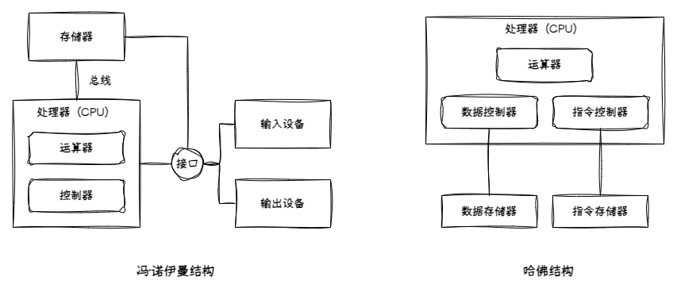
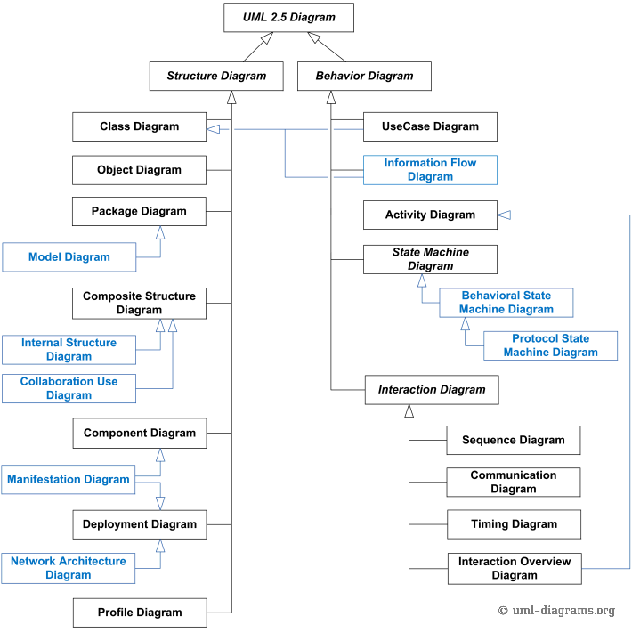

本文总结了系统架构师考试中相关的易混淆概念，包括OSI七层模型与TCP/IP协议集的区别、各层协议数据单元（PDU）的定义，以及常见协议的分类和作用，帮助考生理清网络基础知识点。

<!-- more -->

---

## 冯·诺伊曼结构与哈佛结构

- 冯·诺伊曼经典计算机结构主要分为**云算器**、**控制器**、**存储器**、**输入设备**和**输出设备**，通过**总线**连接
- 冯·诺伊曼结构的核心思想是“存储程序”和“程序控制”，也就是说，计算机将程序和数据都存储在存储器中，控制器按照存储器中的指令顺序执行程序
- 现代计算机遵循冯·诺伊曼结构，将云算器与控制器合并为**处理器**、输入设备和输出设备合并为**接口**、**总线**、**外设**的一体化系统
- 哈佛计算机架构上个世纪 50 年代因为冯·诺伊曼结构的兴起而淡出视野，在 80 年代由于**数字信号处理器（DSP）**的发展而再次流行

---

## 处理器芯片架构

[文献参考](https://jameltayeb.com/2020/08/15/p6-rocks/)

### Intel 芯片架构发展进程

| 年代 | 架构名称 | 代表产品 | 特点与意义 |
|-|-|-|-|
| 1978 | 8086 * | 8086 / 8088 | x86 架构诞生，奠定指令集基础 |
| 1982 | 80286 | Intel 286 | 实模式 + 保护模式 |
| 1985 | 80386 * | Intel 386 | 32位寄存器，全新内存分页机制 |
| 1989 | 80486 | Intel 486 | 集成FPU，支持流水线 |
| 1993 | P5 | Pentium | 超标量结构（双发射），分支预测 |
| 1995 | P6 * | Pentium Pro / II / III | 乱序执行、指令重命名、动态执行三件套 |
| 2000 | NetBurst | Pentium 4 | 超长流水线（20+），高频追求，失败案例 |
| 2006 | Core（Yonah → Conroe） * | Core 2 Duo | P6 改进 + 双核 + 更高能效比 |
| 2008 | Nehalem * | Core i7-920 | 引入 QPI、IMC、L3 缓存、SMT 超线程 |
| 2010 | Westmere | i7-980X | 六核处理器，AES-NI 指令集 |
| 2011 | Sandy Bridge * | i7-2600K | CPU+GPU 融合封装，AVX 指令 |
| 2012 | Ivy Bridge | i7-3770K | 三栅极（3D Tri-Gate）晶体管首次引入 |
| 2013 | Haswell | i7-4770K | FIVR 供电、AVX2、TSX 支持 |
| 2014 | Broadwell | i7-5775C | 14nm 首发，缓存更大 |
| 2015 | Skylake | i7-6700K | DDR4 支持，微指令缓存 |
| 2016 | Kaby Lake | i7-7700K | 优化版 Skylake，无架构大变 |
| 2017 | Coffee Lake | i7-8700K | 六核主流化 |
| 2018 | Whiskey Lake / Amber Lake | i5-8265U 等 | 移动平台优化 |
| 2019 | Comet Lake / Ice Lake | i7-10710U / i7-1065G7 | Ice 为首个 10nm CPU，集成 Iris Plus GPU |
| 2020 | Tiger Lake * | i7-1165G7 | 全新 Willow Cove 架构 + Xe GPU |
| 2021 | Alder Lake * | i9-12900K | 大小核混合（P核 + E核），Intel Thread Director |
| 2022 | Raptor Lake | i9-13900K | 增强混合架构，性能核+能效核更多 |
| 2023 | Meteor Lake * | Core Ultra 7 | 首次采用 Chiplet 架构，AI NPU |

### Nvidia GPU 芯片架构发展进程

| 年代 | 架构名称 | 代表产品 | 特点与意义 |
|-|-|-|-|
| 2004 | Curie | GeForce 6/7 系列 | 首次支持 Shader Model 3.0，引入 PureVideo 技术 |
| 2006 | Tesla | GeForce 8/9 系列 | 引入统一着色器架构，支持 CUDA，开启 GPGPU 计算 |
| 2010 | Fermi | GeForce 400/500 系列 | 引入 L1/L2 缓存，支持 ECC，提升计算性能 |
| 2012 | Kepler | GeForce 600/700 系列 | 提升能效比，支持动态并行和 Hyper-Q 技术 |
| 2014 | Maxwell | GeForce 900 系列 | 优化 SM 设计，提升性能和能效，支持 DirectX 12 |
| 2016 | Pascal | GeForce 10 系列 | 引入 NVLink，支持 HBM2，提升深度学习性能 |
| 2017 | Volta | Tesla V100 | 首次引入 Tensor Core，专为 AI 和 HPC 设计 |
| 2018 | Turing | GeForce RTX 20 系列 | 引入 RT Core，支持实时光线追踪和 AI 加速 |
| 2020 | Ampere | GeForce RTX 30 系列 | 提升 Tensor 和 RT Core 性能，支持 PCIe 4.0 |
| 2022 | Hopper | H100 | 引入 Transformer Engine，优化 AI 训练和推理 |
| 2024 | Blackwell | B100/B200 | 提升 AI 性能，支持 FP8 精度，优化能效比 |

---

## OSI 模型和 TCP/IP 协议集

- 网络五层模型是野路子，OSI 七层模型是官方标准 [ISO/IEC 7498-1](https://www.iso.org/obp/ui/#iso:std:iso-iec:7498:-1:ed-1:v2:en)
- OSI 协议集是 ISO 国际标准组织为实现 OSI 七层理论而制定的一整套实际网络协议，但历史上败给了 TCP/IP 协议集合
- OSI 协议集中有部分协议得到了保留并传播，比如 LLC、MAC

### 协议数据单元（PDU）

协议数据单元（Protocol Data Unit, PDU）是指在网络通信中，各层协议在数据传输时所使用的数据格式或信息单位。每一层在发送数据时会在上一层的数据基础上添加自己的头部（有时还有尾部），形成该层的 PDU 。对于 OSI 模型：

| 层级 | PDU | 说明 |
|-|-|-|
| 应用层 表示层 会话层 | Message（消息） | 应用数据（如HTTP请求、FTP命令等） |
| 传输层 | Segment（TCP段） / Datagram（UDP数据报） | 端到端传输单元 |
| 网络层 | Packet（分组/数据包） | 网络中路由转发单元 |
| 链路层 | Frame（帧） | 局域网内传输单元 |
| 物理层 | Bits（比特流） | 在物理媒介上传输的电信号/光信号 |

PDU 的概念有助于理解数据在不同协议层之间的封装和解封装过程。

### OSI 协议集

| 层级 | 协议 | 说明 |
|-|-|-|
| 应用层 | FTAM, X.400, X.500 | 文件传输、邮件、目录服务 |
| 表示层 | ASN.1（Abstract Syntax Notation One） | 数据表示和编码规则 |
| 会话层 | X.225 (Session Protocol) | 建立/管理/断开会话连接 |
| 传输层 | TP0-TP4（Transport Protocols） | 类似TCP、UDP的传输协议 |
| 网络层 | CLNP（Connectionless Network Protocol） | 类似IP的无连接网络协议 |
| 数据链路层 | LLC（Logical Link Control）、MAC | 逻辑链路控制和媒体接入控制 |
| 物理层 | X.21、RS-232、ISO 2110 | 各种物理信号标准 |

### TCP/IP 协议集

#### 应用层列表

| 协议 | 用途 | 上下层关系 | 常用端口 |
|:-|:-|:-|:-|
| HyperText Transfer Protocol, HTTP HyperText Transfer Protocol Secure, HTTPS | 网页浏览与安全访问 | 调用 TCP | 80  443 |
| File Transfer Protocol, FTP | 文件传输 | 调用 TCP | 21（控制） 20（数据） |
| Simple Mail Transfer Protocol, SMTP Post Office Protocol 3, POP3 Internet Message Access Protocol 4, IMAP4 | 电子邮件收发 | 调用 TCP | 25 110 143 |
| Domain Name System, DNS | 域名解析 | 调用 TCP / UDP | 53 |
| Dynamic Host Configuration Protocol, DHCP | 动态IP地址分配 | 调用 UDP | 67（服务器） 68（客户端） |
| TELetype NETwork, TELNET Secure Shell, SSH | 远程终端访问 | 调用 TCP | 23 22 |
| Network Time Protocol, NTP | 时间同步 | 调用 UDP | 123 |
| Simple Network Management Protocol, SNMP | 网络管理监控 | 调用 UDP | 161（查询） 162（Trap 告警） |
| Trivial File Transfer Protocol, TFTP | 简单文件传输 | 调用 UDP | 69 |
| Lightweight Directory Access Protocol, LDAP | 目录服务 | 调用 TCP / UDP | 389 |
| Session Initiation Protocol, SIP Real Time Streaming Protocol, RTSP | 实时通信、流媒体控制 | 调用 TCP / UDP | 5060 554 |

#### 传输层列表

| 协议 | 用途 | PDU |
|:-|:-|:-|
| Transmission Control Protocol, TCP | 面向连接，可靠传输 | Segment |
| User Datagram Protocol, UDP | 无连接，快速传输 | Datagram |
| Stream Control Transmission Protocol, SCTP | 多流传输，信令传输 | Chunk |

#### 网络层列表

| 协议 | 用途 | PDU |
|:-|:-|:-|
| Internet Protocol version 4, IPv4 Internet Protocol version 6, IPv6 | 数据报寻址与路由 | Packet |
| Internet Control Message Protocol, ICMP | 差错处理与控制（如Ping） | Message |
| Address Resolution Protocol, ARP | IP地址到MAC地址解析 | Frame |
| Reverse Address Resolution Protocol, RARP | MAC地址到IP地址反查（已淘汰） | Frame |
| Internet Group Management Protocol, IGMP | IPv4多播组管理 | Message |
| Multicast Listener Discovery, MLD | IPv6多播组管理 | Message |
| IP Security, IPSec | IP层安全加密与认证 | Packet |

#### 链路层列表

| 协议 | 用途 | PDU |
|:-|:-|:-|
| Ethernet（以太网） | 有线局域网传输 | Frame |
| Wireless Fidelity, Wi-Fi（IEEE 802.11，无线保真） | 无线局域网传输 | Frame |
| Point-to-Point Protocol, PPP（点对点协议） | 点对点连接（拨号/广域网） | Frame |
| High-Level Data Link Control, HDLC（高级数据链路控制） | 点到点高效传输 | Frame |
| Virtual Local Area Network, VLAN（802.1Q，虚拟局域网） | 虚拟局域网分隔 | Frame |
| Multi-Protocol Label Switching, MPLS（多协议标签交换） | 高效路由转发（标签交换） | Frame / Label |
| Frame Relay（帧中继） Asynchronous Transfer Mode, ATM（异步传输模式） | 早期广域网技术 | Frame / Cell |

---

## 物联网与移动网络协议

- 物联网（IoT）是应用视角的技术概念，是应用需求的集合，而移动网络特指基于移动通信协议（2G/3G/4G/5G 等）发展起来的技术体系，两者具备很大程度的重叠
- 物联网（IoT）按照经典分层模型来讲分为感知层（Perception）、网络层（Network）、应用层（Application），在实际工程应用中，还可以增加平台层（Platform）和服务层（Service）
- 网络协议按照其特性，可以分为局域网（LAN）、广域网（WAN）、无线网、移动网

### 无线网络协议

### 移动网络协议

### 5G 通信协议专题

---

## CORBA 中间件标准

---

## TCSEC 安全等级标准

TCSEC（Trusted Computer System Evaluation Criteria），即著名的“橙皮书（Orange Book）”，是美国国防部在 1983 年制定的一套计算机安全评估标准，用于对操作系统与计算环境的安全等级进行分级。

| 等级 | 名称 | 简要说明 |
|-|-|-|
| D | 最低保护级 Minimal Protection | 不满足 C1 以上的最低安全需求 未通过认证系统的默认等级 |
| C1 | 自主安全保护 Discretionary Security Protection | 实现基本的用户身份认证与访问控制 用户可定义访问权限 |
| C2 | 受控访问保护 Controlled Access Protection | 提供更细粒度的访问控制、审计日志、会话隔离 系统可对每个对象实现独立访问权限控制 |
| B1 | 标记安全保护 Labeled Security Protection | 增加强制访问控制（MAC） 对象被赋予安全标签（如机密级、秘密级） |
| B2 | 结构化保护 Structured Protection | 安全策略和机制更结构化，功能更分明，引入可信计算基（TCB）分层 加强标记传递控制和系统设计审查 |
| B3 | 安全域保护 Security Domains | 系统高度抵抗入侵，具备明显的可信计算边界 支持完全的审计和访问验证 |
| A1 | 形式化验证设计保护 Verified Design | 在 B3 基础上进行形式化的安全模型验证和实现验证 确保所有安全机制符合设计规范，是最高级别的保障体系 |

这里重点澄清《计算机信息系统安全保护等级划分准则》（GB/T 17859-1999）与 TCSEC 安全等级标准的对应关系

| 等级 | 名称 | 说明 |
|-|-|-|
| 第一级（C1） | 自主保护级 | 防止无意的非法用户访问，保障系统基本可用性 实施最基本的安全措施，如用户认证和简单访问控制 |
| 第二级（C2） | 系统审计级 | 除一级目标外，要求可追踪操作行为 增加审计日志、安全标识、事件追踪 |
| 第三级（B1） | 安全标记级 | 加强对数据资源的访问控制，防止主动攻击 引入强制访问控制、访问标记、安全标签等机制 |
| 第四级（B2） | 结构保护级 | 防范有组织攻击，具备较高可信保障能力 明确划分系统安全边界，具备完整的安全策略实施机制 |
| 第五级（B3） | 访问验证级 | 防范国家级攻击者，支持系统整体可信验证 系统整体安全架构具备形式化安全验证机制，可抵御高强度攻击 |

---

## 软件著作权

## UML 设计标准

- 以 UML 2.5 为例，官方将图形工具分类为结构图（Structure Diagram）和行为图（Behavior Diagram）

