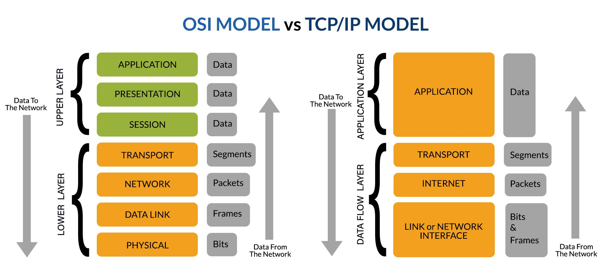

+++
date = '2025-04-27T02:39:00+08:00'
draft = true
title = '架构考试 - 总结 - 弱点概念'
+++

# 架构考试 - 总结 - 弱点概念

---

## 网络工程弱点概念

> **概念澄清**：
> - 网络五层模型是野路子，OSI 七层模型是官方标准 [ISO/IEC 7498-1](https://www.iso.org/obp/ui/#iso:std:iso-iec:7498:-1:ed-1:v2:en)
> - OSI 协议集是 ISO 国际标准组织为实现 OSI 七层理论而制定的一整套实际网络协议，但历史上败给了 TCP/IP 协议集合
> - OSI 协议集中有部分协议得到了保留并传播，比如 LLC、MAC

**协议数据单元（PDU）**

协议数据单元（Protocol Data Unit, PDU）是指在网络通信中，各层协议在数据传输时所使用的数据格式或信息单位。每一层在发送数据时会在上一层的数据基础上添加自己的头部（有时还有尾部），形成该层的 PDU 。对于 OSI 模型：

| 层级 | PDU | 说明 |
|-|-|-|
| 应用层 表示层 会话层 | Message（消息） | 应用数据（如HTTP请求、FTP命令等） |
| 传输层 | Segment（TCP段） / Datagram（UDP数据报） | 端到端传输单元 |
| 网络层 | Packet（分组/数据包） | 网络中路由转发单元 |
| 链路层 | Frame（帧） | 局域网内传输单元 |
| 物理层 | Bits（比特流） | 在物理媒介上传输的电信号/光信号 |

PDU 的概念有助于理解数据在不同协议层之间的封装和解封装过程。

**OSI 协议集列表**

| 层级 | 协议 | 说明 |
|-|-|-|
| 应用层 | FTAM, X.400, X.500 | 文件传输、邮件、目录服务 |
| 表示层 | ASN.1（Abstract Syntax Notation One） | 数据表示和编码规则 |
| 会话层 | X.225 (Session Protocol) | 建立/管理/断开会话连接 |
| 传输层 | TP0-TP4（Transport Protocols） | 类似TCP、UDP的传输协议 |
| 网络层 | CLNP（Connectionless Network Protocol） | 类似IP的无连接网络协议 |
| 数据链路层 | LLC（Logical Link Control）、MAC | 逻辑链路控制和媒体接入控制 |
| 物理层 | X.21、RS-232、ISO 2110 | 各种物理信号标准 |

**TCP/IP 协议集列表**

1. 应用层

| 协议 | 用途 | 上下层关系 | 常用端口 |
|:-|:-|:-|:-|
| HyperText Transfer Protocol, HTTP HyperText Transfer Protocol Secure, HTTPS | 网页浏览与安全访问 | 调用 TCP | 80  443 |
| File Transfer Protocol, FTP | 文件传输 | 调用 TCP | 21（控制） 20（数据） |
| Simple Mail Transfer Protocol, SMTP Post Office Protocol 3, POP3 Internet Message Access Protocol 4, IMAP4 | 电子邮件收发 | 调用 TCP | 25 110 143 |
| Domain Name System, DNS | 域名解析 | 调用 TCP / UDP | 53 |
| Dynamic Host Configuration Protocol, DHCP | 动态IP地址分配 | 调用 UDP | 67（服务器） 68（客户端） |
| TELetype NETwork, TELNET Secure Shell, SSH | 远程终端访问 | 调用 TCP | 23 22 |
| Network Time Protocol, NTP | 时间同步 | 调用 UDP | 123 |
| Simple Network Management Protocol, SNMP | 网络管理监控 | 调用 UDP | 161（查询） 162（Trap 告警） |
| Trivial File Transfer Protocol, TFTP | 简单文件传输 | 调用 UDP | 69 |
| Lightweight Directory Access Protocol, LDAP | 目录服务 | 调用 TCP / UDP | 389 |
| Session Initiation Protocol, SIP Real Time Streaming Protocol, RTSP | 实时通信、流媒体控制 | 调用 TCP / UDP | 5060 554 |

2. 传输层

| 协议 | 用途 | PDU |
|:-|:-|:-|
| Transmission Control Protocol, TCP | 面向连接，可靠传输 | Segment |
| User Datagram Protocol, UDP | 无连接，快速传输 | Datagram |
| Stream Control Transmission Protocol, SCTP | 多流传输，信令传输 | Chunk |

3. 网络层

| 协议 | 用途 | PDU |
|:-|:-|:-|
| Internet Protocol version 4, IPv4 Internet Protocol version 6, IPv6 | 数据报寻址与路由 | Packet |
| Internet Control Message Protocol, ICMP | 差错处理与控制（如Ping） | Message |
| Address Resolution Protocol, ARP | IP地址到MAC地址解析 | Frame |
| Reverse Address Resolution Protocol, RARP | MAC地址到IP地址反查（已淘汰） | Frame |
| Internet Group Management Protocol, IGMP | IPv4多播组管理 | Message |
| Multicast Listener Discovery, MLD | IPv6多播组管理 | Message |
| IP Security, IPSec | IP层安全加密与认证 | Packet |

4. 链路层

| 协议 | 用途 | PDU |
|:-|:-|:-|
| Ethernet（以太网） | 有线局域网传输 | Frame |
| Wireless Fidelity, Wi-Fi（IEEE 802.11，无线保真） | 无线局域网传输 | Frame |
| Point-to-Point Protocol, PPP（点对点协议） | 点对点连接（拨号/广域网） | Frame |
| High-Level Data Link Control, HDLC（高级数据链路控制） | 点到点高效传输 | Frame |
| Virtual Local Area Network, VLAN（802.1Q，虚拟局域网） | 虚拟局域网分隔 | Frame |
| Multi-Protocol Label Switching, MPLS（多协议标签交换） | 高效路由转发（标签交换） | Frame / Label |
| Frame Relay（帧中继） Asynchronous Transfer Mode, ATM（异步传输模式） | 早期广域网技术 | Frame / Cell |