本文系统梳理了系统架构师考试中信息系统基础知识的主要内容，涵盖计算机系统的组成与分类、硬件与软件基础、操作系统、数据库、文件系统、网络协议与通信技术、网络工程、计算机语言、多媒体、系统工程、系统性能等方面。内容包括各类硬件（如处理器、存储器、总线、接口、外设）、主流操作系统及其原理、数据库类型与管理、文件系统结构与访问控制、网络分层模型与协议、5G 通信关键技术、网络设备与组网技术、系统工程方法与生命周期、MBSE、性能指标与评估方法等。文章以表格、流程图和对比分析为主，突出各知识点的定义、分类、原理、应用及发展趋势，为备考系统架构师考试提供了全面的知识参考。

<!-- more -->

## 1.1 计算机系统概述

### 计算机系统的定义、组成和分类

1946年，第一台计算机诞生，专业名词为电子数字积分器和计算机 (ENIAC)。

冯·诺依曼提出离散变量电子计算机 (EDVIC)，又称数字计算机，是现代计算机的主要类型。其构成主要包括以下几个部分：

| 组件 | 描述 | 作用 |
|-|-|-|
| 运算器 (ALU) | 执行算术和逻辑运算 | 数据加工处理 |
| 控制器 (CU) | 取指令、译码、发控制信号 | 控制计算机各部件协调工作 |
| 存储器 (Memory) | 存储程序和数据 | 分为内存和外存，内存速度快容量小，外存速度慢容量大 |
| 输入设备 (Input Devices) | 将外部信息输入计算机 | 键盘、鼠标、扫描仪、摄像头等 |
| 输出设备 (Output Devices) | 将计算机处理结果输出 | 显示器、打印机、音箱等 |

这些组成部分通过总线（Bus）相互连接，实现数据的传输和交换。 冯·诺依曼体系结构是现代计算机的基础，其核心思想是“存储程序”和“程序控制”。 也就是说，计算机将程序和数据都存储在存储器中，控制器按照存储器中的指令顺序执行程序。

从冯·诺伊曼体系结构开始，计算机分为软件系统和硬件系统两个部分。

## 1.2 计算机硬件

### 1.2.1 计算机硬件组成

#### 冯·诺依曼计算机结构

现实的硬件构成中，运算器和控制器在处理器 (CPU) 上集成，输入设备和输出设备经常也被集成为一体，按照传输过程划分为总线、接口外部设备。因此，教材的阐述主要以处理器、存储器、总线、接口、外部设备作为内容框架。

### 1.2.2 处理器

位宽上由 4 位发展为 64 位；从单一的运算器和控制器的功能集成发展为多级缓存、多种通道总线和接口；在内核上从单核发展位多核、异构多核和众核处理器架构。

异构多核是指在一个处理器芯片上集成多种不同类型的处理器核心。这些核心可能具有不同的指令集架构、不同的性能特点和不同的功耗特性。例如，一个芯片上可以同时包含 ARM 核心、GPU 核心和 DSP 核心。这种架构可以根据不同的应用场景，选择合适的处理器核心来执行任务，从而提高整体的性能和效率。

众核处理器是指在一个处理器芯片上集成大量的处理器核心。通常来说，核心数量达到几十个甚至上百个的处理器就可以被称为众核处理器。这种架构可以提供强大的并行计算能力，适用于需要处理大量并发任务的应用场景，例如科学计算、图像处理和视频编码等。

处理器核心与逻辑单元（ALU）有着本质区别：

1. 处理器核心（Core）：
    - 完整的处理单元，包含ALU、控制单元、寄存器组和缓存等
    - 能独立获取、解码和执行指令
    - 多核处理器在一个物理芯片上集成多个这样的完整核心

2. 算术逻辑单元（ALU）：
    - 处理器核心内的组件之一
    - 专门执行算术运算（加减乘除）和逻辑运算（与或非等）
    - 不能独立执行程序，由控制单元调度

一个处理器核心通常包含一个或多个ALU。多核处理器可以实现真正的并行计算，而多个ALU只能提高单个核心的运算能力。

超线程技术(HT)是英特尔开发的一种处理器技术，允许一个物理处理器核心同时执行两个独立的指令流(线程)。主要特点包括:

1. 资源共享:
    - 单个物理核心的执行资源(如ALU、缓存)由两个逻辑处理器共享
    - 每个逻辑处理器有自己的架构状态(寄存器)

2. 工作原理:
    - 当一个线程因等待内存访问等操作而闲置时，另一个线程可利用空闲的执行资源
    - 通过填充执行管道中的"气泡"提高处理器利用率

3. 性能提升:
    - 理想情况下可提升30%-40%的性能
    - 并非所有应用都能获得相同程度的提升，取决于应用特性

4. 与真正的多核区别:
    - 超线程只是在单核上提供两个执行上下文
    - 真正的多核处理器具有多个完全独立的物理核心

#### 典型的处理器系统结构

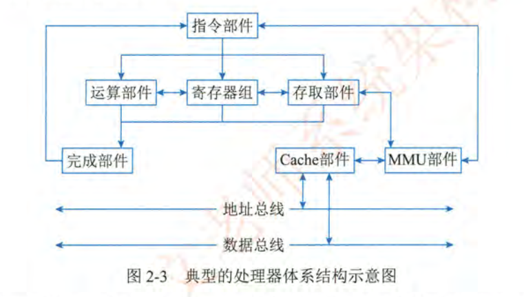

| 组件 | 描述 | 作用 |
|-|-|-|
| 运算器 (ALU) | 执行算术和逻辑运算 | 数据加工处理 |
| 控制器 (CU) | 取指令、译码、发控制信号 | 控制计算机各部件协调工作 |
| 寄存器 | 存储指令、数据和地址 | CPU 内部数据存储 |
| 高速缓存 (Cache) | 存储 CPU 经常访问的数据 | 减少 CPU 访问内存的次数，提高 CPU 的运行速度 |
| 指令译码器 | 将指令译码成 CPU 可以执行的微操作 | 指令翻译 |
| 总线接口 | CPU 与外部设备之间的数据传输 | CPU 与外部设备之间的桥梁 |
| 中断控制器 | 处理外部设备的中断请求 | 提高 CPU 的响应速度 |

MMU 功能说明：

| 功能 | 描述 | 作用 |
|-|-|-|
| 地址转换 | 使用页表实现虚拟地址到物理地址的转换 | 记录虚拟页和物理页之间的映射关系，当 CPU 发出一个虚拟地址时，MMU 会查找页表，找到对应的物理地址，然后访问物理内存 |
| 内存保护 | 提供内存保护功能，防止程序访问不属于自己的内存区域 | 通过在页表中设置权限位（如读、写、执行），MMU 可以控制程序对内存的访问权限，如果程序试图访问没有权限的内存区域，MMU 会产生一个异常，从而保护系统的稳定性和安全性 |
| 缓存管理 | 与缓存（Cache）协同工作，提高内存访问速度 | 控制缓存的行为，如缓存的分配、替换和刷新，通过合理的缓存管理策略，可以减少 CPU 访问主内存的次数，从而提高系统的性能 |
| TLB | 缓存最近使用的虚拟地址到物理地址的映射关系 | 快速地将虚拟地址转换为物理地址，从而提高内存访问速度 |

总结：
- 提供更大的地址空间：通过虚拟地址，程序可以使用比实际物理内存更大的地址空间。
- 内存保护：防止程序互相干扰，提高系统的稳定性。
- 内存共享：允许多个程序共享同一块物理内存，提高内存利用率。
- 动态内存分配：支持动态地分配和释放内存，提高内存管理的灵活性。

#### CPU、GPU、DSP、FPGA

|  | CPU | GPU | DSP | FPGA |
|-|-|-|-|-|
| 定义 | 计算机的运算和控制核心 | 用于加速图形渲染的专用处理器 | 专门用于处理数字信号的处理器 | 是一种可编程的硬件设备 |
| 特点 | 通用性强，擅长处理复杂的逻辑运算和控制任务，优化目标是降低延迟，提高单线程性能 | 并行处理能力强，擅长处理图像、视频等多媒体数据，优化目标是提高吞吐量，适合并行计算密集型任务 | 针对数字信号处理进行了优化，具有高效的信号处理能力，通常具有专门的硬件加速器，可以加速常见的信号处理算法，功耗较低，适合嵌入式系统 | 灵活性高，可以根据需要进行定制，实现各种不同的硬件电路，并行处理能力强，可以同时处理大量的计算任务，功耗较高，开发难度较大 |
| 应用 | 个人电脑、服务器、移动设备等各种计算机系统 | 游戏、图像处理、视频编辑、深度学习等领域 | 音频处理、视频处理、通信、雷达、医疗设备等领域 | 通信、工业控制、航空航天、军事等领域 |

DSP（数字信号处理器）在处理数字信号时，针对其特性进行了一系列优化：
1. 通过饱和算法处理溢出问题：
    - 在数字信号处理中，信号的动态范围可能很大，运算过程中容易产生溢出。
    - 饱和算法是一种处理溢出的方法，当运算结果超出表示范围时，将其钳位到最大或最小值，而不是直接截断或回绕。
    - 例如，对于有符号 16 位整数，范围是 -32768 到 32767。如果计算结果是 32768，饱和算法会将其设置为 32767，避免数据错误。
2. 通过乘积累加运算提高矩阵运算的效率：
    - 乘积累加（Multiply-Accumulate, MAC）是 DSP 中常见的运算，形式为 `a = a + b - c`。
    - 许多 DSP 芯片都内置了 MAC 硬件加速器，可以在一个时钟周期内完成乘法和加法运算。
    - 矩阵运算通常涉及大量的乘积累加运算，使用 MAC 可以显著提高运算效率。
    - 例如，在计算卷积、相关和滤波器时，MAC 非常有用。
3. 以及为傅里叶变换设计专用指令：
    - 傅里叶变换是信号处理中的核心算法，用于将信号从时域转换到频域。
    - 为了加速傅里叶变换的计算，DSP 可能会提供专门的指令，如蝶形运算指令。
    - 这些指令通常会利用硬件加速器，以高效地执行傅里叶变换的各个步骤。
    - 通过专用指令，可以显著提高傅里叶变换的计算速度，从而实现实时信号处理。

#### 指令集：CISC 和 RISC 结构

指令集是处理器（CPU）中所有机器指令的集合，每条指令对应着处理器可以执行的一个基本操作。指令集的设计直接影响处理器的性能、复杂度和功耗。

| 特性 | CISC (复杂指令集计算) | RISC (精简指令集计算) |
|-|-|-|
| 指令数量 | 多 | 少 |
| 指令长度 | 不固定 | 固定 |
| 寻址方式 | 多样 | 简单 |
| 指令复杂度 | 单条指令可完成复杂任务 | 需要多条指令完成复杂任务 |
| 设计目标 | 减少编译器负担，提高代码密度 | 优化指令执行效率 |
| 优点 | 有效利用内存，特定任务性能高 | 处理器设计简单，指令执行效率高，功耗低 |
| 缺点 | 处理器设计复杂，指令执行效率不均衡，难以优化，功耗高 | 代码密度较低，对编译器要求高 |
| 典型代表 | Intel x86 | ARM, MIPS |

总结：

- CISC 追求功能强大，指令复杂，适用于需要处理复杂任务的场景。
- RISC 追求效率和简单，指令精简，适用于对功耗和性能有要求的移动设备和嵌入式系统。

#### 国产处理器芯片结构

| 公司名称 | 专注领域 | 代表产品型号 | 指令集/处理器类型 |
| :- | :- | :- | :- |
| 龙芯 | 自主指令集CPU | 龙芯3A5000、龙芯3A6000、龙芯3C5000系列 | LoongArch（CPU） |
| 飞腾 | 高性能通用CPU | 腾云S2500、腾云S5000C系列、腾锐D2000 | ARM（CPU） |
| 申威 | 高性能计算（HPC）CPU | 申威26010 | 自主指令集（CPU） |
| 兆芯 | x86兼容CPU | 开胜KH-40000系列、开先KX-6000系列 | x86（CPU） |
| 景嘉微 | 高性能GPU | JM7200、JM9系列 | GPU |
| 国芯 | 数字电视芯片、物联网芯片 | 请查询国芯科技官网 | 包含CPU，DSP等 |
| 华睿 | 嵌入式人工智能处理器和芯片 | 产品广泛应用于智慧物联，智慧交通，智慧工业等等方面 | 包括多种处理器类型。包含嵌入式AI芯片。 |
| 翔腾微 | 模拟集成电路和数模混合集成电路 | 请查询翔腾微电子官方网站 | 混合类型芯片，其中包括 DSP 类型的。 |

### 1.2.3 存储器

存储器是计算机系统中用于存储程序和数据的部件。它是计算机的核心组成部分之一，负责保存 CPU 运行所需的指令和数据，以及程序运行的中间结果。

| 分类标准 | 类型 | 特点 |
|-|-|-|
| 存储介质 | 半导体存储器 | 使用半导体器件存储数据，如 RAM、ROM、Flash Memory 等。 |
| | 磁存储器 | 使用磁性材料存储数据，如硬盘、磁带等。 |
| | 光存储器 | 使用光学技术存储数据，如 CD-ROM、DVD-ROM 等。 |
| 存储方式 | 随机存储器 (RAM) | 可以随机访问任何存储单元，读写速度快，但断电后数据会丢失。包括静态 RAM (SRAM) 和动态 RAM (DRAM)。 |
| | 只读存储器 (ROM) | 只能读取数据，不能写入数据，断电后数据不会丢失。包括掩膜 ROM (MROM)、可编程 ROM (PROM)、可擦除可编程 ROM (EPROM) 和电可擦除可编程 ROM (EEPROM)。 |
| | 闪存 (Flash Memory) | 一种非易失性存储器，可以像 RAM 一样快速读取数据，又可以像 ROM 一样断电后数据不丢失。包括 NAND Flash 和 NOR Flash。 |
| 系统作用 | 主存储器 (Main Memory) | 也称为内存，是 CPU 可以直接访问的存储器，用于存储当前正在运行的程序和数据。 |
| | 辅助存储器 (Auxiliary Memory) | 也称为外存，是用于长期存储程序和数据的存储器，如硬盘、SSD、U 盘等。 |
| | 高速缓存 (Cache) | 位于 CPU 和主存储器之间，用于存储 CPU 经常访问的数据，以提高 CPU 的运行速度。 |

#### 片上缓存、片外缓存、主存和外存

| 存储器类型 | 位置 | 速度 | 容量 | 主要用途 |
|-|-|-|-|-|
| 片上缓存（On-Chip Cache） | 处理器芯片内部 | 非常快 | 小（KB 到 MB） | 存储 CPU 频繁访问的数据和指令 |
| 片外缓存（Off-Chip Cache） | 处理器芯片外部 | 较快 | 较大 | 扩展缓存容量 |
| 主存（Main Memory） | 计算机系统内部 | 较慢 | 大 | 存储当前运行的程序和数据 |
| 外存（External Memory） | 计算机系统外部 | 慢 | 非常大 | 长期存储程序和数据 |

#### SRAM、DRAM、NVRAM、Flash、EPROM、Disk

| 存储器类型 | 特点 | 用途 |
| :- | :- | :- |
| SRAM (静态随机存取存储器) | 速度快，集成度低，成本高 | 高速缓存 |
| DRAM (动态随机存取存储器) | 集成度高，成本低，需要定期刷新 | 主内存 |
| NVRAM (非易失性随机存取存储器) | 断电后数据不丢失，如FRAM、MRAM | 特定应用的持久存储 |
| Flash Memory (闪存) | 非易失性，读写速度快，分NAND和NOR | 固态硬盘（SSD）、U盘等 |
| EPROM (可擦除可编程只读存储器) | 可擦除，可编程 | 早期嵌入式系统 |
| Disk (磁盘) | 容量大，速度相对较慢 | 硬盘（HDD）、SSD（固态硬盘） |

| 特性 | SRAM (静态随机存取存储器) | DRAM (动态随机存取存储器) |
|-|-|-|
| 存储原理 | 使用触发器存储数据，不需刷新 | 使用电容存储数据，需要定期刷新 |
| 存储单元组成 | 6个晶体管 | 1个晶体管 + 1个电容 |
| 速度 | 非常快 | 相对较慢 |
| 功耗 | 较高 | 较低 |
| 成本 | 较高 | 较低 |
| 集成度 | 较低 | 较高 |
| 主要用途 | 高速缓存（Cache），如 L1、L2、L3 缓存 | 主内存（Main Memory），即内存条 |

### 1.2.4 总线

总线是计算机系统中用于连接各个部件，实现数据传输的通道。根据不同的分类标准，总线可以分为多种类型。

#### 内总线、系统总线和外部总线等

| 分类标准 | 类型 | 说明 |
| - | - | - |
| 数据传输方式 | 并行总线 | 数据以并行方式传输，速度快，但线路复杂，成本高。 |
| | 串行总线 | 数据以串行方式传输，速度相对较慢，但线路简单，成本低。 |
| 信号线功能 | 地址总线 | 传输地址信息，用于指定存储器或 I/O 设备的地址。 |
| | 数据总线 | 传输数据信息，用于在 CPU、存储器和 I/O 设备之间传输数据。 |
| | 控制总线 | 传输控制信号，用于控制 CPU、存储器和 I/O 设备的操作。 |
| 连接对象 | 内部总线（片上总线） | 用于连接 CPU 内部的各个部件，如 ALU、寄存器、Cache 等。 |
| | 系统总线（外部总线、板级总线、局部总线） | 用于连接计算机系统的各个主要部件，如 CPU、内存、I/O 接口等。 |
| | 外部总线（通信总线） | 用于连接计算机系统与外部设备，如打印机、显示器、键盘等。 |

常见的并行总线和串行总线：

| 总线类型 | 特点 | 主要用途 | 串行/并行 |
| :- | :- | :- | :- |
| PCI/PCIe | 高速数据传输，用于连接计算机内部设备 | 计算机内部设备连接 | PCI（并行），PCIe（串行） |
| ATA (IDE) | 早期硬盘连接总线 | 早期硬盘连接 | 并行 |
| USB | 通用串行接口，用于连接外部设备 | 外部设备连接 | 串行 |
| SATA | 硬盘连接总线 | 硬盘连接 | 串行 |
| CAN | 控制器局域网，用于汽车电子、工业控制 | 汽车电子、工业控制 | 串行 |
| RS-232/RS-485 | 串口通信总线 | 串口通信 | 串行 |
| RapidIO | 高性能计算、嵌入式系统总线 | 高性能计算、嵌入式系统 | 串行 |
| 以太网 | 网络通信总线 | 网络通信 | 串行 |
| ARINC429 | 航空数据传输总线 | 航空数据传输 | 串行 |
| ARINC659/ARINC664 | 航空网络通信总线 | 航空网络通信 | 串行 |
| MIL-STD-1553B | 军用航空电子系统总线 | 军用航空电子系统 | 串行 |
| IEEE1394 (FireWire) | 高速数据传输总线 | 早期高速设备连接 | 串行 |
| VME (VMEbus) | 工业自动化、科学研究总线 | 工业自动化、科学研究 | 并行 |

### 1.2.5 接口

#### 显示、音频、网络和 SATA 等

| 接口类型 | 特点 | 主要用途/功能 |
| :- | :- | :- |
| 显示类接口 (HDMI, DVI, VGA等) | 传输视频信号，高清或模拟信号 | 连接显示器、投影仪等显示设备 |
| 音频输入/输出类接口 (TRS, RCA, XLR等) | 传输音频信号，模拟信号 | 连接耳机、麦克风、音响等音频设备 |
| 网络类接口 (RJ45, FC等) | 传输网络数据，高速数据传输 | 连接以太网、光纤网络等网络设备 |
| PS/2接口 | 早期键盘鼠标连接接口 | 连接旧式键盘和鼠标 |
| USB接口 | 通用串行接口，支持多种设备 | 连接键盘、鼠标、打印机、存储设备等 |
| SATA接口 | 硬盘连接接口，高速数据传输 | 连接硬盘、固态硬盘等存储设备 |
| LPT打印接口 | 早期打印机连接接口 | 连接旧式打印机 |
| RS-232接口 | 串口通信接口，低速数据传输 | 早期串口通信，工业控制等 |
| 离散量接口 | 传输开关信号，控制信号 | 工业自动化控制、传感器连接等 |
| A/D转换接口 | 模拟信号转换为数字信号 | 数据采集、测量仪器等 |


### 1.2.6 外部设备

#### 鼠标、显示器、扫描仪和摄像头等

| 外设类型 | 主要功能/用途 | 特点 |
| :- | :- | :- |
| 键盘 | 输入文本、命令 | 标准输入设备，适用于文字录入和操作控制。 |
| 鼠标 | 图形界面操作、指针控制 | 便捷的交互工具，用于精确控制和导航。 |
| 显示器 | 显示图像、视频、文本 | 视觉输出设备，提供用户界面和信息展示。 |
| 扫描仪 | 图像、文档数字化 | 将纸质文件转换为电子格式，便于存储和编辑。 |
| 摄像头 | 图像、视频捕捉 | 用于视频通话、图像录制、安全监控等。 |
| 麦克风 | 音频输入 | 录制声音、语音输入、语音通信。 |
| 打印机 | 文本、图像输出 | 将电子文档打印到纸张上。 |
| 光驱 | 光盘数据读取/写入 | 读取或写入CD/DVD/蓝光光盘，逐渐被淘汰。 |
| 网卡 | 网络连接 | 提供计算机连接网络的接口，实现数据传输。 |
| 存储卡/盘 | 数据存储、传输 | 便携式存储设备，用于存储和传输文件。 |
| 加速计 | 测量加速度 | 用于运动检测、方向识别等，常见于移动设备。 |
| GPS | 定位导航 | 提供全球定位信息，用于导航、跟踪等。 |
| 陀螺仪 | 测量旋转角度 | 用于姿态检测、方向控制，常见于移动设备。 |
| 感光设备 | 光线感应 | 测量光照强度，用于自动亮度调节、拍照等。 |
| 指纹识别设备 | 身份验证 | 通过指纹识别进行身份验证，提高安全性。 |
| 测温仪 | 温度测量 | 测量物体或环境温度，用于工业、医疗等领域。 |
| 测速仪 | 速度测量 | 测量物体运动速度，用于交通、工业等领域。 |
| 轨迹球 | 指针控制 | 替代鼠标，适用于特殊环境或操作需求。 |
| 操作面板 | 控制指令输入 | 用于工业控制、航空航天等领域，进行复杂操作。 |
| 红外/NFC感应设备 | 近距离无线通信 | 用于数据传输、支付、身份识别等。 |
| 场强测量设备 | 测量电磁场强度 | 用于环境监测、电子设备测试等。 |
| 功率驱动装置 | 功率控制 | 控制电机、液压装置等设备的功率。 |
| 机械臂 | 自动化操作 | 在工业、医疗等领域进行精确操作。 |
| 液压装置 | 液压动力输出 | 提供强大动力，用于重型机械、航空等领域。 |
| 油门/驾驶杆 | 控制输入 | 用于模拟驾驶、飞行等，提供操作指令。 |

## 1.3 计算机软件

### 1.3.1 计算机软件概述

#### 计算机软件的定义和作用

计算机软件是指在计算机系统中运行的指令序列和相关数据，它是计算机系统的组成部分，与硬件相互依存。计算机软件的作用是控制计算机硬件，实现各种应用功能，提高计算机的使用效率和灵活性。

1. 定义：
    - 计算机软件是计算机系统中与硬件相互依存的另一部分，包括程序、数据及相关文档的完整集合。
    - 软件是用户与硬件之间的接口界面，用户通过软件来使用计算机完成特定的任务。
2. 作用：
    - 控制硬件：软件通过指令控制计算机的各个硬件部件，使它们协调工作，完成各种计算和处理任务。
    - 实现应用功能：软件可以实现各种应用功能，如文字处理、图像处理、数据管理、网络通信等，满足用户的各种需求。
    - 提高效率：软件可以自动化执行许多重复性的任务，提高工作效率，减少人工干预。
    - 扩展功能：软件可以扩展计算机的功能，使其能够处理更复杂的问题，适应不同的应用场景。
3. 特点：
    - 无形性：软件是一种逻辑产品，没有物理形态，可以通过复制和传播进行共享。
    - 复杂性：大型软件系统通常包含大量的代码和数据，结构复杂，开发和维护难度大。
    - 易变性：软件容易修改和更新，可以根据需求进行定制和扩展。
    - 依赖性：软件的运行依赖于硬件和操作系统的支持，不同的硬件和操作系统可能需要不同的软件版本。
4. 软件质量：
    - 正确性：软件能够按照设计要求正确地完成任务，没有错误和缺陷。
    - 可靠性：软件在规定的条件下，能够长时间稳定运行，不会出现故障。
    - 效率：软件能够高效地利用计算机资源，如 CPU、内存、磁盘等，提高运行速度。
    - 易用性：软件界面友好，操作简单，用户容易上手。
    - 可维护性：软件结构清晰，代码规范，容易修改和维护。
    - 可移植性：软件可以在不同的硬件和操作系统上运行，具有良好的兼容性。

#### 计算机软件的分类：系统软件和应用软件

1. 系统软件 (System Software)：
    - 定义：是计算机系统中最基础的软件，用于管理和控制计算机硬件，为应用软件提供运行环境。
    - 类型：
   - 操作系统 (Operating System, OS)：管理计算机硬件和软件资源，提供用户界面，如 Windows、Linux、macOS 等。
   - 编译程序 (Compiler)：将高级语言程序翻译成机器语言程序，如 GCC、Visual C++ 等。
   - 汇编程序 (Assembler)：将汇编语言程序翻译成机器语言程序。
   - 链接程序 (Linker)：将多个目标文件链接成一个可执行文件。
   - 设备驱动程序 (Device Driver)：控制计算机的外部设备，如打印机驱动、显卡驱动等。
   - 数据库管理系统 (Database Management System, DBMS)：管理和维护数据库，提供数据访问接口，如 MySQL、Oracle、SQL Server 等。
   - 网络软件：支持计算机网络通信，如 TCP/IP 协议栈、网络服务器等。
2. 应用软件 (Application Software)：
    - 定义：是为满足用户特定需求而开发的软件，可以直接为用户提供各种服务。
    - 类型：
   - 通用软件：可以满足各种用户的通用需求，如文字处理软件 (Microsoft Word)、电子表格软件 (Microsoft Excel)、演示文稿软件 (Microsoft PowerPoint) 等。
   - 专用软件：为特定行业或领域开发的软件，如财务软件、医疗软件、教育软件、游戏软件等。
   - 定制软件：根据用户的特定需求进行定制开发的软件，如企业管理系统、客户关系管理系统等。

系统软件和应用软件的区别：

- 作用：系统软件用于管理和控制计算机硬件，为应用软件提供运行环境；应用软件直接为用户提供各种服务。
- 用户：系统软件主要由系统管理员和开发人员使用；应用软件主要由最终用户使用。
- 依赖性：应用软件的运行依赖于系统软件的支持；系统软件不依赖于应用软件。
- 层次：系统软件位于计算机系统的底层，是计算机系统的基础；应用软件位于计算机系统的上层，是计算机系统的应用。

### 1.3.2 操作系统

#### 操作系统的组成、作用和类型

操作系统 (Operating System, OS) 是一种管理计算机硬件与软件资源的系统软件，同时也是计算机系统的内核与基石。

操作系统本质上是运行在计算机上的一个大型程序，负责管理计算机的所有硬件和软件资源。

操作系统的主要组成部分包括：

| 组成部分 | 描述 |
|-|-|
| 内核 (Kernel) | 操作系统的核心部分，负责管理 CPU、内存、设备等硬件资源，提供进程管理、内存管理、文件系统等基本功能。 |
| 进程管理 (Process Management) | 负责创建、调度和管理进程，实现多任务并发执行，提高计算机的运行效率。 |
| 内存管理 (Memory Management) | 负责分配和管理内存空间，实现虚拟内存，提高内存利用率，防止进程之间的冲突。 |
| 文件系统 (File System) | 负责管理文件系统，提供文件的存储、访问和管理功能，方便用户使用和管理数据。 |
| 设备管理 (Device Management) | 负责管理计算机的外部设备，如打印机、显示器、键盘等，提供设备驱动程序，实现设备与计算机之间的通信。 |
| 用户界面 (User Interface) | 提供用户与计算机进行交互的界面，如命令行界面 (CLI) 和图形用户界面 (GUI)。 |
| 系统调用接口 (System Call Interface) | 提供应用程序访问操作系统内核功能的接口，是应用程序与操作系统之间的桥梁。 |

操作系统的作用：

| 功能 | 描述 |
|-|-|
| 资源管理 | 操作系统负责管理计算机的各种资源，如 CPU、内存、磁盘、I/O 设备等，合理分配和调度这些资源，提高资源利用率。 |
| 进程管理 | 操作系统负责创建、调度和管理进程，实现多任务并发执行，提高计算机的运行效率。 |
| 内存管理 | 操作系统负责分配和管理内存空间，实现虚拟内存，提高内存利用率，防止进程之间的冲突。 |
| 文件管理 | 操作系统负责管理文件系统，提供文件的存储、访问和管理功能，方便用户使用和管理数据。 |
| 设备管理 | 操作系统负责管理计算机的外部设备，如打印机、显示器、键盘等，提供设备驱动程序，实现设备与计算机之间的通信。 |
| 交互管理 | 操作系统提供用户界面，方便用户与计算机进行交互，如命令行界面 (CLI) 和图形用户界面 (GUI)。 |

操作系统的类型：

| 操作系统类型 | 进程管理 | 内存管理 | 文件系统 | 设备管理 | 主流操作系统产品 |
| :- | :- | :- | :- | :- | :- |
| 批处理操作系统 | 按作业顺序处理，采用批处理调度算法 | 静态内存分配，内存划分为固定区域 | 简单文件系统，如顺序文件 | 独占式设备管理，一个作业独占设备 | IBM OS/360 |
| 分时操作系统 | 时间片轮转调度算法，多任务并发执行 | 动态内存分配，支持虚拟内存 | 复杂文件系统，如树形目录结构 | 共享式设备管理，多个进程共享设备 | UNIX, Linux |
| 实时操作系统 | 优先级调度算法，保证实时任务及时执行 | 静态内存分配，避免动态分配的不确定性 | 简单文件系统，保证实时性和可靠性 | 优先级设备管理，根据任务紧急程度分配设备 | VxWorks, FreeRTOS |
| 网络操作系统 | 支持分布式进程管理，提供网络通信接口 | 动态内存分配，支持分布式内存管理 | 分布式文件系统，支持网络文件共享 | 网络设备管理，支持远程设备访问 | Novell NetWare, Windows Server |
| 分布式操作系统 | 分布式进程调度，支持进程迁移 | 分布式内存管理，支持全局地址空间 | 分布式文件系统，提供全局文件访问 | 分布式设备管理，支持设备共享 | Google Fuchsia, Amoeba |
| 嵌入式操作系统 | 简化的进程管理，支持实时任务调度 | 静态或动态内存分配，优化内存使用 | 简单文件系统，适应嵌入式环境 | 专用设备管理，支持低功耗和高可靠性 | RTEMS, Zephyr |
| 微机操作系统 | 多任务管理，支持用户态和内核态切换 | 动态内存分配，支持分页和分段机制 | 支持多种文件系统，如 FAT32、NTFS | 通用设备管理，支持即插即用 | Windows, macOS |

#### 操作系统的特点

操作系统的主要特点包括并发性、共享性、虚拟性和不确定性。

| 特点 | 描述 |
|-|-|
| 并发性 (Concurrency) | 指在同一时间段内，多个程序同时运行的特性。在宏观上，多个程序同时在系统中运行；在微观上，这些程序是分时交替执行的。并发性是操作系统最重要的特性之一，它可以提高系统的资源利用率和吞吐量。 |
| 共享性 (Sharing) | 指系统中的资源可以被多个进程共享使用。共享性可以提高资源的利用率，减少资源的浪费。共享方式有两种：互斥共享和同时共享。互斥共享是指多个进程不能同时访问同一个资源，必须互斥地访问；同时共享是指多个进程可以同时访问同一个资源，如只读文件。 |
| 虚拟性 (Virtualization) | 指通过虚拟技术将一个物理实体转换为多个逻辑实体。操作系统通过虚拟技术，可以将物理资源（如 CPU、内存、磁盘等）虚拟成多个逻辑资源，供多个进程使用。虚拟技术可以提高资源的利用率，简化系统的管理。 |
| 不确定性 (Nondeterminacy) | 指操作系统在执行过程中，由于受到外部事件的影响，其执行结果可能是不确定的。例如，多个进程并发执行时，它们的执行顺序是不确定的；中断的发生时间是不确定的；用户的输入是不确定的。不确定性是操作系统的一个重要特点，也是操作系统设计和开发的难点之一。 |

#### 操作系统的基本原理

总结，操作系统从最早期的单通道批处理操作系统出发，从进程调度、内存管理、文件系统、设备交互等维度进行多层次的扩展。

从单通道到多通道，再到时间片轮转，到控制实时、信号实时、分布式调度。资源规模越来越大。

#### 批处理操作系统和分时操作系统

批处理操作系统是一种能够自动处理一批作业的操作系统，作业按照一定的顺序依次执行。根据系统是否支持多道程序设计，批处理操作系统可以分为单通道和多通道两种类型：
- 单通道批处理系统一次只能运行一个作业，作业必须顺序执行，直到当前作业完成后才能开始下一个作业。
- 多通道批处理系统支持多道程序设计，可以同时运行多个作业，作业之间共享系统资源。

总结来说，多通道批处理系统通过多道程序设计显著提高了系统资源的利用率和作业执行效率，是现代操作系统的基础之一。

时间片轮转调度算法 (Round Robin, RR) 是分时操作系统中常用的一种进程调度算法，主要用于实现多任务并发执行：
- 系统将 CPU 时间划分为若干个固定长度的时间片，每个时间片通常为几十毫秒到几百毫秒。
- 就绪队列中的每个进程按照先入先出的顺序依次获得 CPU 执行权。
- 如果一个进程在时间片内完成了任务，则释放 CPU，调度下一个进程。
- 如果一个进程在时间片内未完成任务，则被挂起，放回就绪队列的末尾，等待下一轮调度。

1. Linux 的时间片长度：
    - 在 Linux 系统中，时间片长度是动态调整的，取决于进程的优先级和调度策略。
    - 对于普通进程，时间片长度通常在 1 毫秒到 100 毫秒之间。
    - 优先级较高的进程会分配较短的时间片，以便更频繁地获得 CPU；优先级较低的进程会分配较长的时间片。
    - Linux 使用完全公平调度器 (CFS)，时间片的分配基于进程的虚拟运行时间。
2. Windows 的时间片长度：
    - 在 Windows 系统中，时间片长度通常是固定的，但可以根据系统配置和电源模式进行调整。
    - 默认情况下，时间片长度为 15 毫秒（桌面系统）或 30 毫秒（服务器系统）。
    - 在高性能模式下，时间片长度可能会缩短，以提高系统的响应速度。
    - Windows 使用多级反馈队列调度算法，结合时间片轮转和优先级调度。

#### 网络操作系统及分布式操作系统

网络操作系统是一种支持多台计算机通过网络进行通信和资源共享的操作系统。它的主要功能包括：
- 提供网络连接和通信功能，支持数据传输和远程访问。
- 管理网络资源（如文件、打印机等）的共享和访问控制。
- 提供用户认证和安全机制，确保网络的安全性。
- 支持分布式应用程序的运行。
- 常见的网络操作系统包括 Windows Server、Linux（如 Ubuntu Server）、Novell NetWare 等。

分布式操作系统是一种运行在分布式计算环境中的操作系统，它将多台计算机的资源（如处理器、内存、存储等）整合为一个统一的系统，为用户提供透明的资源访问和管理。其主要特点包括：

- 透明性：用户无需关心资源的物理位置，系统提供位置透明性、访问透明性等。
- 资源共享：支持多个节点之间的资源共享和协作。
- 容错性：通过冗余和分布式架构提高系统的可靠性和容错能力。
- 并行性：支持分布式计算任务的并行处理，提高计算效率。
- 常见的分布式操作系统包括 Google 的 Fuchsia、Amoeba、Plan 9 等。

#### 嵌入式操作系统与实时操作系统

嵌入式操作系统 (Embedded Operating System) 是一种专门为嵌入式系统设计的操作系统。嵌入式系统是指嵌入到其他设备中的计算机系统，如智能手机、家电、汽车电子等。

| 特点 | 描述 |
|-|-|
| 资源受限 | 嵌入式系统的硬件资源通常比较有限，如 CPU 性能、内存容量、存储空间等。 |
| 实时性要求 | 某些嵌入式系统需要满足实时性要求，即在规定的时间内完成任务，如工业控制、航空航天等。 |
| 可靠性要求 | 嵌入式系统通常需要长时间稳定运行，不能出现故障，如医疗设备、安全监控等。 |
| 低功耗要求 | 某些嵌入式系统需要低功耗运行，以延长电池寿命，如移动设备、可穿戴设备等。 |
| 专用性 | 嵌入式系统通常是为特定应用设计的，功能比较单一，不需要通用操作系统的复杂功能。 |

实时操作系统 (Real-Time Operating System, RTOS) 是一种专门为实时应用设计的操作系统。实时应用是指需要在规定的时间内完成任务的应用，如工业控制、航空航天、医疗设备等。

| 特点 | 描述 |
|-|-|
| 实时性 | 实时操作系统最主要的特点是实时性，即能够保证任务在规定的时间内完成。 |
| 确定性 | 实时操作系统的执行结果是确定的，不会受到外部因素的影响。 |
| 优先级调度 | 实时操作系统通常采用优先级调度算法，保证高优先级任务优先执行。 |
| 中断响应 | 实时操作系统需要快速响应中断，以保证实时任务的及时执行。 |
| 可靠性 | 实时操作系统需要长时间稳定运行，不能出现故障。 |

嵌入式操作系统和实时操作系统的关系：

- 实时操作系统是一种特殊的嵌入式操作系统，它主要关注实时性要求。
- 并非所有的嵌入式系统都需要实时操作系统，只有那些需要满足实时性要求的嵌入式系统才需要使用实时操作系统。
- 常见的实时操作系统包括 VxWorks、FreeRTOS、RTEMS、Zephyr 等。
- 嵌入式 Linux 也可以通过实时扩展（如 PREEMPT_RT 补丁）来实现实时性。
- 嵌入式操作系统和实时操作系统在资源管理、进程调度、中断处理等方面都有一些差异，需要根据具体的应用场景进行选择。

实时操作系统 (RTOS) 的进程调度算法是确保实时任务能够及时、可靠地执行的关键。以下是几种主流的实时操作系统进程调度算法：

| 调度算法 | 描述 | 优点 | 缺点 |
|-|-|-|-|
| 优先级调度 (Priority Scheduling) | 每个任务被赋予一个优先级，调度器总是选择优先级最高的任务执行。 | 简单高效，易于实现。 | 可能导致低优先级任务饥饿。 |
| 抢占式优先级调度 (Preemptive Priority Scheduling) | 当一个更高优先级的任务就绪时，当前正在执行的任务会被立即中断，高优先级任务获得 CPU 执行权。 | 响应速度快，能够保证高优先级任务的实时性。 | 可能导致频繁的任务切换，增加系统开销。 |
| 轮询调度 (Round Robin) | 每个任务被分配一个时间片，任务按照时间片轮流执行。 | 公平性好，每个任务都有机会执行。 | 实时性较差，不适合对实时性要求较高的系统。 |
| 最早截止时间优先 (Earliest Deadline First, EDF) | 按照任务的截止时间进行调度，截止时间越早的任务优先级越高。 | 理论上可以达到 100% 的 CPU 利用率。 | 实现复杂，需要精确的任务截止时间信息。 |
| 最小剩余时间优先 (Least Laxity First, LLF) | 按照任务的松弛度（截止时间 - 当前时间 - 剩余执行时间）进行调度，松弛度越小的任务优先级越高。 | 能够更好地适应任务执行时间的变化。 | 实现复杂，需要动态计算任务的松弛度。 |
| 最高响应比优先 (Highest Response Ratio Next, HRRN) | 综合考虑任务的等待时间和执行时间，计算响应比（(等待时间 + 执行时间) / 执行时间），选择响应比最高的任务执行。 | 兼顾了公平性和效率，避免了饥饿现象。 | 实现复杂，需要动态计算任务的响应比。 |

FreeRTOS 是一款流行的实时操作系统，提供了多种进程调度算法，以满足不同应用场景的需求。以下是 FreeRTOS 常用的进程调度算法：

| 调度算法 | 描述 |
|-|-|
| 优先级调度 (Priority Scheduling) | 每个任务被赋予一个优先级，调度器总是选择优先级最高的任务执行。 |
| 抢占式优先级调度 (Preemptive Priority Scheduling) | 当一个更高优先级的任务就绪时，当前正在执行的任务会被立即中断，高优先级任务获得 CPU 执行权。 |
| 时间片轮转调度 (Time Slicing or Round Robin) | 相同优先级的任务共享 CPU 时间，每个任务被分配一个时间片，任务按照时间片轮流执行。 |
| 合作式调度 (Cooperative Scheduling) | 任务主动放弃 CPU 使用权，调度器才会选择下一个任务执行。 |

### 1.3.3 数据库系统

#### 数据库的定义、作用和类型

数据库（Database）是按照数据结构来组织、存储和管理数据的仓库，它提供了一种结构化的方式来存储和检索信息。数据库可以用于各种应用场景，如企业管理、电子商务、科学研究等。

数据库的作用：

- 数据存储：将数据持久化地存储在磁盘或其他存储介质上，保证数据的安全性和可靠性。
- 数据管理：提供数据的增、删、改、查等操作，方便用户管理和维护数据。
- 数据共享：允许多个用户或应用程序同时访问和修改数据，实现数据的共享和协作。
- 数据安全：提供数据的安全保护机制，如用户认证、权限控制、数据加密等，防止未经授权的访问和篡改。
- 数据一致性：保证数据的一致性和完整性，防止数据出现错误和冲突。

数据库的类型：

| 数据库类型 | 数据模型 | 特点 | 适用场景 | 典型产品 |
|-|-|-|-|-|
| 关系型数据库 (RDBMS) | 关系模型，基于表格和关系 | 结构化数据，支持 ACID 事务，数据一致性强 | 企业级应用、金融系统、电商平台 | Oracle, MySQL, SQL Server, PostgreSQL |
| 键值数据库 (Key-Value Store) | 键值对模型 | 简单高效，读写速度快，可扩展性强 | 缓存、会话管理、配置管理 | Redis, Memcached, Amazon DynamoDB |
| 列存储数据库 (Columnar Database) | 列式存储模型 | 适合大数据分析，查询性能高，压缩比高 | 数据仓库、BI 报表、日志分析 | Apache Cassandra, HBase, Amazon Redshift |
| 文档数据库 (Document Database) | 文档模型，通常是 JSON 或 XML 格式 | 灵活的数据结构，易于开发，适合半结构化数据 | 内容管理系统、博客平台、移动应用 | MongoDB, Couchbase, Amazon DocumentDB |
| 图数据库 (Graph Database) | 图模型，基于节点和边 | 适合处理复杂的关系网络，查询性能高 | 社交网络、知识图谱、推荐系统 | Neo4j, Amazon Neptune |

#### 数据库管理系统的基本原理

数据库管理系统 (Database Management System, DBMS) 是一种用于管理数据库的软件系统。它提供了一组接口和工具，用于创建、维护和访问数据库。DBMS 的基本原理包括：

- 数据模型：定义数据的组织方式和结构，如关系模型、键值模型、文档模型等。
- 数据存储：将数据存储在磁盘或其他存储介质上，并提供数据的索引和访问机制。
- 数据查询：提供查询语言（如 SQL）和查询优化器，用于检索和过滤数据。
- 事务管理：提供 ACID 事务支持，保证数据的一致性和完整性。
- 并发控制：提供并发控制机制，防止多个用户同时访问和修改数据时出现冲突。
- 安全管理：提供用户认证、权限控制、数据加密等安全机制，保护数据的安全。
- 备份和恢复：提供数据的备份和恢复功能，防止数据丢失。

#### 关系型数据库系统（数据模型、关系描述和数据库设计）

关系型数据库系统 (Relational Database Management System, RDBMS) 是一种基于关系模型的数据库系统。关系模型将数据组织成表格（关系），每个表格包含若干行（元组）和列（属性）。关系之间通过键（Key）进行关联。

- 数据模型：关系模型，基于表格和关系。
- 关系描述：使用关系代数或关系演算来描述关系之间的操作。
- 数据库设计：包括概念设计、逻辑设计和物理设计。概念设计确定数据的实体和关系；逻辑设计将概念模型转换为关系模型；物理设计确定数据的存储结构和访问方式。

第三范式（3NF）是数据库设计中的一种规范化方法，旨在减少数据冗余，提高数据完整性。3NF 的目标是确保数据库中的每个非键属性都直接依赖于主键，而不是依赖于其他非键属性。

3NF 的定义：
- 满足 1NF（第一范式）和 2NF（第二范式）的所有要求。
- 任何非主属性不传递依赖于主属性。

传递依赖是指如果存在 A -> B -> C 的关系，其中 A 是主键，B 和 C 是非键属性，那么 C 传递依赖于 A。

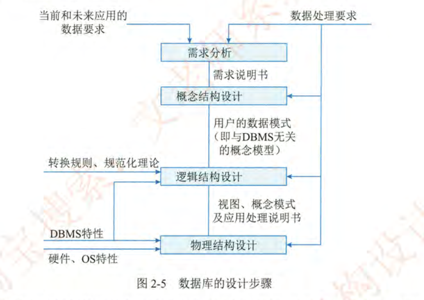

#### 分布式数据库系统（结构和应用）

分布式数据库系统 (Distributed Database System, DDBS) 是一种将数据存储在多个物理位置的数据库系统。DDBS 的结构包括：

- 全局数据字典：存储整个数据库的元数据信息。
- 局部数据字典：存储每个节点的局部元数据信息。
- 全局查询处理器：负责将用户的查询请求分解为多个子查询，并在不同的节点上执行。
- 局部查询处理器：负责在每个节点上执行子查询。
- 事务管理器：负责管理分布式事务，保证数据的一致性和完整性。

DDBS 的应用场景包括：

- 大规模数据存储和处理：将数据分散存储在多个节点上，提高存储容量和处理能力。
- 高可用性：当某个节点发生故障时，系统可以自动切换到其他节点，保证服务的可用性。
- 异地数据访问：允许用户从不同的地理位置访问数据。

分布式数据库的特性软考官方总结为：数据的集中控制性、数据独立性、数据冗余可控性、场地自治性和存取有效性。

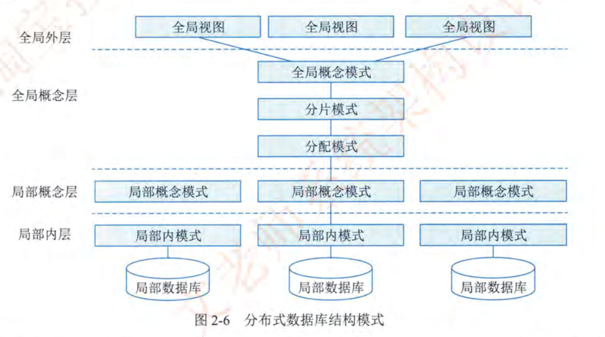

| 产品名称 | 厂商 | 特点 | 适用场景 |
|-|-|-|-|
| Oracle RAC (Real Application Clusters) | Oracle | 高可用性、负载均衡、数据共享 | 大型企业级应用，需要高可用性和可扩展性 |
| IBM DB2 pureScale | IBM | 高可用性、负载均衡、数据共享 | 大型企业级应用，需要高可用性和可扩展性 |
| Microsoft SQL Server Always On Availability Groups | Microsoft | 高可用性、灾难恢复 | Windows 平台上的企业级应用 |
| Apache Cassandra | Apache | 高可扩展性、高容错性、去中心化 | 大规模数据存储和处理，如社交网络、物联网 |
| MongoDB Sharding | MongoDB | 高可扩展性、灵活的数据模型 | Web 应用、移动应用 |
| Amazon Aurora | Amazon | 高性能、高可用性、与 MySQL 和 PostgreSQL 兼容 | 云原生应用，需要高性能和可扩展性 |
| Google Cloud Spanner | Google | 全球分布式、强一致性、高可用性 | 全球范围内的应用，需要强一致性和高可用性 |
| TiDB | PingCAP | 分布式 NewSQL 数据库，支持 ACID 事务和水平扩展 | 金融、电商等需要强一致性和可扩展性的场景 |

#### 数据库管理系统（定义、特点和产品 (Oracle、IBM DB2、Sybase 等)）

数据库管理系统 (Database Management System, DBMS) 是一种用于管理数据库的软件系统。DBMS 的特点包括：

- 数据独立性：应用程序与数据的存储方式和结构无关。
- 数据共享性：多个应用程序可以同时访问和修改数据。
- 数据一致性：保证数据的一致性和完整性。
- 数据安全性：提供数据的安全保护机制。
- 数据可恢复性：提供数据的备份和恢复功能。

常见的 DBMS 产品包括：

- Oracle：一种大型的关系型数据库系统，具有高性能、高可靠性和高安全性。
- IBM DB2：一种大型的关系型数据库系统，适用于企业级应用。
- Sybase：一种关系型数据库系统，适用于金融和电信行业。
- MySQL：一种开源的关系型数据库系统，适用于 Web 应用和中小型企业。
- SQL Server：一种关系型数据库系统，适用于 Windows 平台。
- PostgreSQL：一种开源的关系型数据库系统，具有高度的可扩展性和灵活性。

### 1.3.4 文件系统

#### 文件系统的定义、作用和类型

文件系统 (File System) 是操作系统用于管理磁盘或其他存储设备上的文件和目录的机制。它提供了一种结构化的方式来组织和访问数据，方便用户和应用程序进行文件操作。

文件系统的定义：

- 文件系统是操作系统中负责管理和组织文件的一组软件和数据结构。
- 它定义了文件的存储格式、目录结构、访问权限等，以及文件操作的接口。
- 文件系统将存储设备划分为多个块，并使用元数据（如文件目录、索引等）来跟踪文件的位置和属性。

文件系统的作用：

- 文件组织：将文件和目录组织成层次化的目录结构，方便用户查找和管理文件。
- 存储管理：管理磁盘空间，分配和回收存储块，保证文件的存储和访问效率。
- 文件访问：提供文件操作接口，如创建、删除、读取、写入等，方便用户和应用程序进行文件操作。
- 权限控制：提供文件访问权限控制，保护文件的安全性和隐私。
- 数据完整性：保证数据的完整性和一致性，防止数据丢失和损坏。

文件系统的类型：

| 文件系统类型 | 特点 | 适用场景 | 典型产品 |
|-|-|-|-|
| 磁盘文件系统 | 基于磁盘存储设备，提供文件的存储和访问功能 | 各种操作系统，如 Windows、Linux、macOS 等 | FAT32、NTFS、ext4、HFS+ |
| 网络文件系统 | 基于网络协议，提供远程文件访问功能 | 网络共享、分布式存储 | NFS、SMB/CIFS、AFS |
| 虚拟文件系统 | 抽象的文件系统接口，允许应用程序访问不同类型的文件系统 | 各种操作系统，如 Linux VFS |  |
| 闪存文件系统 | 专门为闪存存储设备设计，优化读写性能和寿命 | 嵌入式系统、固态硬盘 | JFFS2、YAFFS、FAT32 |
| 数据库文件系统 | 将文件存储在数据库中，提供事务支持和数据一致性 | 需要事务支持的文件存储 |  |
| 对象存储 | 将文件作为对象存储，提供可扩展性和高可用性 | 云存储、大数据存储 | Amazon S3、OpenStack Swift |

#### 文件系统的组成和基本原理

文件系统由以下几个主要组成部分构成：

| 组件 | 定义 | 作用 | 存储位置 |
|-|-|-|-|
| 元数据 (Metadata) | 描述文件和目录属性的数据，如文件名、大小、创建时间等 | 用于管理文件和目录，提供文件查找、访问控制等功能 | 通常存储在文件系统的特定区域，如 inode 表（Linux）或 Master File Table (MFT)（NTFS） |
| 目录结构 (Directory Structure) | 组织文件和目录的层次化结构，通常采用树形结构 | 方便用户查找和管理文件，提供文件路径名解析功能 | 目录也是一种特殊的文件，存储了子目录和文件的元数据信息 |
| 文件数据 (File Data) | 文件的实际内容，如文本、图像、音频、视频等 | 存储用户的数据，提供数据的读取和写入功能 | 存储在磁盘或其他存储设备的连续或非连续的存储块中 |
| 存储空间管理 (Storage Space Management) | 管理磁盘或其他存储设备的存储空间，分配和回收存储块 | 提高存储空间的利用率，保证文件的存储和访问效率 | 使用空闲空间列表或位图来跟踪空闲块 |
| 文件访问接口 (File Access Interface) | 提供文件操作的接口，如创建、删除、读取、写入等 | 方便用户和应用程序进行文件操作 | 通过系统调用或 API 提供文件操作接口 |

文件系统的基本原理：

1. 文件组织：文件系统将文件和目录组织成层次化的目录结构，方便用户查找和管理文件。
2. 存储管理：文件系统管理磁盘空间，分配和回收存储块，保证文件的存储和访问效率。
3. 文件访问：文件系统提供文件操作接口，如创建、删除、读取、写入等，方便用户和应用程序进行文件操作。
4. 权限控制：文件系统提供文件访问权限控制，保护文件的安全性和隐私。
5. 数据完整性：文件系统保证数据的完整性和一致性，防止数据丢失和损坏。

文件系统的逻辑结构和物理结构是文件系统设计的两个重要方面，它们分别从不同的角度描述了文件的组织方式。

1. 逻辑结构 (Logical Structure)：
    - 定义：用户或应用程序所看到的文件组织方式，即文件和目录的层次化结构。
    - 特点：
        - 独立于物理存储介质，用户无需关心文件在磁盘上的具体存储位置。
        - 提供文件路径名解析功能，方便用户查找和访问文件。
        - 支持文件和目录的创建、删除、重命名等操作。
        - 提供文件访问权限控制，保护文件的安全性和隐私。
    - 示例：
        - 目录结构：树形目录结构，如 Windows 的目录结构和 Linux 的目录结构。
        - 文件类型：普通文件、目录文件、设备文件等。
        - 文件属性：文件名、大小、创建时间、修改时间、访问权限等。
2. 物理结构 (Physical Structure)：
    - 定义：文件在磁盘或其他存储介质上的实际存储方式，即文件数据的存储块和元数据的存储位置。
    - 特点：
        - 依赖于物理存储介质，如磁盘、闪存等。
        - 涉及存储块的分配和回收、磁盘空间的管理等。
        - 影响文件的存储和访问效率。
        - 对用户和应用程序是透明的，用户无需关心文件的具体存储方式。
    - 示例：
        - 存储块：磁盘上的连续或非连续的存储块，用于存储文件数据。
        - 元数据存储：inode 表（Linux）、Master File Table (MFT)（NTFS）。
        - 存储空间管理：空闲空间列表、位图。

总结：

- 逻辑结构是用户看到的文件的组织方式，关注文件的目录结构、文件类型和文件属性。
- 物理结构是文件在磁盘上的实际存储方式，关注存储块的分配和回收、元数据的存储位置等。
- 逻辑结构和物理结构是相互独立的，逻辑结构为用户提供方便的文件访问接口，物理结构保证文件的存储和访问效率。

#### 文件系统的存取方式和存储管理

文件系统的存取方式和存储管理是文件系统设计的核心问题，它们直接影响文件的存储效率、访问速度和数据安全性。

1. 文件存取方式：
    - 顺序存取：按照文件中数据的先后顺序进行存取，适用于顺序访问的文件，如日志文件、备份文件等。
    - 随机存取：可以随机访问文件中的任何位置，适用于需要频繁修改和访问的文件，如数据库文件、配置文件等。
    - 索引存取：通过索引表来定位文件中的数据，适用于需要快速查找和访问的文件，如大型数据库文件、多媒体文件等。

2. 存储管理：
    - 连续存储：将文件存储在磁盘上的一块连续的存储空间中。
        - 优点：访问速度快，适用于顺序访问的文件。
        - 缺点：容易产生磁盘碎片，存储空间利用率低。
    - 链接存储：将文件存储在磁盘上的多个不连续的存储块中，通过指针将这些存储块链接起来。
        - 优点：存储空间利用率高，可以动态扩展文件大小。
        - 缺点：访问速度慢，不适用于随机访问的文件。
    - 索引存储：为每个文件创建一个索引表，记录文件中每个数据块的存储位置。
        - 优点：访问速度快，适用于随机访问的文件。
        - 缺点：需要额外的存储空间来存储索引表。

3. 空闲空间管理：
    - 空闲区表（Free Space List）：
        - 定义：使用一个表格来记录磁盘上所有空闲的存储区域的信息，包括起始地址和大小。
        - 优点：简单易懂，适用于磁盘空间较小的系统。
        - 缺点：当磁盘碎片较多时，空闲区表会变得很大，影响查找效率。
    - 位示图（Bit Map） -主流-：
        - 定义：使用一个位图来表示磁盘上所有存储块的占用情况，每一位对应一个存储块，0 表示空闲，1 表示已占用。
        - 优点：占用空间小，查找速度快，适用于磁盘空间较大的系统。
        - 缺点：不适合管理连续的空闲块。
    - 空闲块链（Free Block Chain）：
        - 定义：将磁盘上所有空闲的存储块链接成一个链表，每个空闲块包含指向下一个空闲块的指针。
        - 优点：可以动态分配和回收存储块，适用于磁盘空间变化频繁的系统。
        - 缺点：查找速度慢，容易产生磁盘碎片。

文件系统的链接是一种特殊的文件类型，它指向文件系统中已存在的其他文件或目录。链接允许用户通过不同的路径名访问同一个文件或目录，而无需复制文件内容。

文件系统的链接分为两种类型：硬链接和符号链接（软链接）。

1. 硬链接 (Hard Link)：
    - 定义：硬链接是指向文件索引节点（inode）的链接。inode 是文件系统中用于描述文件元数据（如文件大小、权限、创建时间等）的数据结构。
2. 符号链接（软链接） (Symbolic Link or Soft Link)：
    - 定义：符号链接是指向另一个文件或目录的链接，它包含目标文件或目录的路径名。

| 特性 | 硬链接 | 符号链接 |
|-|-|-|
| 指向对象 | inode | 文件或目录的路径名 |
| 跨文件系统 | 否 | 是 |
| 指向目录 | 否 | 是 |
| 删除链接的影响 | 删除链接不影响文件，只有当所有硬链接都被删除时，文件才会被删除 | 删除链接不影响目标文件或目录 |
| 删除目标的影响 | 删除目标文件后，文件仍然可以通过其他硬链接访问 | 删除目标文件后，符号链接失效 |
| 存储空间 | 与文件共享存储空间 | 占用独立的存储空间，存储目标文件或目录的路径名 |

文件系统的访问控制是保护文件安全的重要机制，用于限制用户对文件的访问权限。常见的文件访问控制方法包括访问控制矩阵、访问控制表和用户权限表。

1. 访问控制矩阵 (Access Control Matrix)：
    - 定义：访问控制矩阵是一个二维表格，用于描述每个用户对每个对象的访问权限。
    - 结构：
        - 行：表示用户（User）或主体（Subject），即访问资源的实体。
        - 列：表示对象（Object），即被访问的资源，如文件、目录等。
        - 单元格：表示用户对对象的访问权限，如读、写、执行等。
    - 优点：
        - 完整性：可以清晰地描述每个用户对每个对象的访问权限。
        - 灵活性：可以灵活地设置不同的访问权限。
    - 缺点：
        - 存储空间大：当用户和对象数量很大时，访问控制矩阵会变得非常庞大，占用大量的存储空间。
        - 实现复杂：访问控制矩阵的实现比较复杂，需要维护一个庞大的二维表格。
    - 示例：

    | 用户/对象 | 文件 A | 文件 B | 目录 C |
    |-|-|-|-|
    | 用户 1 | 读、写 |  | 读、执行 |
    | 用户 2 |  | 读 | 读 |
    | 用户 3 | 读 | 写、执行 |  |

2. 访问控制表 (Access Control List, ACL)：
    - 定义：访问控制表是与每个对象关联的列表，用于描述哪些用户可以访问该对象以及他们的访问权限。
    - 结构：
        - 每个对象都有一个 ACL，ACL 中包含多个访问控制项 (Access Control Entry, ACE)。
        - 每个 ACE 描述一个用户或用户组对该对象的访问权限。
    - 优点：
        - 节省存储空间：只存储有访问权限的用户的信息，不需要存储所有用户的访问权限。
        - 实现相对简单：只需要维护每个对象的 ACL。
    - 缺点：
        - 查找效率低：当需要查找某个用户对多个对象的访问权限时，需要遍历多个 ACL。
        - 权限管理复杂：当需要修改某个用户的访问权限时，需要修改多个 ACL。
    - 示例：
        - 文件 A 的 ACL：
            - 用户 1：读、写
            - 用户 3：读
        - 文件 B 的 ACL：
            - 用户 2：读
            - 用户 3：写、执行
        - 目录 C 的 ACL：
            - 用户 1：读、执行
            - 用户 2：读

3. 用户权限表 (User Rights Table)：
    - 定义：用户权限表是与每个用户关联的列表，用于描述该用户可以访问哪些对象以及他们的访问权限。
    - 结构：
        - 每个用户都有一个权限表，权限表中包含多个权限项。
        - 每个权限项描述该用户对某个对象的访问权限。
    - 优点：
        - 查找效率高：当需要查找某个用户对多个对象的访问权限时，只需要查找该用户的权限表。
        - 权限管理简单：当需要修改某个用户的访问权限时，只需要修改该用户的权限表。
    - 缺点：
        - 存储空间大：需要为每个用户都创建一个权限表，占用大量的存储空间。
        - 实现相对复杂：需要维护每个用户的权限表。
    - 示例：
        - 用户 1 的权限表：
            - 文件 A：读、写
            - 目录 C：读、执行
        - 用户 2 的权限表：
            - 文件 B：读
            - 目录 C：读
        - 用户 3 的权限表：
            - 文件 A：读
            - 文件 B：写、执行

| 特性 | 访问控制矩阵 | 访问控制表 (ACL) | 用户权限表 |
|-|-|-|-|
| 存储方式 | 二维表格 | 对象关联列表 | 用户关联列表 |
| 存储内容 | 用户对对象的访问权限 | 用户对对象的访问权限 | 用户对对象的访问权限 |
| 优点 | 完整性、灵活性 | 节省存储空间、实现相对简单 | 查找效率高、权限管理简单 |
| 缺点 | 存储空间大、实现复杂 | 查找效率低、权限管理复杂 | 存储空间大、实现相对复杂 |
| 适用场景 | 用户和对象数量较少的系统 | 用户数量较多，但每个对象的访问用户较少的系统 | 对象数量较多，但每个用户的访问对象较少的系统 |

### 1.3.5 网络协议

#### 局域网协议 (LAN)

局域网（Local Area Network，LAN）是在一个有限区域内（如家庭、学校、办公室或建筑物群）互连计算机和其他设备的网络。LAN 的特点是传输速度快、误码率低、延迟小，通常由私有网络管理。

常见局域网协议：
- 以太网 (Ethernet)： 最流行的 LAN 技术，使用 CSMA/CD 访问控制方法。
- 令牌环网 (Token Ring)： 一种已过时的 LAN 技术，使用令牌传递机制。
- FDDI (Fiber Distributed Data Interface)： 一种使用光纤的 LAN 技术，提供高速数据传输。
- ARP（地址解析协议）： 负责将IP地址转换为物理地址（MAC地址），以便在局域网中进行通信。
- RARP（逆地址解析协议）： 允许局域网中的机器发现自己的IP地址等网络配置信息。

#### 广域网协议 (WAN)

广域网（Wide Area Network，WAN）是覆盖较大地理区域的网络，可以跨越城市、国家甚至全球。WAN 通常由电信运营商或互联网服务提供商 (ISP) 管理，用于连接不同地点的 LAN 和其他网络。

常见广域网协议：
- PPP (Point-to-Point Protocol)： 用于在两个节点之间建立直接连接，常用于拨号上网和专线连接。
- HDLC (High-Level Data Link Control)： 一种面向比特的数据链路层协议，提供可靠的数据传输。
- 帧中继 (Frame Relay)： 一种分组交换技术，提供高速数据传输，但可靠性不如 X.25。
- X.25： 一种早期的分组交换技术，提供可靠的数据传输，但速度较慢。
- MPLS (Multiprotocol Label Switching)： 一种在 IP 网络上进行高速数据转发的技术，常用于 VPN 和流量工程。

#### 无线网协议

无线网络使用无线电波进行数据传输，无需物理电缆连接，提供移动性和灵活性。

常见无线网协议：
- IEEE 802.11 (Wi-Fi)： 最常见的无线局域网标准，提供多种速率和安全选项。
    - 802.11a/b/g/n/ac/ax 等不同版本，提供不同的传输速率和技术特性。
    - WPA/WPA2/WPA3 等安全协议，用于保护无线网络的安全。
- 蓝牙 (Bluetooth)： 一种短距离无线通信技术，用于连接耳机、键盘、鼠标等设备。
- Zigbee： 一种低功耗无线通信技术，适用于物联网设备和传感器网络。

#### 移动网协议

移动网络是用于移动设备（如手机、平板电脑）进行无线通信的网络，提供语音、数据和多媒体服务。

常见移动网协议：
- 2G (GSM/CDMA)： 第二代移动通信技术，提供语音和短信服务。
    - GSM (Global System for Mobile Communications)：全球移动通信系统，使用 TDMA 技术。
    - CDMA (Code Division Multiple Access)：码分多址，提供更好的抗干扰能力。
- 3G (UMTS/CDMA2000)： 第三代移动通信技术，提供高速数据传输和多媒体服务。
    - UMTS (Universal Mobile Telecommunications System)：通用移动通信系统，基于 WCDMA 技术。
    - CDMA2000：CDMA 技术的演进版本，提供更高的数据传输速率。
- 4G (LTE)： 第四代移动通信技术，提供更高的数据传输速率和更低的延迟。
    - LTE (Long Term Evolution)：长期演进，使用 OFDM 技术。
- 5G (NR)： 第五代移动通信技术，提供超高速率、超低延迟和大规模连接。
    - NR (New Radio)：新空口，使用更先进的无线技术。
- GPRS (General Packet Radio Service)： 在GSM网络上提供分组交换数据服务。
- EDGE (Enhanced Data rates for GSM Evolution)： 提高GPRS数据传输速率的技术。
- HSPA (High Speed Packet Access)： 3G的增强版本，提供更快的数据传输速度。

#### TCP/IP 协议集

TCP/IP（Transmission Control Protocol/Internet Protocol，传输控制协议/网际协议）协议集是互联网的基础，它定义了一系列用于在网络上传输数据的协议。TCP/IP 协议集采用分层结构，通常分为四层或五层：

| 层次 | 协议 | 描述 |
|-|-|-|
| 应用层 (Application Layer) | HTTP, FTP, SMTP, DNS 等 | 提供应用程序之间的通信服务，如 Web 浏览、文件传输、电子邮件等。 |
| 传输层 (Transport Layer) | TCP, UDP | 提供端到端的可靠或不可靠的数据传输服务。 |
| 网络层 (Network Layer) | IP, ICMP, ARP, RARP 等 | 负责将数据包从源主机路由到目标主机。 |
| 数据链路层 (Data Link Layer) | Ethernet, Wi-Fi, PPP 等 | 提供物理链路上的数据传输，如以太网、Wi-Fi 等。 |
| 物理层 (Physical Layer) |  | 物理层负责传输比特流，例如以太网使用的双绞线、光纤等。 |

TCP（Transmission Control Protocol，传输控制协议）和 UDP（User Datagram Protocol，用户数据报协议）是 TCP/IP 协议集中传输层的两种主要协议。

| 特性 | TCP | UDP |
|-|-|-|
| 连接 | 面向连接 | 无连接 |
| 可靠性 | 可靠传输，提供数据确认、重传和拥塞控制 | 不可靠传输，不保证数据到达 |
| 顺序 | 保证数据按顺序到达 | 不保证数据按顺序到达 |
| 流量控制 | 提供流量控制，防止拥塞 | 不提供流量控制 |
| 头部开销 | 头部较大（20 字节） | 头部较小（8 字节） |
| 适用场景 | 需要可靠传输的应用，如 Web 浏览、文件传输、电子邮件等 | 需要高速传输的应用，如视频流、在线游戏、VoIP 等 |

### 1.3.6 中间件

#### 中间件的定义、作用和类型

中间件是一种独立的系统软件或服务程序，分布式应用软件借助这种软件在不同的技术之间共享资源。中间件位于客户机/ 服务器的操作系统之上，管理着分布式计算。

中间件的作用：

- 连接性：提供不同系统、应用和服务之间的连接和互操作性。
- 屏蔽性：屏蔽底层操作系统的差异，为应用程序提供统一的接口。
- 可扩展性：支持应用的水平扩展，提高系统的吞吐量和性能。
- 可靠性：提供事务管理、消息队列等机制，保证数据的可靠传输和处理。
- 安全性：提供身份认证、授权、加密等安全功能，保护数据的安全。

中间件的类型：

| 中间件类型 | 描述 | 典型产品 |
|-|-|-|
| 通信处理中间件 | 负责处理网络通信，提供消息传递、远程调用等功能 | IBM MQSeries, RabbitMQ, Apache Kafka |
| 事务处理中间件 | 负责管理事务，保证数据的一致性和完整性 | BEA Tuxedo, IBM CICS, JBoss Transactions |
| 数据存储管理中间件 | 负责管理数据存储，提供数据访问、缓存、复制等功能 | Redis, Memcached, Apache Cassandra |
| Web 服务中间件 | 负责处理 Web 服务请求，提供服务发布、发现、调用等功能 | Apache Tomcat, JBoss AS, IBM WebSphere |
| 安全中间件 | 负责提供安全功能，如身份认证、授权、加密等 | Spring Security, Apache Shiro, IBM Tivoli Access Manager |
| 跨平台和架构的中间件 | 可以在不同的操作系统和硬件架构上运行，提供统一的接口 | Java Virtual Machine (JVM), .NET Common Language Runtime (CLR) |
| 专用平台中间件 | 只能在特定的操作系统或硬件平台上运行 | IBM z/OS 上的 CICS, Windows 上的 COM+ |
| 网络中间件 | 专注于网络功能的中间件，如负载均衡、反向代理、内容分发等 | Nginx, HAProxy, Apache Traffic Server |

#### 中间件的典型软件产品 (IBM MQSeries、BEA Tuxedo)

| 产品名称 | 类型 | 厂商 | 主要功能 | 适用场景 |
|-|-|-|-|-|
| IBM MQSeries (现 IBM MQ) | 消息队列中间件 | IBM | 消息传递、异步通信、事务支持 | 企业级应用集成、金融交易、物联网 |
| BEA Tuxedo (现 Oracle Tuxedo) | 事务处理中间件 | Oracle | 事务管理、负载均衡、高可用性 | 金融交易、电信计费、在线支付 |
| Apache Tomcat | Web 应用服务器 | Apache | Servlet 容器、JSP 支持、Web 服务 | Web 应用、RESTful API |
| JBoss AS (现 Red Hat JBoss EAP) | 应用服务器 | Red Hat | Java EE 应用服务器、事务管理、集群 | 企业级应用、SOA |
| IBM WebSphere Application Server | 应用服务器 | IBM | Java EE 应用服务器、事务管理、安全 | 大型企业级应用、SOA |
| Redis | 键值存储数据库 | Redis Labs | 缓存、会话管理、消息队列 | Web 应用、移动应用 |
| Memcached | 内存对象缓存系统 | 开源 | 缓存、会话管理 | Web 应用、API 缓存 |
| Apache Kafka | 分布式流处理平台 | Apache | 消息队列、流处理、实时数据管道 | 大数据分析、日志收集、事件驱动架构 |
| Nginx | Web 服务器、反向代理、负载均衡器 | Nginx, Inc. | Web 服务器、反向代理、负载均衡 | Web 应用、API 网关 |
| HAProxy | 负载均衡器 | HAProxy Technologies | 负载均衡、高可用性 | Web 应用、数据库集群 |

### 1.3.7 软件构件

#### 软件构件的定义和作用

软件构件是指具有相对独立功能、可复用、可组装的软件单元。构件可以是代码、文档、数据或其他软件元素。

软件构件的作用：

- 提高软件的复用性：构件可以在不同的应用系统中重复使用，减少开发工作量。
- 提高软件的可靠性：构件经过充分的测试和验证，具有较高的可靠性。
- 提高软件的可维护性：构件具有良好的封装性，易于修改和维护。
- 提高软件的开发效率：通过组装已有的构件，可以快速构建新的应用系统。

#### 软件构件的组装模型

软件构件的组装模型是指将多个构件组合成一个完整的应用系统的方法。常见的组装模型包括：

- 基于接口的组装：构件之间通过接口进行交互，接口定义了构件提供的服务和需要的服务。
- 基于消息的组装：构件之间通过消息进行通信，消息定义了构件之间传递的数据和控制信息。
- 基于服务的组装：构件作为服务提供者，通过服务注册和发现机制进行组装。

#### 商用构件标准规范 (CORBA、J2EE 和 DNA 2000 等)

商用构件标准规范是指由标准化组织或厂商制定的构件开发和组装的标准。常见的标准规范包括：

- CORBA (Common Object Request Broker Architecture)：
    - 是一种面向对象的分布式计算标准，定义了构件之间的通信接口和协议。
    - CORBA 构件可以运行在不同的操作系统和编程语言上，具有良好的互操作性。
- J2EE (Java 2 Platform, Enterprise Edition)：
    - 是 Java 平台上用于开发企业级应用的构件标准，定义了 Servlet、JSP、EJB 等构件类型。
    - J2EE 构件可以运行在支持 Java 虚拟机的服务器上，具有良好的可移植性。
- DNA 2000 (Distributed interNet Applications architecture)：
    - 是微软公司提出的一个分布式应用架构，用于构建可扩展、可靠和安全的 Web 应用。
    - DNA 2000 基于 COM+ 组件技术，提供了一系列的构件开发和组装工具。
    - DNA 2000 构件可以运行在 Windows 操作系统上，具有良好的集成性。

CORBA (Common Object Request Broker Architecture) 是一种开放的、与厂商无关的分布式对象计算体系结构。为了实现 CORBA，有许多不同的产品和实现可供选择。以下是一些常见的 CORBA 配套产品实现：

| 产品名称 | 厂商 | 描述 |
|-|-|-|
| Orbix | IONA Technologies (Progress Software 收购) | 一种流行的 CORBA 实现，支持多种编程语言和平台。 |
| VisiBroker | Borland (Micro Focus 收购) | 另一款流行的 CORBA 实现，提供高性能和可扩展性。 |
| TAO (The ACE ORB) | Douglas C. Schmidt (开源) | 一种开源的 CORBA 实现，基于 ACE (Adaptive Communication Environment) 框架。 |
| JacORB | Freie Universität Berlin (开源) | 一种用 Java 编写的开源 CORBA 实现。 |
| MICO (MICO Is COrba) | University of Frankfurt (开源) | 另一种开源的 CORBA 实现，用 C++ 编写。 |
| OpenORB | University of Cambridge (开源) | 一种用 Python 编写的开源 CORBA 实现。 |
| omniORB | AT&T Laboratories Cambridge (开源) | 一种开源的 C++ ORB，支持多种平台。 |

这些 CORBA 实现提供了不同的功能和特性，可以根据具体的应用需求进行选择。例如，Orbix 和 VisiBroker 是商业产品，提供更多的企业级功能和支持；TAO 和 JacORB 是开源产品，更适合于研究和开发。

COM、DCOM 和 COM+ 是 Microsoft 的组件对象模型 (Component Object Model) 技术，用于实现软件组件的互操作性和重用。

1. COM (Component Object Model)：
    - 定义：COM 是一种二进制接口标准，允许不同的软件组件在同一台机器上进行交互，而无需关心它们的实现语言或开发工具。
    - 特点：
        - 基于接口：COM 组件通过接口暴露其功能，客户端通过接口访问组件。
        - 语言无关：COM 组件可以使用任何支持 COM 接口的编程语言（如 C++, VB）开发。
        - 进程内/外：COM 组件可以运行在客户端进程内部（In-Proc）或外部（Out-of-Proc）。
    - 用途：实现组件的重用和互操作性，构建模块化的应用程序。
2. DCOM (Distributed Component Object Model)：
    - 定义：DCOM 是 COM 的扩展，允许 COM 组件在不同的机器上进行交互。
    - 特点：
        - 分布式：DCOM 组件可以运行在不同的机器上，通过网络进行通信。
        - 基于 RPC：DCOM 使用远程过程调用 (RPC) 技术实现组件之间的通信。
        - 安全：DCOM 提供安全机制，如身份验证和授权，保护组件的安全。
    -   用途：构建分布式应用程序，实现跨机器的组件协作。
3. COM+：
    - 定义：COM+ 是 COM 的进一步扩展，提供了一系列企业级服务，如事务管理、对象池、消息队列等。
    - 特点：
        - 企业级服务：COM+ 提供事务、安全、并发等企业级服务，简化了分布式应用的开发。
        - 声明式编程：COM+ 允许通过声明式配置来管理事务、安全等服务，无需编写大量的代码。
        - 组件生命周期管理：COM+ 容器负责管理组件的生命周期，如创建、激活、销毁等。
    - 用途：构建企业级分布式应用，简化开发和管理。

总结：
- COM 是组件对象模型的基础，用于实现本地组件的互操作性。
- DCOM 是 COM 的分布式扩展，用于实现跨机器的组件协作。
- COM+ 是 COM 的企业级扩展，提供事务、安全等服务，简化分布式应用的开发。

### 1.3.8 应用软件

#### 通用软件的定义、范围和类别

略

#### 专用软件的定义、范围和类别

略

## 1.4 嵌入式系统及软件

### 1.4.1 嵌入式系统的组成及特点

#### 嵌入式系统的定义、组成和用途

组成：嵌入式处理器、相关支撑硬件、嵌入式操作系统、支撑软件以及应用软件。

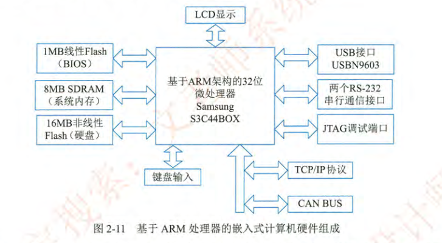

#### 嵌入式处理器及支撑硬件、环境要求及特点

特点：专用性强、技术融合、软硬一体、比通用计算机资源少、程序代码固化、需专门开发工具和环境、体积小价格低工艺先进，性价比高配置要求低实时性强、安全性可靠性要求高

> 这本教材的特点总结狗屁不通

#### 嵌入式软件集成开发环境

开发环境和运行环境分离，开发环境被称为宿主机，运行环境被称为目标机

> 其实也是扯淡，生产环境和开发环境怎么可能在一台机器上

### 1.4.2 嵌入式系统分类

#### 嵌入式系统、(强/弱)实时系统、安全攸关系统

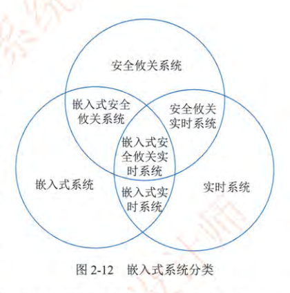

> 功能性、实时性、安全性

### 1.4.3 嵌入式软件的组成及特点

#### 嵌入式软件的架构和特点

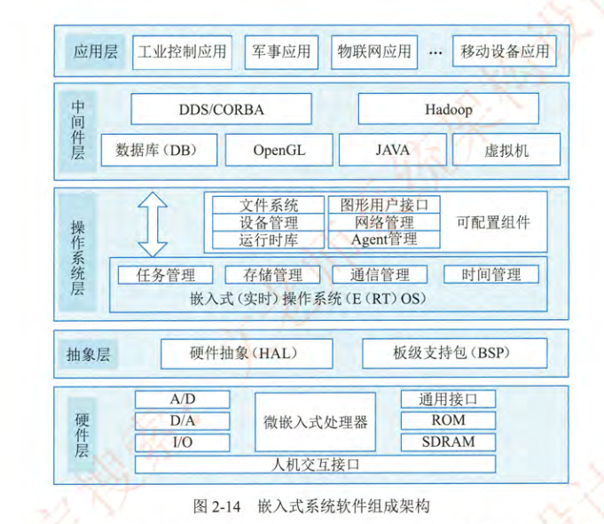

> 这写的是些什么狗屁，边缘侧软件和中心侧没有任何标识，怎么，在 TM 边缘机上部署 Hadoop 么？这章真 TM 是个外行写的

软件特点：可剪裁性、可配置性、强实时性、安全性、可靠性、高确定性。

> 模块化、高敏感、高可用

#### 嵌入式软件开发与传统软件开发方法的差异

- 嵌入式软件开发是在宿主机 ( PC 机或工作站 ) 上使用专门的嵌入式工具开发 , 生成二进制代码后 , 需要使用工具卸载到目标机或固化在目标机储存器上运行
- 嵌入式软件开发时更强调软 / 硬件协同工作的效率和稳定性
- 嵌入式软件开发的结果通常需要固化在目标系统的储存器或处理器内部储存器资源中
- 嵌入式软件的开发一般需要专门的开发工具 、 目标系统和测试设备
- 嵌入式软件对实时性的要求更高
- 嵌入式软件对安全性和可靠性的要求较高
- 嵌入式软件开发是要充分考虑代码规模
- 在安全攸关系统中的嵌入式软件 , 其开发还应满足某些领域对设计和代码审定
- 模块化设计即将一个较大的程序按功能划分成若干程序模块 , 每个模块实现特定的功能

> 定制化开发环境、充分考虑工作环境因素、容量与计算性能考虑程度更高、除了这些，其他的都是狗屁不通

### 1.4.4 安全攸关软件的安全性设计

#### 安全攸关软件的定义和作用

定义：用于一个系统中、可能导致不可接受的风险的软件。

#### 安全性设计方法：DO-178 目的、安全等级划分和生命周期等

DO-178（Software Considerations in Airborne Systems and Equipment Certification）是由 RTCA（Radio Technical Commission for Aeronautics）制定的一项针对航空电子设备和系统中的软件开发过程的行业标准。

1. 目的：
    - DO-178 的主要目的是确保航空电子设备和系统中的软件是安全可靠的，以保障飞行安全。
    - 该标准提供了一套全面的软件开发指南，涵盖了软件需求、设计、编码、测试、验证和配置管理等各个方面。
2. 安全等级划分：
    - DO-178 将软件的安全性划分为五个等级（A 到 E），等级越高，对软件的安全性要求越高。
    - 安全等级的划分基于软件故障可能造成的潜在影响：
        - A 级：软件故障可能导致灾难性后果，如飞机坠毁。
        - B 级：软件故障可能导致严重后果，如人员伤亡。
        - C 级：软件故障可能导致重大后果，如飞行性能下降。
        - D 级：软件故障可能导致轻微后果，如乘客不适。
        - E 级：软件故障不会对飞行安全产生影响。
3. 生命周期：
    - DO-178 定义了软件开发的生命周期，包括以下阶段：
        - 软件需求分析：确定软件的功能和性能需求，以及安全需求。
        - 软件设计：将软件需求转换为详细的设计方案。
        - 软件编码：根据设计方案编写代码。
        - 软件测试：对代码进行单元测试、集成测试和系统测试，验证软件是否满足需求。
        - 软件验证：对软件进行形式化验证、代码审查和静态分析，确保软件的正确性和可靠性。
        - 软件配置管理：对软件的配置进行管理，确保软件的可追溯性和一致性。
4. DO-178B 和 DO-178C：
    - DO-178B 是 DO-178 的一个重要版本，于 1992 年发布，被广泛应用于航空电子软件开发。
    - DO-178C 是 DO-178B 的修订版本，于 2011 年发布，主要增加了对形式化方法和面向对象技术的支持。
5. 符合 DO-178 的软件开发过程需要进行严格的文档记录和审查，以确保软件的质量和安全性。
6. DO-178 是航空电子软件开发领域最权威的标准之一，被 FAA（美国联邦航空管理局）、EASA（欧洲航空安全局）等航空监管机构广泛认可和采用。

| 过程 | 描述 |
|-|-|
| 软件计划过程 | 建立软件开发、验证和配置管理的计划。 |
| 软件需求过程 | 确定软件的功能、性能和安全需求。 |
| 软件设计过程 | 将软件需求转换为详细的设计方案。 |
| 软件编码过程 | 根据设计方案编写代码。 |
| 软件集成过程 | 将各个软件模块集成成完整的软件系统。 |
| 软件测试过程 | 对代码进行单元测试、集成测试和系统测试，验证软件是否满足需求。 |
| 软件验证过程 | 对软件进行形式化验证、代码审查和静态分析，确保软件的正确性和可靠性。 |
| 软件配置管理过程 | 对软件的配置进行管理，确保软件的可追溯性和一致性。 |
| 软件质量保证过程 | 确保软件开发过程符合质量标准和规范。 |
| 软件工具鉴定过程 | 评估和确认软件开发工具的适用性和可靠性。 |

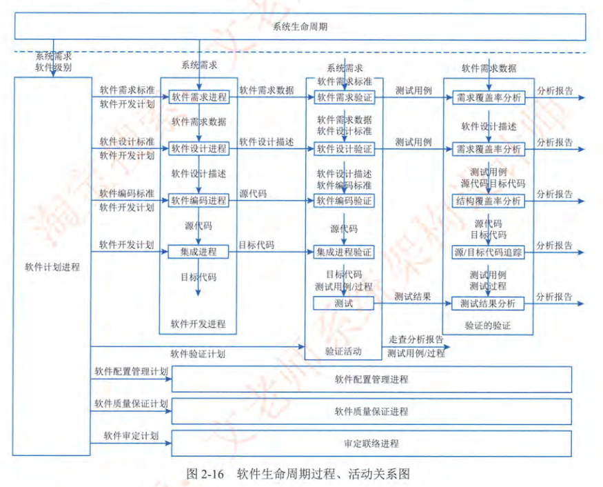

> 核心：目标、过程（进程）、数据

## 1.5 计算机网络

### 1.5.1 网络的基本概念

#### 计算机网络发展的四个阶段

计算机网络发展的四个阶段：

| 阶段 | 时间 | 特点 | 主要应用 |
|-|-|-|-|
| 诞生阶段：面向终端的计算机通信网络 | 20 世纪 60 年代 | 以单个计算机为中心，通过终端连接到主机 | 远程终端访问、数据采集 |
| 形成阶段：计算机 - 计算机网络 | 20 世纪 70 年代 | 多台计算机互连，实现文件传输和资源共享 | 文件传输、电子邮件 |
| 互联互通阶段：开放式标准化网络 | 20 世纪 80 年代 | 采用 TCP/IP 协议，实现不同网络之间的互联互通 | 互联网、企业网 |
| 告诉发展阶段：高速互联网络 | 20 世纪 90 年代至今 | 强调高速数据传输和多媒体应用 | 宽带互联网、移动互联网 |

> 点对点、点对面、面对面、多类型终端

#### 基本功能：数据通信、资源共享、管理集中化、分布式处理和负荷均衡

略

#### 基本指标：速率、带宽、吞吐量、时延和利用率等

在计算机网络中，以下是一些重要的性能指标：

| 指标 | 定义 | 单位 | 影响因素 | 典型值 |
|-|-|-|-|-|
| 速率 (Speed) | 指数据在网络中传输的速度，也称为数据传输速率或比特率。 | bit/s (比特每秒), kbps, Mbps, Gbps, Tbps | 信道带宽、调制技术、编码方式 | 10 Mbps (以太网), 1 Gbps (千兆以太网), 10 Gbps (万兆以太网) |
| 带宽 (Bandwidth) | 指信道或网络的最大数据传输能力，表示在单位时间内可以传输的数据量。 | Hz (赫兹) 或 bit/s (比特每秒) | 物理介质、传输技术 | 10 MHz (模拟信道), 100 Mbps (以太网), 1 Gbps (光纤) |
| 吞吐量 (Throughput) | 指在单位时间内实际成功传输的数据量，受到网络拥塞、设备性能等因素的影响。 | bit/s (比特每秒) 或 packet/s (包每秒) | 网络拥塞、设备性能、协议开销 | 小于或等于带宽 |
| 时延 (Latency) | 指数据从源端发送到目标端所需的时间，包括发送时延、传播时延、排队时延和处理时延。 | s (秒), ms (毫秒), μs (微秒) | 传输距离、网络拥塞、设备处理能力 | 几毫秒到几百毫秒 |
| 利用率 (Utilization) | 指网络或设备的实际使用率，表示网络或设备在一段时间内繁忙程度。 | % (百分比) | 流量负载、设备容量 | 0% 到 100% |

在实际应用中，需要综合考虑这些指标，以优化网络性能，提高用户体验。

| 概念 | 比特（Bit） | 字节（Byte） |
|-|-|-|
| 定义 | 计算机中最小的数据单位，表示一个二进制位，可以是 0 或 1。 | 计算机中常用的数据单位，由 8 个比特组成。 |
| 符号 | b | B |
| 容量 | 只能表示两种状态（0 或 1） | 可以表示 256 种不同的状态（2^8） |
| 换算关系 |  | 1 字节 = 8 比特 |
| 应用 | 用于表示开关状态、逻辑值等 | 用于存储字符、数字、图像等 |

在计算机存储容量的计量中，存在两种不同的标准：一种是以 1000 为基数的十进制标准，另一种是以 1024 为基数的二进制标准。

1. 十进制标准：
    - 采用 1000 作为进率，即 1 KB = 1000 字节，1 MB = 1000 KB，1 GB = 1000 MB，以此类推。
    - 这种标准通常用于硬盘制造商，因为它可以使硬盘的容量看起来更大。
    - 单位符号：KB、MB、GB、TB 等。
2. 二进制标准：
    - 采用 1024 作为进率，即 1 KiB = 1024 字节，1 MiB = 1024 KiB，1 GiB = 1024 MiB，以此类推。
    - 这种标准更符合计算机的存储方式，因为计算机中的数据是以二进制形式存储的。
    - 单位符号：KiB、MiB、GiB、TiB 等。

由于这两种标准的存在，可能会导致在实际使用中出现容量差异。例如，一个标称容量为 1 TB 的硬盘，在计算机中显示的容量可能只有 931 GiB 左右。这是因为硬盘制造商采用的是十进制标准，而操作系统采用的是二进制标准。

为了区分这两种标准，国际电工委员会（IEC）制定了一套新的单位符号，用于表示以 1024 为基数的存储容量：

| 单位符号 | 名称 | 换算关系 |
|-|-|-|
| KiB | 千比字节（Kibibyte） | 1 KiB = 1024 字节 |
| MiB | 兆比字节（Mebibyte） | 1 MiB = 1024 KiB |
| GiB | 吉比字节（Gibibyte） | 1 GiB = 1024 MiB |
| TiB | 太比字节（Tebibyte） | 1 TiB = 1024 GiB |
| PiB | 拍比字节（Pebibyte） | 1 PiB = 1024 TiB |
| EiB | 艾比字节（Exbibyte） | 1 EiB = 1024 PiB |
| ZiB | 泽比字节（Zebibyte） | 1 ZiB = 1024 EiB |
| YiB | 尧比字节（Yobibyte） | 1 YiB = 1024 ZiB |

因此，1 GB（Gigabyte）等于 1000^3 字节，而 1 GiB（Gibibyte）等于 1024^3 字节。

### 1.5.2 通信技术

#### 基本知识：信道、信号变换、复用和多址、5G 通信网

香农公式（Shannon's Formula）是信息论中的一个重要公式，用于计算在给定信噪比（Signal-to-Noise Ratio，SNR）和带宽（Bandwidth）的信道中，理论上可以实现的最大数据传输速率（信道容量，Channel Capacity）。香农公式的数学表达式如下：

$C = B \log_2(1 + \frac{S}{N})$

其中：

- $C$：信道容量（Channel Capacity），表示信道在理想情况下可以实现的最大数据传输速率，单位为 bit/s（比特每秒）。
- $B$：信道带宽（Bandwidth），表示信道可以传输的频率范围，单位为 Hz（赫兹）。
- $S$：信号功率（Signal Power），表示信号的平均功率，单位为 W（瓦特）。
- $N$：噪声功率（Noise Power），表示噪声的平均功率，单位为 W（瓦特）。
- $\frac{S}{N}$：信噪比（Signal-to-Noise Ratio，SNR），表示信号功率与噪声功率之比，通常以分贝（dB）为单位表示。

信噪比的计算公式如下：

$SNR_{dB} = 10 \log_{10}(\frac{S}{N})$

香农公式表明，信道容量与信道带宽和信噪比成正比。也就是说，信道带宽越大，信噪比越高，信道容量就越大，可以实现的数据传输速率就越高。

香农公式是一个理论上的极限值，实际的数据传输速率通常会低于香农公式计算出的信道容量，因为实际的通信系统会受到各种因素的影响，如信道衰落、干扰、编码效率等。

| 步骤 | 描述 |
|-|-|
| 1. 信号编码 |  |
| 1.1. 采样 | 将连续的模拟信号在时间上离散化，转换为离散的采样值。 |
| 1.2. 量化 | 将离散的采样值在幅度上离散化，转换为有限个量化级别。 |
| 1.3. 编码 | 将量化后的采样值转换为二进制码流。 |
| 1.4. 交织 | 重新排列编码后的数据，以减少突发错误的影响。 |
| 2. 调制 | 将数字信号转换为模拟信号，以便在模拟信道上传输。常见的调制方式包括幅度调制（AM）、频率调制（FM）和相位调制（PM）。 |
| 3. 脉冲成形 | 对调制后的信号进行脉冲成形，以减小信号的带宽和码间干扰。 |
| 4. 信号放大 | 放大信号的功率，以提高信号的传输距离和抗干扰能力。 |
| 5. 信道传输 | 将信号通过信道（如有线信道、无线信道或光纤信道）传输到接收端。 |
| 6. 信号接收 | 接收端接收到信号后，进行信号放大和滤波，以提高信号的质量。 |
| 7. 解调 | 将模拟信号转换为数字信号，以便进行后续处理。 |
| 8. 信号解码 |  |
| 8.1. 解码 | 将接收到的二进制码流转换为量化后的采样值。 |
| 8.2. 解交织 | 按照交织的反向操作，恢复原始数据排列顺序。 |
| 8.3. 反量化 | 将量化后的采样值转换为离散的采样值。 |
| 8.4. 滤波 | 对离散的采样值进行滤波，以平滑信号并去除噪声。 |

| 技术 | 描述 | 优点 | 缺点 | 应用 |
|-|-|-|-|-|
| 频分复用 (Frequency Division Multiplexing, FDM) | 将信道带宽划分为多个互不重叠的频带，每个用户占用一个频带进行通信。 | 实现简单，技术成熟。 | 频带利用率低，容易产生频率干扰。 | 模拟通信系统，如广播、电视。 |
| 时分复用 (Time Division Multiplexing, TDM) | 将信道时间划分为多个时隙，每个用户在不同的时隙内进行通信。 | 信道利用率高，适用于数字通信。 | 需要精确的同步，容易产生时隙冲突。 | 数字通信系统，如电话、数据传输。 |
| 波分复用 (Wavelength Division Multiplexing, WDM) | 将光纤信道划分为多个波长，每个用户占用一个波长进行通信。 | 带宽利用率高，适用于光纤通信。 | 设备成本高，波长管理复杂。 | 光纤通信系统，如光纤网络、海底光缆。 |
| 码分复用 (Code Division Multiplexing, CDM) | 为每个用户分配一个唯一的码序列，通过码序列来区分不同的用户。 | 抗干扰能力强，适用于无线通信。 | 实现复杂，需要精确的功率控制。 | 无线通信系统，如 CDMA、3G。 |
| 空分复用 (Space Division Multiplexing, SDM) | 利用空间资源进行复用，如多天线技术、扇区化技术等。 | 提高信道容量，适用于无线通信。 | 实现复杂，需要精确的信道估计。 | 无线通信系统，如 4G、5G。 |
| 正交频分复用 (Orthogonal Frequency Division Multiplexing, OFDM) | 将信道带宽划分为多个正交的子载波，每个子载波上进行数据传输。 | 抗多径衰落能力强，频谱利用率高。 | 实现复杂，对同步要求高。 | 无线通信系统，如 Wi-Fi、4G。 |

> 频分（正交频分）、时分、波分、码分、空分（扇区方向）

### 1.5.3 网络技术

#### 局域网 (LAN) (五类拓扑和以太网技术)

星状拓扑、树状拓扑、总线拓扑、环形拓扑、网状拓扑

| 字段 | 长度（字节） | 描述 |
|-|-|-|
| 前导码（Preamble）（全双工） | 7 | 用于同步接收端的时钟信号 |
| 帧起始定界符（SFD）（全双工） | 1 | 标志着帧的开始 |
| 目的 MAC 地址（DMAC） | 6 | 接收方的物理地址 |
| 源 MAC 地址(SMAC) | 6 | 发送方的物理地址 |
| 类型/长度(TYPE/LENGTH) | 2 | 指示上层协议类型或数据字段的长度 |
| 数据(DATA) | 46-1500 | 实际传输的数据 |
| 帧校验序列（FCS） | 4 | 用于检测帧在传输过程中是否发生错误 |

分帧与最小帧长度（64 byte）（帧填充）

> 最小帧长度的原理性解释，放屁闻到屎味的时候我已经跑到隔壁房间了，你怎么说屁是我放的，木有证据好吧？

| 通信模式 | 描述 | 优点 | 缺点 | 应用 |
|-|-|-|-|-|
| 单工 (Simplex) | 只能在一个方向上传输数据，一方只能发送，另一方只能接收。 | 实现简单，成本低。 | 无法进行双向交互。 | 广播、电视。 |
| 半双工 (Half-Duplex) | 可以在两个方向上传输数据，但同一时刻只能在一个方向上传输。 | 节省信道资源。 | 需要进行方向切换，效率较低。 | 对讲机、早期以太网（使用集线器）。 |
| 全双工 (Full-Duplex) | 可以在两个方向上同时传输数据。 | 效率高，可以同时进行双向交互。 | 需要更多的信道资源，实现复杂。 | 现代以太网（使用交换机）、电话。 |

反压（Backpressure）是一种在数据流处理系统中用于控制数据流速的机制，以防止系统被高速数据流压垮。当数据源产生数据的速度超过了数据处理节点或消费节点能够处理的速度时，就会产生反压。

反压的主要目的是确保数据处理的稳定性和可靠性，防止数据丢失或系统崩溃。通过反压机制，下游节点可以向上游节点发出信号，告知其降低数据发送速率，从而使整个系统达到一个平衡状态。

以下是反压的一些关键概念和实现方式：

1. 产生原因：
    - 数据源速度过快：数据源（如传感器、消息队列等）产生数据的速度超过了下游节点的处理能力。
    - 处理节点瓶颈：数据处理节点（如计算节点、存储节点等）的处理能力不足，无法及时处理接收到的数据。
    - 网络拥塞：网络带宽不足或网络延迟过高，导致数据传输速度受限。
2. 常见解决方案：
    - 流量控制：下游节点向上游节点发送信号，要求其降低数据发送速率。
    - 缓冲：在节点之间设置缓冲区，用于临时存储未能及时处理的数据。
    - 熔断：当下游节点出现故障时，上游节点停止向其发送数据，防止资源浪费。
    - 降级：当下游节点负载过高时，上游节点降低数据质量或减少数据量，以减轻下游节点的压力。
3. 实现方式：
    - 基于 Credit 的反压：下游节点维护一个 Credit 计数器，表示其能够处理的数据量。每当上游节点发送数据时，下游节点减少 Credit 计数器。当 Credit 计数器为零时，上游节点停止发送数据，直到下游节点再次发送 Credit 信号。
    - 基于令牌的反压：下游节点定期向上游节点发送令牌，表示其能够处理的数据量。上游节点只有在收到令牌后才能发送数据。
    - 基于窗口的反压：下游节点维护一个滑动窗口，表示其能够处理的数据量。上游节点根据滑动窗口的大小来调整数据发送速率。
4. 适用场景：
    - 流式计算：如 Apache Kafka、Apache Flink、Apache Spark Streaming 等。
    - 消息队列：如 RabbitMQ、RocketMQ 等。
    - 微服务架构：用于保护服务之间的调用链，防止雪崩效应。
5. 优点：
    - 提高系统稳定性：防止系统被高速数据流压垮，保证数据处理的稳定性和可靠性。
    - 防止数据丢失：通过流量控制和缓冲机制，避免数据在传输过程中丢失。
    - 提高资源利用率：通过熔断和降级机制，避免资源浪费，提高系统整体性能。

> 反压：冲刺阶段女方喊“到了”
> 帧前导（PAUSE）：冲刺阶段女方喊“暂停30秒”

#### 无线局域网 (WLAN) (WLAN 标准和三类拓扑)

| 标准 | 频率 | 带宽 | 速率 | 特点 |
|-|-|-|-|-|
| 802.11a | 5 GHz | 20 MHz | 54 Mbps | 较短的传输距离，易受干扰 |
| 802.11b | 2.4 GHz | 22 MHz | 11 Mbps | 传输距离较远，但速率较低 |
| 802.11g | 2.4 GHz | 20 MHz | 54 Mbps | 兼容 802.11b，速率较高 |
| 802.11n | 2.4/5 GHz | 20/40 MHz | 600 Mbps | 支持 MIMO，速率高，覆盖范围广 |
| 802.11ac | 5 GHz | 20/40/80/160 MHz | 1.73 Gbps | 支持 MU-MIMO，速率更高 |
| 802.11ax (Wi-Fi 6) | 2.4/5/6 GHz | 20/40/80/160 MHz | 9.6 Gbps | 支持 OFDMA，效率更高，延迟更低 |

WLAN 拓扑结构

| 拓扑结构 | 描述 | 优点 | 缺点 |
|-|-|-|-|
| 星型拓扑 | 所有设备都连接到一个中心接入点 (AP)。 | 易于管理和维护，故障隔离性好。 | 中心 AP 故障会影响整个网络。 |
| 扩展星型拓扑 | 多个星型网络通过主干网络连接。 | 扩展性好，可以连接更多的设备。 | 结构复杂，管理难度大。 |
| Ad-hoc 拓扑 | 设备之间直接连接，无需中心 AP。 | 部署简单，成本低。 | 传输距离有限，安全性差。 |

> 教材里的傻吊分类，点对点，HUB型，完全分布型，我他妈就不清楚什么叫做什么他妈的完全分布型。（猜测是蜂窝网络中的动态路由）

#### 广域网 (WAN)

广域网（Wide Area Network，WAN）是覆盖较大地理区域的网络，可以跨越城市、国家甚至全球。WAN 通常由电信运营商或互联网服务提供商 (ISP) 管理，用于连接不同地点的 LAN 和其他网络。

| 特点 | 描述 |
|-|-|
| 覆盖范围广 | WAN 可以覆盖城市、国家甚至全球，连接不同地点的网络。 |
| 传输速率低 | 相比 LAN，WAN 的传输速率较低，延迟较高。 |
| 成本高 | WAN 的建设和维护成本较高。 |
| 复杂性高 | WAN 的网络结构复杂，管理难度大。 |
| 可靠性要求高 | WAN 需要提供高可靠性的数据传输服务。 |

WAN 的分类：

| 类型 | 描述 | 典型技术 |
|-|-|-|
| 电路交换 WAN | 基于电路交换技术，提供独占的物理连接。 | PSTN、ISDN |
| 分组交换 WAN | 基于分组交换技术，将数据分成小的数据包进行传输。 | X.25、帧中继、ATM |
| 专线 WAN | 提供点到点的专用线路连接。 | T1/E1、T3/E3 |
| 虚拟专用网 (VPN) | 通过公共网络建立安全的加密连接。 | IPsec VPN、SSL VPN |
| 软件定义 WAN (SD-WAN) | 通过软件控制和管理 WAN 连接。 | SD-WAN |

常见的 WAN 相关技术：

| 技术 | 描述 | 优点 | 缺点 |
|-|-|-|-|
| 帧中继 (Frame Relay) | 一种分组交换技术，提供高速数据传输。 | 速率高，成本相对较低。 | 可靠性不如 X.25。 |
| ATM (Asynchronous Transfer Mode) | 一种面向连接的分组交换技术，提供高质量的服务。 | 支持多种业务，QoS 保证。 | 成本高，复杂性高。 |
| MPLS (Multiprotocol Label Switching) | 一种在 IP 网络上进行高速数据转发的技术。 | 转发速度快，支持 VPN 和流量工程。 | 配置复杂，成本较高。 |
| SD-WAN (Software-Defined WAN) | 一种通过软件控制和管理 WAN 连接的技术。 | 灵活性高，易于管理，降低成本。 | 安全性需要特别关注。 |

> 教材：同步光网络 SONET ，数字数据网 DDN，帧中继，异步传输 ATM。
> 特点：面向数据通信（废话），范围广，没有固定拓扑结构（也是废话），电信部门或者专项组织运营
> 分类：公共、专用、无线

#### 城域网 (MAN)

分布式队列双总线（Distributed Queue Dual Bus，DQDB）是一种用于城域网（MAN）的媒体访问控制协议。它基于双总线结构，提供了一种高效的、公平的访问机制，适用于传输各种类型的数据，包括语音、视频和数据。

DQDB 的主要特点：

| 特点 | 描述 |
|-|-|
| 双总线结构 | 使用两条单向总线进行数据传输，一条总线用于发送数据，另一条总线用于接收数据。 |
| 分布式队列 | 每个节点维护一个虚拟队列，用于记录等待发送的数据包。 |
| 预留机制 | 节点在发送数据之前，需要先在总线上预留时隙，以避免冲突。 |
| 公平性 | 通过复杂的算法，保证每个节点都有公平的访问机会。 |
| 支持多种业务 | 可以传输各种类型的数据，包括语音、视频和数据。 |

DQDB 的工作原理：

1. 节点在发送数据之前，需要先监听两条总线，确定是否有空闲时隙。
2. 如果有空闲时隙，节点会在发送总线上发送一个请求信号，表示需要预留一个时隙。
3. 接收总线上的所有节点都会监听请求信号，并更新自己的虚拟队列。
4. 当节点收到一个允许信号时，表示可以发送数据。
5. 节点在发送总线上发送数据，并在接收总线上接收数据。

DQDB 的优点：

| 优点 | 描述 |
|-|-|
| 高效性 | 通过预留机制，可以避免冲突，提高传输效率。 |
| 公平性 | 通过复杂的算法，保证每个节点都有公平的访问机会。 |
| 支持多种业务 | 可以传输各种类型的数据，包括语音、视频和数据。 |

DQDB 的缺点：

| 缺点 | 描述 |
|-|-|
| 复杂性 | 算法复杂，实现难度大。 |
| 可扩展性差 | 随着节点数量的增加，性能会下降。 |
| 已经被淘汰 | 已经被更先进的技术所取代。 |

DQDB 是一种早期的城域网技术，虽然已经逐渐被淘汰，但它的一些思想和技术仍然对后来的网络技术产生了影响。

DQDB（分布式队列双总线）技术由于其复杂性和可扩展性差等缺点，逐渐被更先进的技术所取代，如：

- 以太网 (Ethernet)： 以太网技术简单易用、成本低廉、易于扩展，逐渐成为城域网的主流技术。
- 光纤技术 (Fiber Optics)： 光纤技术具有高带宽、低延迟、抗干扰能力强等优点，适用于构建高速城域网。
- 多协议标签交换 (MPLS)： MPLS 是一种在 IP 网络上进行高速数据转发的技术，可以提供更好的服务质量和流量工程能力。
- 无源光网络 (PON)： PON 是一种基于光纤的点对多点接入技术，具有高带宽、低成本等优点，适用于构建光纤到户 (FTTH) 的城域网。
- 软件定义网络 (SDN)： SDN 是一种新型的网络架构，通过软件控制和管理网络资源，可以实现更灵活、更高效的网络管理。

> 淘汰了傻逼

#### 移动通信网 (发展、特征和服务化架构)

5G 移动通信网的特点：

| 特点 | 描述 |
|-|-|
| 高速率 | 5G 提供比 4G 更高的数据传输速率，理论峰值速率可达 10 Gbps 以上。 |
| 低延迟 | 5G 的延迟更低，端到端延迟可低至 1 毫秒，适用于对延迟敏感的应用。 |
| 大规模连接 | 5G 支持更多的设备连接，每平方公里可连接数百万个设备，适用于物联网应用。 |
| 网络切片 | 5G 支持网络切片技术，可以将物理网络划分为多个虚拟网络，每个虚拟网络满足不同的应用需求。 |
| 边缘计算 | 5G 支持边缘计算技术，可以将计算和存储资源部署在网络的边缘，减少数据传输延迟。 |

5G 采用服务化架构（Service-Based Architecture，SBA），将网络功能（Network Function，NF）设计为独立的服务，通过标准化的接口进行交互。SBA 的优点包括：

| 优点 | 描述 |
|-|-|
| 灵活性 | 可以根据需求灵活地组合和部署网络功能。 |
| 可扩展性 | 可以方便地添加和删除网络功能。 |
| 可靠性 | 可以通过冗余和容错机制提高网络的可靠性。 |
| 互操作性 | 可以支持不同厂商的网络功能之间的互操作。 |

5G 的网元（Network Function）分类：

| 网元名称 | 简称 | 功能描述 |
|-|-|-|
| 接入和移动性管理功能 | AMF (Access and Mobility Management Function) | 负责用户接入、移动性管理、认证和授权等功能。 |
| 会话管理功能 | SMF (Session Management Function) | 负责会话管理、IP 地址分配、QoS 控制等功能。 |
| 用户面功能 | UPF (User Plane Function) | 负责用户数据的转发和处理。 |
| 网络切片选择功能 | NSSF (Network Slice Selection Function) | 负责根据用户的需求选择合适的网络切片。 |
| 策略控制功能 | PCF (Policy Control Function) | 负责制定和执行网络策略。 |
| 应用功能 | AF (Application Function) | 负责与应用服务器进行交互，提供应用服务。 |
| 认证服务器功能 | AUSF (Authentication Server Function) | 负责用户身份的认证。 |
| 网络存储库功能 | NRF (Network Repository Function) | 负责存储网络功能的信息。 |
| 网络功能编排功能 | NFVO (Network Function Orchestration) | 负责网络功能的部署和管理。 |
| 数据网络 | DN (Data Network) | 提供用户数据传输的网络，如互联网、企业网等。 |
| 无线接入网 | RAN (Radio Access Network) | 提供无线接入的网络，如 5G 基站。 |

| 切片类型 | 描述 | 典型应用 | 性能指标要求 |
|-|-|-|-|
| 增强型移动宽带 (eMBB) | 提供高速率、大带宽的移动宽带服务，满足高清视频、VR/AR 等应用的需求。 | 高清视频、VR/AR、在线游戏 | 高速率、大带宽 |
| 超可靠低延迟通信 (URLLC) | 提供超高可靠性和超低延迟的通信服务，满足工业自动化、远程医疗等应用的需求。 | 工业自动化、远程医疗、自动驾驶 | 高可靠性、低延迟 |
| 大规模机器类型通信 (mMTC) | 提供大规模的设备连接和低功耗的通信服务，满足物联网应用的需求。 | 智能家居、智能城市、环境监测 | 大规模连接、低功耗 |

### 1.5.4 组网技术

#### 网络设备 (基本网络设备：集线器、中继器、网桥、交换机、路由器和防火墙等)

#### 交换技术、路由技术及相关协议

| 设备 | 交换机 (Switch) | 路由器 (Router) |
|-|-|-|
| 工作层次 | 数据链路层 (第二层) | 网络层 (第三层) |
| 主要功能 | 在局域网内进行数据转发 | 在不同网络之间进行数据路由 |
| 数据转发依据 | MAC 地址 | IP 地址 |
| 适用范围 | 局域网 (LAN) | 广域网 (WAN) 和局域网 (LAN) |
| 端口数量 | 通常有多个端口 | 通常端口数量较少 |
| 广播域 | 位于同一个广播域 | 可以分割广播域 |
| 寻址方式 | 基于 MAC 地址学习和转发 | 基于路由表进行 IP 地址寻址 |
| 是否需要配置 IP 地址 | 通常不需要配置 IP 地址 | 需要配置 IP 地址 |
| 是否支持 VLAN | 支持 VLAN | 支持 VLAN |
| 是否支持 NAT | 通常不支持 NAT | 支持 NAT |
| 是否支持防火墙 | 通常不支持防火墙 | 支持防火墙 |
| 主要作用 | 提高局域网内的带宽利用率和数据传输效率 | 实现不同网络之间的互联互通，并提供安全和管理功能 |

- 交换技术
    - MAC 地址学习
        - 描述：交换机通过学习源 MAC 地址，建立 MAC 地址表。
    - MAC 地址转发
        - 描述：交换机根据目的 MAC 地址，将数据帧转发到相应的端口。
    - VLAN (Virtual LAN)
        - 描述：将一个物理 LAN 划分为多个逻辑 LAN，实现广播域的隔离。
        - 协议：802.1Q
    - STP (Spanning Tree Protocol)
        - 描述：用于防止交换机网络中的环路。
        - 协议：802.1D
- 路由技术
    - 静态路由
        - 描述：手动配置路由表，指定数据包的转发路径。
    - 动态路由
        - 描述：路由器通过路由协议自动学习和更新路由表。
        - 协议：RIP、OSPF、BGP
- 路由协议
    - RIP (Routing Information Protocol)
        - 描述：一种基于距离向量的路由协议，适用于小型网络。
    - OSPF (Open Shortest Path First)
        - 描述：一种基于链路状态的路由协议，适用于大型网络。
    - BGP (Border Gateway Protocol)
        - 描述：一种用于在自治系统之间交换路由信息的协议，适用于互联网。

#### 开放系统互连参考模型 (OSI/RM)

##### 分层参考模型

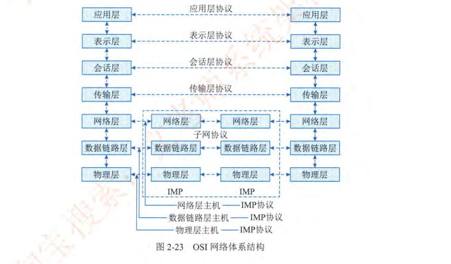

> 比 TCP/IP 多了 会话层和表示层

##### OSI 协议集

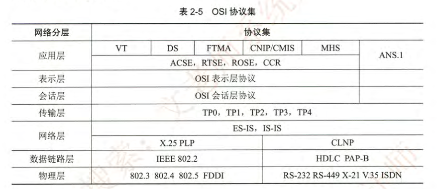

##### TCP/IP 协议集

好的，为了更清晰地呈现TCP/IP协议族中的子协议，我将它们以表格的形式列出，并按照网络层和传输层进行分类：

-TCP/IP协议族子协议表-

| 层次 | 协议名称 | 协议缩写 | 协议功能描述 | 常见应用场景 |
| :- | :- | :- | :- | :- |
| 网络层 | 网际协议 | IP | 负责数据包的路由和寻址，使数据能够在网络中传输。是整个TCP/IP协议族的核心。 | 所有基于互联网的通信。 |
| 网络层 | 互联网控制消息协议 | ICMP | 用于发送控制消息，例如错误报告和网络状态信息。 | ping、traceroute等网络诊断工具。 |
| 网络层 | 地址解析协议 | ARP | 用于将IP地址解析为物理硬件地址（MAC地址）。 | 局域网内IP地址和MAC地址的转换。 |
| 传输层 | 传输控制协议 | TCP | 提供可靠的、面向连接的字节流传输，适用于需要保证数据完整性的应用。 | 网页浏览（HTTP）、文件传输（FTP）、电子邮件（SMTP）等。 |
| 传输层 | 用户数据报协议 | UDP | 提供无连接的数据报传输，适用于对实时性要求较高但对数据完整性要求较低的应用。 | 视频流、在线游戏、DNS查询等。 |
| 应用层 | 超文本传输协议 | HTTP | 用于在Web浏览器和Web服务器之间传输超文本（HTML）内容。 | 网页浏览。 |
| 应用层 | 文件传输协议 | FTP | 用于在计算机之间传输文件。 | 文件上传、下载。 |
| 应用层 | 简单邮件传输协议 | SMTP | 用于在邮件服务器之间传输电子邮件。 | 电子邮件发送。 |
| 应用层 | 域名系统 | DNS | 用于将域名解析为IP地址。 | 域名解析。 |

##### 协议集比较

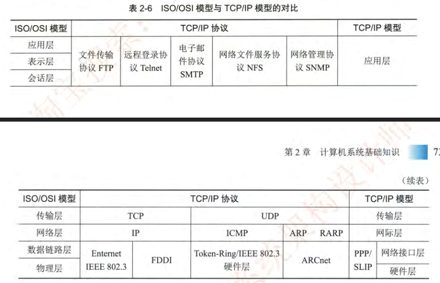

### 1.5.5 网络工程

#### 网络规划、网络设计和网络实施

略

## 1.6 计算机语言

### 1.6.1 计算机语言的组成

- 表达式：常量、变量、字面量、运算符
- 流程控制：分支、循环、函数、异常
- 集合：字符串、数组、散列表

### 1.6.2 计算机语言的类别

#### 机器语言 (指令格式、操作码和寻址)

机器语言是计算机能够直接识别和执行的指令，由二进制代码组成。每条指令都包含操作码和操作数。

- 指令格式：
    - 操作码 (Opcode)：指定要执行的操作，如加法、减法、数据传输等。
    - 操作数 (Operand)：指定操作的对象，可以是数据、寄存器或内存地址。
- 操作码：
    - 是指令的核心部分，告诉 CPU 执行什么操作。
    - 不同的 CPU 架构有不同的操作码。
- 寻址方式：
    - 立即寻址：操作数直接包含在指令中。
    - 直接寻址：操作数是内存地址。
    - 寄存器寻址：操作数是寄存器。
    - 间接寻址：操作数是内存地址，该地址存储的是另一个内存地址。

机器码样例：

- 假设 `a` 存储在内存地址 `0x1000`，`b` 存储在寄存器 `R1` 中。
- 假设使用 x86 汇编指令集。

```assembly
MOV R0, R1      ; 将 R1 的值复制到 R0
ADD R0, 1       ; R0 的值加 1
MOV [0x1000], R0 ; 将 R0 的值存储到内存地址 0x1000 (a)
```

对应的机器码 (示例，实际值取决于具体的 CPU 架构):

```
B8 C1          ; MOV R0, R1  (假设 R1 对应 C1)
83 C0 01       ; ADD R0, 1   (假设 R0 对应 C0)
C7 05 00 10 00 00 ?? ?? ?? ?? ; MOV [0x1000], R0 (?? 是 R0 的值)
```

-解释：-

1.  `MOV R0, R1`:  将寄存器 `R1` 的内容移动到寄存器 `R0`。
2.  `ADD R0, 1`:  将寄存器 `R0` 的值加 1。
3.  `MOV [0x1000], R0`:  将寄存器 `R0` 的内容移动到内存地址 `0x1000`，即变量 `a` 的存储位置。

-注意：-

-   这只是一个示例，实际的机器码会根据具体的 CPU 架构和指令集而有所不同。
-   不同的汇编器和编译器可能会生成不同的机器码。
-   内存地址和寄存器的表示方式也会因系统而异。

#### 汇编语言 (语句格式和伪指令)

#### 高级语言 (C、C++、Java 和 Python 等)

#### 建模语言 (UML 的组成要素、关系和五种视图)

用例视图、逻辑视图、进程视图、实现视图、部署视图

#### 形式化语言 (规格说明、分类、开发过程和 Z 语言)

好的，以下是一个简单的 Z 语言示例，用于描述一个简单的银行账户系统：

```z
SCHEMA Account
    balance : N

    balance >= 0
```

-解释：-

-   `SCHEMA Account`：定义了一个名为 `Account` 的模式，用于描述银行账户的状态。
-   `balance : N`：声明了一个名为 `balance` 的变量，类型为自然数 (`N`)，表示账户余额。
-   `balance >= 0`：定义了一个谓词，表示账户余额必须大于等于 0。

-操作：-

```z
SCHEMA Deposit
    Account
    amount? : N

    balance' = balance + amount?
```

-解释：-

-   `SCHEMA Deposit`：定义了一个名为 `Deposit` 的模式，用于描述存款操作。
-   `Account`：包含了 `Account` 模式中的所有变量和谓词，表示存款操作会影响账户的状态。
-   `amount? : N`：声明了一个名为 `amount?` 的输入变量，类型为自然数 (`N`)，表示存款金额。
-   `balance' = balance + amount?`：定义了一个谓词，表示存款后的账户余额等于存款前的余额加上存款金额。

-错误处理：-

```z
SCHEMA InsufficientFunds
    Account
    amount? : N
    REPORT : report

    amount? > balance
    REPORT = insufficient_funds
```

-解释：-

-   `SCHEMA InsufficientFunds`：定义了一个名为 `InsufficientFunds` 的模式，用于描述余额不足的错误情况。
-   `Account`：包含了 `Account` 模式中的所有变量和谓词，表示余额不足的错误情况与账户的状态有关。
-   `amount? : N`：声明了一个名为 `amount?` 的输入变量，类型为自然数 (`N`)，表示取款金额。
-   `REPORT : report`：声明了一个名为 `REPORT` 的变量，类型为 `report`，用于表示错误报告。
-   `amount? > balance`：定义了一个谓词，表示取款金额大于账户余额。
-   `REPORT = insufficient_funds`：定义了一个谓词，表示错误报告为 `insufficient_funds`。

-总结：-

这个简单的 Z 语言示例展示了如何使用模式、变量和谓词来描述一个简单的银行账户系统。Z 语言可以用于描述软件系统的需求、设计和规格说明，并可以使用工具进行验证和测试。

## 1.7 多媒体

### 1.7.1 多媒体概述

#### 多媒体的定义、特征、基本组成及应用

略

### 1.7.2 多媒体的主要关键技术

#### 视音频技术

略

#### 通信技术

略

#### 数据压缩技术

略

#### VR/AR 技术

略

## 1.8 系统工程

### 1.8.1 系统工程的基本概念

系统工程是运用系统方法，对系统进程规划、研究、设计、制造、试验和使用的组织管理技术。

系统是人造的，被创建用于在定义明确的环境中提供产品或服务，使用户和其他利益攸关者收益。

系统工程是一个跨学科的工程学和工程管理领域，其核心在于：

- 设计、开发和管理复杂系统：
    - 系统工程关注的是整体，而非单一组件，旨在确保复杂系统在其整个生命周期内都能有效运作。
- 利用系统性思考：
    - 系统工程强调对系统及其各个组成部分之间的相互作用进行全面分析，以确保所有元素协调一致，实现整体目标。
- 跨学科方法：
    - 系统工程融合了多个工程学科（如机械工程、电子工程、软件工程等）以及管理学、心理学等其他学科的知识。
- 关注系统的整个生命周期：
    - 系统工程的工作，包含系统的概念提出，设计，制造，运行，维护，一直到系统的最终的消亡，对系统的整个生命周期，做全方位的管理。

简而言之，系统工程是一种整体性的方法，旨在确保复杂系统能够有效地满足其预定的目标和需求。

> 钱学森：系统工程是组织管理系统的规划、研究、设计、制造、试验和使用的科学方法，是一种对所有系统都具有普遍意义的科学方法。

### 1.8.2 系统工程方法

#### 霍尔的三维结构

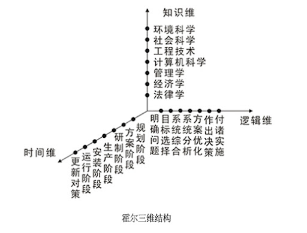

#### 切克兰德方法

从绝对最优化到相对最优化

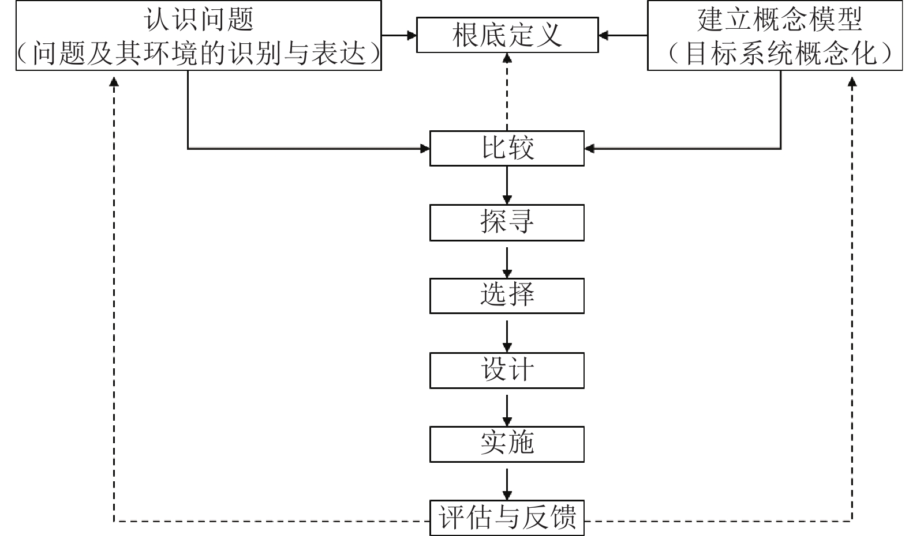

#### 并行工程方法

- 在产品的设计开发期间，将概念设计、结构设计、工艺设计、最终需求等结合起来，保证以最快的速度按要求的质量完成。
- 各项工作由与此相关的项目小组完成。进程中小组成员各自安排自身的工作，但可以随时或定期反馈信息，并对出现的问题协调解决。
- 依据适当的信息系统工具，反馈与协调整个项目的进行。利用现代CIM技术，在产品的研制与开发期间，辅助项目进程的并行化。

#### 综合集成法

处理开放的复杂巨系统的方法：从定性到定量的综合集成法。

系统的特点：

- 多目标（Multi-objective）
- 多层次（Hierarchical）
- 多变量（Multi-variable）
- 强耦合（Strongly coupled）
- 开放性（Openness）
- 非线性（Nonlinearity）
- 自组织（Self-organization）
- 自适应（Self-adaptive）

教材中的开放的复杂巨系统特性：开放性、复杂性、进化与涌现性、层次性、巨量性

系统的开放性：系统与外部环境存在物质、能量、信息的交换。

- 与环境的交互：开放的复杂巨系统并非孤立存在，而是与周围环境进行着物质、能量和信息的持续交换。这种交互使得系统能够不断地适应变化，维持自身的动态平衡。
- 动态的适应：由于与环境的交互，开放的复杂巨系统具有很强的适应性和自组织能力。它们能够根据外部环境的变化，调整自身的结构和功能，以保持其稳定性和发展性。
- 不确定性和演化：开放性意味着系统受到外部环境的影响，而外部环境往往是复杂和不确定的。因此，开放的复杂巨系统具有一定的不确定性和演化性，其行为和发展路径可能难以完全预测。
- 多层次的关联：开放的复杂巨系统内部含有许多的子系统，并且这些子系统之间，和子系统与外部环境之间，有着千丝万缕的信息，能量，物质的关联。这也就使得这一系统，更加的复杂化。

研究方法：
- 定性与定量的研究贯穿生命周期
- 科学理论与经验知识结合
- 夸学科综合研究
- 宏观视角与微观视角
- 大型计算机系统支持

#### WSR 系统方法

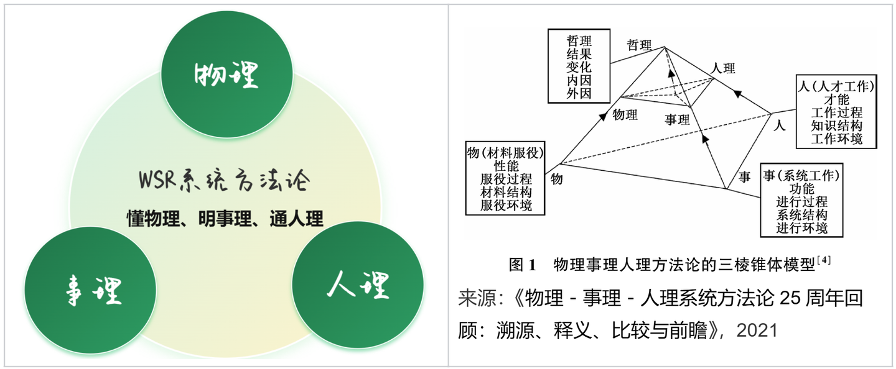

1. 理解意图：明确项目或活动的目的和期望结果。
2. 制定目标：根据意图，设定具体、可量化的目标。
3. 调查分析：收集和分析相关信息，以了解现状和潜在问题。
4. 构造策略：基于分析结果，制定达成目标的策略和计划。
5. 选择方案：从多个可能的策略中选择最佳方案。
6. 实现构想：执行选定的方案，并监控进展以实现最终目标。
7. 协调关系：确保所有相关方之间的有效沟通和协作。

### 1.8.3 系统工程的全生命周期

#### 周期阶段：探索研究、概念阶段、开发阶段、生产阶段、使用阶段、保障阶段和退役阶段

参考霍尔模型时间维。

#### 采用方法：计划驱动方法、渐进迭代式开发、精益开发和敏捷开发

构建系统的传统范式：需求、设计、构建、测试、部署。

渐进迭代式开发 IID：需求不明确前提下的妥协。

精益开发：价值最大化

敏捷开发：短周期、频交付、简单化、多沟通、多总结

### 1.8.4 基于模型的系统工程 (MBSE)

#### MBSE 的基本概念

模型可视化、规范化、标准化

#### MBSE 的三大支柱技术 (建模语言、建模工具和建模思路)

SysML 建模语言、数据分析软件。

| 方法名称 | 提出/开发者 | 核心特点 |
| :- | :- | :- |
| IBM Telelogic Harmony-SE | IBM Telelogic | 基于模型的系统工程（MBSE），强调需求管理、设计、验证和确认。 |
| Weilkiens System Modeling (SYSMOD) method | Weilkiens | 模型驱动，提供结构化的系统描述和分析方法。 |
| INCOSE Object-Oriented Systems Engineering Method (OOSEM) | 国际系统工程理事会（INCOSE） | 面向对象，强调系统的模块化和可重用性。 |

## 1.9 系统性能

### 1.9.1 性能指标

#### 计算机的性能指标

| 指标名称 | 英文名称 | 单位 | 解释 |
| :- | :- | :- | :- |
| 时钟频率（主频） | Clock Frequency | Hertz (Hz) | 指 CPU 每秒钟可以完成的指令周期数。频率越高，CPU 的运算速度越快。 |
| 运算速度 | Processing Speed / Calculation Speed | FLOPS (Floating-point Operations Per Second) | 指计算机每秒钟可以执行的浮点运算次数，反映了计算机处理复杂计算任务的能力。也有使用MIPS (Million Instructions Per Second)的。 |
| 运算精度 | Calculation Precision | - | 指计算机进行数值计算时，结果的精确程度。 |
| 内存的存储容量 | Memory Capacity | Bytes (B), Gigabytes (GB) | 指计算机内存（RAM）可以存储数据的总量。 |
| 存储器的存取周期 | Memory Access Time | Nanoseconds (ns) | 指计算机存储器进行一次读写操作所需的时间。 |
| 数据处理速率（PDR） | Processing Data Rate (PDR) | Bytes per second (B/s) | 指计算机在单位时间内处理数据的能力。 |
| 吞吐率 | Throughput | Transactions per second (TPS) | 指系统在单位时间内成功处理的请求或事务的数量。 |
| 各种响应时间 | Response Time | Milliseconds (ms) | 指计算机系统对用户或外部事件的响应速度。 |
| 各种利用率 | Utilization Rate | Percentage (%) | 指计算机系统资源的利用程度。 |
| RASIS 特性（可靠性、可用性、可维护性、完整性和安全性） | RASIS Characteristics (Reliability, Availability, Serviceability, Integrity, Security) | - | 这是一组综合指标，用于评估计算机系统的整体可靠性和安全性。它们分别表示：可靠性，可用性，可维护性，完整性，和安全性。 |
| 平均故障响应时间 | Mean Time To Repair (MTTR) | Hours (h), Minutes (min) | 指计算机系统出现故障后，从故障发生到恢复正常运行所需的时间。 |
| 兼容性 | Compatibility | - | 指计算机系统与其他硬件、软件或设备的协同工作能力。 |
| 可扩充性 | Scalability / Expandability | - | 指计算机系统在性能或容量方面进行升级和扩展的容易程度。 |
| 性能价格比 | Performance Price Ratio | - | 指计算机系统的性能与其价格之比。 |

| 排名 | 超算名称 | 峰值算力 (PFlops) | 处理器 |
|-|-|-|-|
| 1 | 神威·太湖之光 | 125.4 | 申威26010 |
| 2 | 天河二号 | 54.9 | Intel Xeon E5-2692 v2 |

| GPU 型号 | 架构 | 峰值单精度浮点算力 (TFLOPS) |
|-|-|-|
| NVIDIA H100 | Hopper | ~1979 |
| NVIDIA A100 | Ampere | 312 |

#### 路由器的性能指标

| 指标名称 | 英文名称 | 单位 | 内容 |
| - | - | - | - |
| 设备吞吐量 | Device Throughput | | 路由器在单位时间内能够处理的数据量，通常用bps（比特每秒）或pps（包每秒）衡量。 |
| 端口吞吐量 | Port Throughput | | 路由器端口在单位时间内能够处理的数据量，通常用bps或pps衡量。 |
| 全双工线速转发能力 | Full-Duplex Wire-Speed Forwarding Capability | | 路由器在全双工模式下能够以线速转发数据的能力，线速是指端口的最大传输速率。 |
| 背靠背帧数 | Back-to-Back Frames | | 路由器能够连续处理的最大帧数，用于衡量路由器在高负载下的性能。 |
| 路由表能力 | Routing Table Capacity | 条目数 | 路由器能够存储的路由条目数量，影响路由器能够处理的网络规模。 |
| 背板能力 | Backplane Capacity | | 路由器内部数据总线能够传输的最大数据量，影响路由器的整体性能。 |
| 丢包率 | Packet Loss Rate | 百分比（%） | 数据包在传输过程中丢失的比例，影响网络传输的可靠性。 |
| 时延 | Latency | 毫秒（ms） | 数据包从发送端到接收端所需的时间，影响网络应用的响应速度。 |
| 时延抖动 | Jitter | 毫秒（ms） | 数据包到达时间的不稳定性，影响实时应用的质量，如语音和视频。 |
| VPN支持能力 | VPN Support Capability | | 路由器对VPN协议的支持情况，包括支持的协议类型和性能。 |
| 内部时钟精度 | Internal Clock Precision | | 路由器内部时钟的准确性，影响路由器的时间同步和日志记录。 |
| 队列管理机制 | Queue Management Mechanism | | 路由器对数据包队列的管理方式，影响网络流量的优先级和公平性。 |
| 端口硬件队列数 | Port Hardware Queue Number | | 路由器端口的硬件队列数量，影响端口能够缓存的数据包数量。 |
| 分类业务带宽保证 | Class-Based Bandwidth Guarantee | | 路由器对不同类型业务的带宽保证能力，确保关键业务的带宽需求。 |
| RSVP | RSVP (Resource Reservation Protocol) | | 资源预留协议，用于在网络中预留带宽资源。 |
| IP DiffServ | IP Differentiated Services | | 区分服务，用于在IP网络中实现服务质量（QoS）。 |
| CAR支持 | Committed Access Rate | | 承诺访问速率，用于限制特定类型流量的带宽。 |
| 冗余 | Redundancy | | 路由器的冗余设计，包括设备冗余和链路冗余，提高网络的可靠性。 |
| 热插拔组件 | Hot-Swappable Components | | 路由器支持热插拔的组件，允许在设备运行期间更换组件，提高维护效率。 |
| 路由器冗余协议 | Router Redundancy Protocol | | 用于实现路由器冗余的协议，如VRRP、HSRP。 |
| 网管 | Network Management | | 路由器的网络管理功能，包括配置、监控和故障排除。 |
| 基于Web的管理 | Web-Based Management | | 路由器支持基于Web的管理界面，方便用户进行配置和管理。 |
| 网管类型 | Network Management Type | | 路由器的网管类型，包括命令行界面（CLI）、图形用户界面（GUI）等。 |
| 带外网管支持 | Out-of-Band Management Support | | 路由器支持带外网管，允许在网络故障时通过独立的管理通道进行管理。 |
| 网管粒度 | Network Management Granularity | | 路由器网管的精细程度，包括对不同网络元素和功能的管理能力。 |
| 计费能力/协议 | Billing Capability/Protocol | | 路由器支持的计费功能和协议，用于网络流量的计费。 |
| 分组语音支持方式 | Packet Voice Support Methods | | 路由器支持分组语音的方式，包括支持的语音编解码器和协议。 |
| 协议支持 | Protocol Support | | 路由器支持的网络协议类型，包括路由协议、传输协议等。 |
| 语音压缩能力 | Voice Compression Capability | | 路由器对语音数据的压缩能力，影响语音传输的带宽需求。 |
| 端口密度 | Port Density | 端口数量 | 路由器端口的数量，影响路由器的接入能力。 |
| 信令支持 | Signaling Support | | 路由器支持的信令协议，用于建立和管理通信连接。 |

#### 交换机的性能指标

| 指标名称 | 英文名称 | 单位 | 内容 |
| - | - | - | - |
| 交换机类型 | Switch Type | | 交换机的种类，如二层交换机、三层交换机、多层交换机等。 |
| 配置 | Configuration | | 交换机的硬件和软件设置，包括端口数量、VLAN、路由协议等。 |
| 支持的网络类型 | Supported Network Types | | 交换机支持的网络协议和标准，如以太网、令牌环、ATM等。 |
| 最大ATM端口数 | Maximum ATM Port Number | 端口数 | 交换机支持的最大异步传输模式（ATM）端口数量。 |
| 最大SONET端口数 | Maximum SONET Port Number | 端口数 | 交换机支持的最大同步光纤网络（SONET）端口数量。 |
| 最大FDDI端口数 | Maximum FDDI Port Number | 端口数 | 交换机支持的最大光纤分布式数据接口（FDDI）端口数量。 |
| 背板吞吐量 | Backplane Throughput | | 交换机背板能够处理的最大数据量，影响交换机的整体性能。 |
| 缓冲区大小 | Buffer Size | | 交换机用于存储数据包的缓冲区大小，影响交换机在高负载下的性能。 |
| 最大MAC地址表大小 | Maximum MAC Address Table Size | 条目数 | 交换机能够存储的最大MAC地址数量，影响交换机能够处理的网络规模。 |
| 最大电源数 | Maximum Power Supply Number | | 交换机支持的最大电源数量，影响交换机的冗余性和可靠性。 |
| 支持协议和标准 | Supported Protocols and Standards | | 交换机支持的各种网络协议和标准，包括IEEE 802.1Q、IEEE 802.1p等。 |
| 路由信息协议 (RIP) | Routing Information Protocol (RIP) | | 一种距离矢量路由协议。 |
| RIP2 | RIPv2 | | RIP的第二版本，支持子网掩码和认证。 |
| 开放式最短路径优先第2版 (OSPF) | Open Shortest Path First v2 (OSPFv2) | | 一种链路状态路由协议。 |
| 边界网关协议 (BGP) | Border Gateway Protocol (BGP) | | 一种外部网关路由协议。 |
| 无类别域间路由 (CIDR) | Classless Inter-Domain Routing (CIDR) | | 一种IP地址分配方法。 |
| 互联网组管理协议 (IGMP) | Internet Group Management Protocol (IGMP) | | 一种用于多播组成员管理的协议。 |
| 距离矢量多播路由协议 (DVMRP) | Distance Vector Multicast Routing Protocol (DVMRP) | | 一种距离矢量多播路由协议。 |
| 开放式最短路径优先多播路由协议 (MOSPF) | Multicast Open Shortest Path First (MOSPF) | | 一种链路状态多播路由协议。 |
| 协议无关的多播协议 (PIM) | Protocol Independent Multicast (PIM) | | 一种协议无关的多播协议。 |
| 资源预留协议 (RSVP) | Resource Reservation Protocol (RSVP) | | 一种用于资源预留的协议。 |
| 802.1p优先级标记 | 802.1p Priority Tagging | | 用于标记数据包优先级的IEEE 802.1p标准。 |
| 多队列 | Multi-Queue | | 交换机支持的多个数据包队列，用于实现服务质量（QoS）。 |
| 路由 | Routing | | 交换机支持的路由功能，包括路由协议、路由表等。 |
| 支持第3层交换 | Layer 3 Switching Support | | 交换机支持的第三层交换功能，能够在网络层（IP层）进行数据包转发。 |
| 支持多层 (4 ~ 7 层) 交换 | Multi-Layer (4-7) Switching Support | | 交换机支持的第四层到第七层交换功能，能够在传输层（TCP/UDP层）和应用层进行数据包转发。 |
| 支持多协议路由 | Multi-Protocol Routing Support | | 交换机支持的多种路由协议，如RIP、OSPF、BGP等。 |
| 支持路由缓存 | Routing Cache Support | | 交换机支持的路由缓存功能，用于加速数据包转发。 |
| 可支持最大路由表数 | Maximum Routing Table Number Support | 条目数 | 交换机能够支持的最大路由条目数量，影响交换机能够处理的网络规模。 |
| VLAN | Virtual LAN | | 虚拟局域网，用于将一个物理局域网划分为多个逻辑局域网。 |
| 最大VLAN数量 | Maximum VLAN Number | | 交换机支持的最大VLAN数量。 |
| 网管 | Network Management | | 交换机的网络管理功能，包括配置、监控和故障排除。 |
| 支持网管类型 | Supported Network Management Types | | 交换机支持的网络管理类型，如命令行界面（CLI）、图形用户界面（GUI）等。 |
| 支持端口镜像 | Port Mirroring Support | | 交换机支持的端口镜像功能，用于网络监控和故障排除。 |
| QoS | Quality of Service | | 服务质量，用于保证网络流量的优先级和带宽。 |
| 支持基于策略的第2层交换 | Policy-Based Layer 2 Switching Support | | 交换机支持的基于策略的第二层交换功能，能够根据用户定义的策略转发数据包。 |
| 每端口最大优先级队列数 | Maximum Priority Queue Number Per Port | | 交换机每个端口支持的最大优先级队列数量。 |
| 支持基于策略的第3层交换 | Policy-Based Layer 3 Switching Support | | 交换机支持的基于策略的第三层交换功能，能够根据用户定义的策略转发数据包。 |
| 支持基于策略的应用级QoS | Policy-Based Application-Level QoS Support | | 交换机支持的基于策略的应用级QoS功能，能够根据应用类型转发数据包。 |
| 支持最小/最大带宽分配 | Minimum/Maximum Bandwidth Allocation Support | | 交换机支持的最小/最大带宽分配功能，能够为不同类型的流量分配不同的带宽。 |
| 冗余 | Redundancy | | 交换机的冗余设计，包括设备冗余和链路冗余，提高网络的可靠性。 |
| 热交换组件 (管理卡、交换结构、接口模块、电源、冷却系统) | Hot-Swappable Components (Management Card, Switching Fabric, Interface Modules, Power Supplies, Cooling System) | | 交换机支持热插拔的组件，允许在设备运行期间更换组件，提高维护效率。 |
| 支持端口链路聚集协议 | Port Link Aggregation Protocol Support | | 交换机支持的端口链路聚集协议，如LACP，用于提高链路带宽和可靠性。 |
| 负载均衡 | Load Balancing | | 交换机支持的负载均衡功能，能够将流量均匀分配到多个链路上。 |

#### 网络的性能指标

- 设备级性能指标
- 网络级性能指标
- 应用级性能指标
- 用户级性能指标
- 吞吐量

#### 操作系统的性能指标

- 系统上下文切换
- 系统响应时间
- 系统的吞吐率
- 系统资源利用率
- 可靠性和可移植性

#### 数据库管理系统的性能指标

- 数据库指标
    - 大小、数量、索引
- 数据库管理系统指标
    - 并发、负载均衡能力、最大连接数

#### Web 服务器的性能指标

- 最大并发连接数
- 响应延迟
- 吞吐量

### 1.9.2 性能计算

#### 定义法、公式法、程序检测法和仪器检测法

| 方法 | 描述 | 优点 | 缺点 |
|-|-|-|-|
| MIPS | 每秒执行百万条指令 | 简单直观 | 不准确，不能反映实际性能 |
| 峰值计算方法 | 理论最大计算能力 | 快速了解计算上限 | 很难达到，不能反映实际性能 |
| 吉普森方法 | 加权平均指令执行时间 | 相对准确，反映实际应用 | 选择指令集和权重有主观性 |

### 1.9.3 性能设计

#### 系统调整、Amdahl 解决方案、响应特性和负载均衡

阿姆达尔定律（Amdahl's Law）是计算机科学中一个重要的定律，用于描述通过改进系统的某个部分所能获得的整体性能提升的限制。它指出，系统性能的提升受到系统中必须串行执行的部分的限制。

阿姆达尔定律的公式如下：

$S = \frac{1}{(1 - P) + \frac{P}{N}}$

其中：

-   $S$：加速比（Speedup），表示整个系统性能提升的倍数。
-   $P$：可并行部分的比例，表示系统中可以并行执行的部分所占的比例。
-   $N$：并行处理器的数量，表示用于并行执行的处理器数量。

阿姆达尔定律表明，即使系统中可并行部分的比例很高，但由于串行部分的限制，整体性能的提升仍然有限。例如，如果系统中 95% 的部分可以并行执行，而只有 5% 的部分必须串行执行，那么即使使用无限数量的处理器，整体性能的提升也只能达到 20 倍。

阿姆达尔定律对系统性能优化具有重要的指导意义。它提醒我们，在优化系统性能时，不仅要关注可并行部分的优化，更要关注串行部分的优化，因为串行部分是系统性能提升的瓶颈。

### 1.9.4 性能评估

#### 基准测试程序

基准测试程序（Benchmark Programs）是一类用于评估计算机系统、组件或软件性能的标准化程序。它们通过模拟实际应用场景，测量系统在特定负载下的性能指标，如运行时间、吞吐量、资源利用率等。

基准测试程序的主要作用：

- 性能评估：评估计算机系统或组件的性能，为用户选择合适的硬件或软件提供依据。
- 性能优化：通过基准测试程序，发现系统性能瓶颈，为性能优化提供方向。
- 系统比较：比较不同系统或组件的性能，为技术选型提供参考。
- 性能监控：定期运行基准测试程序，监控系统性能变化，及时发现潜在问题。

常见的基准测试程序类型：

- CPU 基准测试：
    - Linpack：用于测试 CPU 的浮点运算性能。
    - SPEC CPU：一套综合性的 CPU 基准测试程序，包括整数运算和浮点运算。
    - Geekbench：一款跨平台的 CPU 基准测试程序，适用于桌面、移动和嵌入式设备。
- 内存基准测试：
    - STREAM：用于测试内存带宽和延迟。
    - Memtest86+：一款用于检测内存错误的程序。
- 磁盘基准测试：
    - Iometer：一款用于测试磁盘 I/O 性能的程序。
    - CrystalDiskMark：一款简单易用的磁盘基准测试程序。
- 网络基准测试：
    - iperf：一款用于测试网络带宽的程序。
    - Ping：一款用于测试网络延迟的程序。
- 综合基准测试：
    - PassMark PerformanceTest：一款综合性的系统基准测试程序。
    - PCMark：一款用于测试 PC 综合性能的程序。

基准测试程序的使用方法：

1. 选择合适的基准测试程序：根据需要评估的系统或组件选择合适的基准测试程序。
2. 配置测试环境：配置测试环境，如操作系统、驱动程序、硬件设置等。
3. 运行基准测试程序：按照基准测试程序的说明文档运行程序，并记录测试结果。
4. 分析测试结果：分析测试结果，评估系统性能，并与其他系统或组件进行比较。

#### Web 服务器的性能评估

最大并发数、响应延迟、吞吐量

#### 系统监视

- 监测工具
- 监测日志