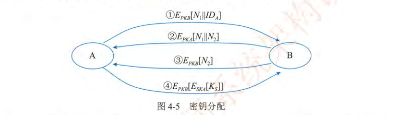

本文总结了系统架构师考试中信息安全相关的核心知识，包括信息安全的基本概念、要素与范围，信息存储和网络安全，信息系统安全的作用，信息安全系统的技术与管理框架。内容涵盖对称与非对称加密算法、密钥管理、访问控制、数字签名、抗攻击技术（如DDoS、欺骗攻击、端口扫描等）、安全保障体系（如等保、TCSEC等级）及安全风险管理方法，帮助读者全面理解信息安全的理论与实践要点。

<!-- more -->

## 3.1 信息安全基础知识

### 3.1.1 信息安全概述

信息安全是指保护信息和信息系统免受未经授权的访问、使用、泄露、破坏、修改或破坏，以确保信息的保密性、完整性和可用性。

信息安全的基本要素包括：

1. 保密性：确保信息不被未经授权的个人、实体或过程访问或泄露。
2. 完整性：确保信息是准确和完整的，没有被未经授权的修改或破坏。
3. 可用性：确保授权用户在需要时能够及时可靠地访问信息和相关资源。
4. 可控性：控制信息的流向以及在系统内的行为。
5. 可审查性：对安全事件进行审计和追踪。

信息安全的范围包括：
1. 设备安全：稳定性、可靠性、可用性
2. 数据安全：秘密性、完整性、可用性
3. 内容安全：政治健康、符合法规、道德规范
4. 行为安全：秘密性、完整性、可控性

### 3.1.2 信息存储安全

1. 信息使用安全
    - 用户的标识与验证
    - 用户存取权限限制
2. 系统安全监控
3. 系统病毒防治

### 3.1.3 网络安全

1. 网络安全漏洞
2. 网络安全威胁
3. 安全措施目标

## 3.2 信息系统安全的作用与意义

1. 保护敏感信息：防止商业机密、个人身份信息等敏感数据泄露，维护组织和个人的利益。
2. 维护业务连续性：保障信息系统的稳定运行，避免因安全事件导致业务中断。
3. 遵守法律法规：满足数据保护、隐私保护等方面的法律法规要求。
4. 提升组织声誉：建立良好的安全形象，增强客户和合作伙伴的信任。
5. 降低安全风险：通过有效的安全措施，降低遭受网络攻击、数据泄露等安全事件的风险。

## 3.3 信息安全系统的组成框架

### 3.3.1 技术体系

1. 基础安全设施
2. 网络安全系统
3. 操作系统应用
4. 数据保护应用
5. 终端安全应用

### 3.3.2 组织机构体系

决策层、管理层、执行层

### 3.3.3 管理体系

法律管理、制度管理、培训管理

## 3.4 信息加解密技术

### 3.4.1 数据加密

数据加密的作用、意义和内涵

保密通信模型

### 3.4.2 对称密钥加密算法

对称密钥加密算法（Symmetric-key algorithm）是密码学中的一类加密算法。

其基本原理是：加密和解密使用相同的密钥。这意味着通信双方需要共享一个密钥，加密者使用该密钥将明文转换为密文，解密者使用相同的密钥将密文还原为明文。

对称密钥加密算法的优点是加密和解密速度快，适合于对大量数据进行加密。常见的对称密钥加密算法包括：

| 算法名称 | 密钥长度 | 轮数 | 优点 | 缺点 | 应用场景 |
| - | - | - | - | - | - |
| DES | 56位 | 16 | 加密速度快，曾经广泛应用 | 密钥长度短，安全性较低，容易被破解 | 早期金融系统、数据加密等 |
| 3DES | 112位或168位 | 48 | 密钥长度增加，安全性提高 | 加密速度相对较慢 | 金融、安全要求较高的系统中 |
| AES | 128位、192位或256位 | 10、12或14 | 安全性高，加密速度快，资源消耗低 |  | 现代密码学应用，如SSL/TLS、VPN、硬盘加密等 |
| IDEA | 128位 | 8 | 安全性较高，曾被广泛使用 | 专利保护，使用可能需要授权 | PGP加密软件 |

### 3.4.3 非对称密钥加密算法

非对称密钥加密算法（Asymmetric-key algorithm），也称为公钥加密算法。

其基本原理是：加密和解密使用不同的密钥，其中一个密钥是公开的，称为公钥（Public Key），另一个密钥是私有的，称为私钥（Private Key）。

发送者使用接收者的公钥对消息进行加密，接收者使用自己的私钥对消息进行解密。由于私钥只有接收者自己知道，因此可以保证消息的机密性。

非对称密钥加密算法的优点是密钥管理简单，安全性高。常见的非对称密钥加密算法包括：

| 算法名称 | 密钥长度 | 优点 | 缺点 | 应用场景 |
| - | - | - | - | - |
| RSA | 1024位、2048位或更高 | 应用广泛，安全性较高 | 加密速度相对较慢 | 数字签名、密钥交换、数据加密等 |
| DSA | 1024位 | 适用于数字签名 |  | 数字签名 |
| ECC | 256位 | 安全性高，密钥长度短，适合于移动设备 |  | 移动支付、物联网等 |

RSA算法是一种应用广泛的公钥加密算法。其基本原理是：

1.  选择两个大的质数p和q。
2.  计算n = p * q，n是公钥和私钥的模数。
3.  计算φ(n) = (p-1) * (q-1)，φ(n)是欧拉函数。
4.  选择一个整数e，1 < e < φ(n)，且e与φ(n)互质。e是公钥指数。
5.  计算d，使得d * e ≡ 1 (mod φ(n))。d是私钥指数。
6.  公钥为(n, e)，私钥为(n, d)。

加密过程：将明文m进行加密，得到密文c。计算公式为：c = m^e mod n。

解密过程：将密文c进行解密，得到明文m。计算公式为：m = c^d mod n。

## 3.5 密钥管理技术

### 3.5.1 对称密钥的分配与管理

内容框架：使用和分发

核心思路：自动化、零库存

核心概念：KDC，Diffie-Hellman*，ISAKMP*、IKE*

相关案例：Kerberos KDC

> 教材这块写的非常混乱，引入了两个混淆的概念，一个是控制矢量，一个是会话密钥。同时对 KDC 较为核心的票据概念只字不提。
> - Kerberos KDC 模型主要的内容是包括了身份和票据两个核心概念，并没有包含控制矢量。
> - 控制矢量的概念教材解释非常差，怀疑引入了夹带了私货，其目的是在密钥的生成过程中加入主密钥和会话密钥的映射关系管理，可用于会话密钥恢复、朔源和控制。
> - 会话密钥的概念和 Kerberos KDC 中的票据的概念重叠，票据的内容包含：客户端身份、服务身份、会话密钥、时间戳、授权信息。

Diffie-Hellman 协议（变种： ECDH - 椭圆曲线 Diffie-Hellman），也称为 Diffie-Hellman 密钥交换，是一种允许双方在不安全的公共信道上安全地交换密钥的密码学协议。它的核心在于，即使第三方能够窃听双方的通信，也无法得到双方最终协商出的共享密钥。
1. 密钥交换而非加密：
    - Diffie-Hellman 协议主要用于密钥交换，而不是直接加密信息。
    - 它允许双方协商出一个共享密钥，然后可以用这个密钥进行对称加密通信。
2. 离散对数问题：
    - 协议的安全性基于离散对数问题的数学难题。
    - 简单来说，就是在已知一些数值的情况下，求解离散对数是非常困难的。
3. 公共参数：
    - 双方需要事先约定两个公共参数：一个大素数 p 和一个生成器 g。这两个参数可以公开传输。
4. 私有密钥和公共密钥：
    - 每一方都生成一个私有密钥，并用这个私有密钥和公共参数计算出一个公共密钥。
    - 双方交换公共密钥，然后使用自己的私有密钥和对方的公共密钥计算出共享密钥。

Diffie-Hellman 协议广泛用于TLS/SSL、VPN、SSH、IPsec、AWS KMS 中。

前向保密（Perfect Forward Secrecy - PFS）：即使服务器的私钥在未来被泄露，过去的会话仍然是安全的，这是因为每次会话的密钥都是新生成的，而不是依赖于服务器的长期私钥。

### 3.5.2 公钥加密体制的密钥管理

教材概念：公开发布、公用目录表、公钥管理机构、公钥证书

相关概念：PGP、CA

### 3.5.3 公钥加密分配单钥密码体制的密钥

> 这里存在两个核心问题，随机数的作用是什么，第二个问题是中间是否存在会话密钥的传输。
> - 随机数的作用：唯一性检查，防止重放。
> - 会话密钥存在加密传输，由公钥加密。

## 3.6 访问控制及数字签名技术

### 3.6.1 访问控制技术

访问控制的基本模型：主体（用户或者访问者）、客体（信息、资源、对象）和控制策略（主体和客体的函数关系，认证、审计）

访问控制的实现技术：访问控制矩阵（信息冗余缺陷）、访问控制表（ACLs）、能力表和授权关系

### 3.6.2 数字签名

特点：可信、不可伪造、不可重用、不可改变、不可抵赖

实现：对称密钥签名、公开密钥签名

当然，为了更清晰地呈现数字签名的实现类型和应用场景，我将之前的总结转换为表格形式。

| 签名机制 | 实现方式 | 应用场景 |
| :- | :- | :- |
| 基于公钥密码学 | 使用非对称密钥对（公钥和私钥）。签名者使用私钥加密消息哈希，验证者使用公钥解密并比较哈希。算法：RSA、DSA、ECDSA等。 | 软件分发验证软件来源和完整性。  电子邮件验证发件人身份。  电子文档签署。  代码签名。  SSL/TLS证书。  区块链交易验证。 |
| 基于HMAC | 使用共享秘密密钥和哈希函数生成消息认证码。发送者生成HMAC并附加到消息，接收者重新计算并比较。 | API身份验证。  数据完整性检查。  预签名URL（如AWS S3）。 |
| 基于仲裁的对称密钥 | 依赖可信第三方仲裁人，双方与仲裁人共享对称密钥。发送方加密消息给仲裁人，仲裁人处理后发验证信息给接收方。 | 对不可否认性要求极高的场景。  部分金融交易，电子合同。 |

## 3.7 信息安全的抗攻击技术

### 3.7.1 密钥的选择：算法、空间、随机性

### 3.7.2 拒绝服务攻击与防御 DDoS：传统 DDoS 和分布式 DDoS

### 3.7.3 欺骗攻击与防御： ARP 攻击、DNS 攻击、IP 攻击

- ARP 攻击：MAC 解析表伪装。
- DNS 攻击：域名挟持伪装
- IP 攻击：TCP 协议的伪装。

反射式 DDoS 攻击，利用 memcached 响应请求远大于接收请求的特点，将请求方伪装成 Github 进行反射式攻击。

### 3.7.4 端口扫描

### 3.7.5 强化 TCP/IP 堆栈以抵御拒绝服务攻击

概念：同步包风暴，阻断三次握手导致服务器长时间等待。
概念：Ping of Death，ICMP 协议攻击
概念：SNMP 攻击（关键控制协议）

### 3.7.6 系统漏洞扫描

## 3.8 信息安全的保障体系与评估方法

### 3.8.1 计算机信息系统安全保护等级

| 等级 | 系统受破坏后的危害 |
| - | - |
| 第一级：用户自主保护级 | 受到破坏后，会对公民、法人和其他组织的权益造成损害，但不危害国家安全、社会秩序和公共利益。 |
| 第二级：系统审计保护级 | 受到破坏后，会对公民、法人和其他组织的权益造成严重损害，或者对社会秩序和公共利益造成损害，但不危害国家安全。 |
| 第三级：安全标记保护级 | 受到破坏后，会对社会秩序和公共利益造成严重损害，或者对国家安全造成损害。 |
| 第四级：结构化保护级 | 受到破坏后，会对国家安全造成严重损害。 |
| 第五级：访问验证保护级 | 受到破坏后，会对国家安全造成特别严重损害。 |

好的，为了更清晰地呈现 TCSEC 等级标准，我将信息整理为表格：

| 等级类别 | 等级 | 等级名称 | 主要特征 |
| - | - | - | - |
| D 类 | D | 最小保护 | 未能符合其他类别的要求的系统。 |
| C 类 | C1 | 自主安全保护 | 提供基本的访问控制，允许用户定义对资源的访问权限。 |
| C 类 | C2 | 受控的访问保护 | 增加用户身份验证、审计跟踪和更精细的访问控制。 |
| B 类 | B1 | 安全标记保护 | 引入安全标记，用于强制实施信息流控制。 |
| B 类 | B2 | 结构化保护 | 增强了安全标记和访问控制，并要求对系统进行形式化的安全策略模型。 |
| B 类 | B3 | 安全域 | 进一步加强了安全机制，并要求系统具有最小的信任计算基（TCB）。 |
| A 类 | A1 | 验证设计 | 最高级别的安全性，要求使用形式化的验证方法来证明系统的安全性。 |

### 3.8.2 安全风险管理

安全风险管理是指通过识别、评估和控制信息安全风险，以确保信息资产得到充分保护的过程。

作用：
1. 识别潜在的安全威胁和漏洞。
2. 评估安全风险对组织业务的影响。
3. 制定和实施有效的安全控制措施。
4. 监控和改进安全管理体系。

安全风险的评估过程包括：

1. 风险识别：识别信息资产、威胁和漏洞。
2. 风险分析：评估威胁利用漏洞的可能性和影响。
    - 可能的威胁
    - 可能的损失（脆弱性）
    - 可能的概率（可能性）
3. 风险评估：确定风险等级，例如高、中、低。
4. 风险处理：选择适当的风险应对措施，例如风险规避、风险转移、风险缓解和风险接受。