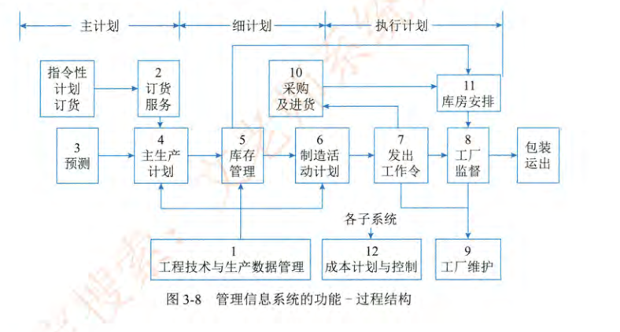
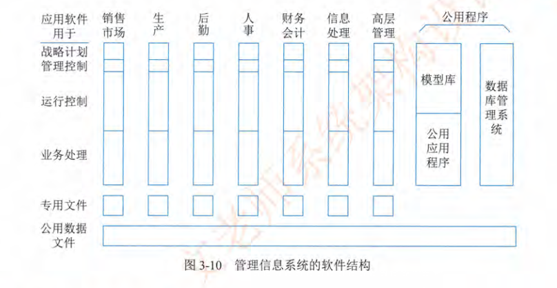
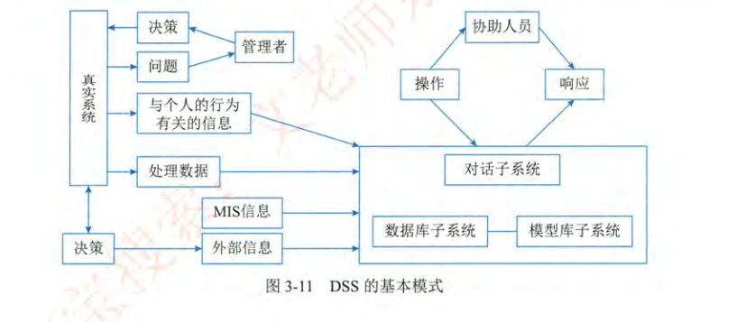
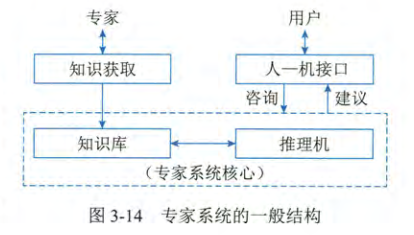

本文总结了系统架构师考试中信息系统相关知识，包括信息系统的定义、发展阶段、分类、生命周期、建设原则及开发方法。内容涵盖业务处理系统、管理信息系统、决策支持系统、专家系统、办公自动化系统、企业资源规划等典型信息系统的概念、功能、组成及特点，并介绍了政府信息化与企业信息化的架构模型。适合备考和系统性复习信息系统基础知识。

<!-- more -->

## 2.1 信息系统概述

### 2.1.1 信息系统的定义

教材：信息系统是由计算机硬件、网络和通信设备、计算机软件、信息资源、信息用户和规章制度组成的以处理信息流为目的的人机一体化系统。

AI：信息系统是由人、计算机硬件、软件、网络通信等组成的，能够进行信息收集、传递、存储、加工、维护和使用的系统。它是一个复杂的系统，旨在支持组织或个人的决策、协调、控制、分析和可视化需求。

信息系统的 5 个基本功能：输入、存储、处理、输出和控制

信息系统是以计算机为基础的人机交互系统，本体是用户，与计算机系统有区别。

教材：信息化是指在国家宏观信息政策的指导下，通过信息技术开发、信息产业的发展和信息人才的配置，最大限度的利用信息资源以满足全社会的信息需求，从而加速社会各个领域的共同发展以推进信息社会的过程

AI：信息化是在经济和社会发展的各个领域，广泛应用现代信息技术，深入开发和广泛利用信息资源，加速实现社会生产力发展、提高经济效益和社会效益的进程。

### 2.1.2 信息系统的发展

诺兰模型（Nolan Model）：

1. 第一阶段：导入阶段
    - 目标：计算机技术的引入和初步应用。
    - 特点：强调技术可行性和初期投资回报。
    - 管理重点：控制成本，技术学习。
2. 第二阶段：扩散阶段
    - 目标：在组织内推广计算机应用。
    - 特点：用户数量增加，应用范围扩大。
    - 管理重点：鼓励用户参与，标准化。
3. 第三阶段：控制阶段
    - 目标：加强对信息技术的管理和控制。
    - 特点：建立规章制度，优化资源配置。
    - 管理重点：预算控制，项目管理。
4. 第四阶段：集成阶段
    - 目标：整合信息系统，实现数据共享。
    - 特点：跨部门协作，数据集成。
    - 管理重点：数据质量，系统整合。
5. 第五阶段：数据管理阶段
    - 目标：将数据视为战略资源进行管理。
    - 特点：数据仓库，数据挖掘。
    - 管理重点：数据分析，决策支持。
6. 第六阶段：成熟阶段
    - 目标：信息技术与业务战略高度融合。
    - 特点：持续创新，竞争优势。
    - 管理重点：战略对齐，价值创造。

### 2.1.3 信息系统的分类

1. 业务（数据）处理系统（TPS/DPS）
2. 管理信息系统（MIS）
3. 决策支持系统（DSS）
4. 专家系统（ES）
5. 办公自动化系统（OA）
6. 综合性信息系统（ERP/WMS/MES/SFC/PDM）

### 2.1.4 信息系统生命周期

1. 信息系统的产生阶段
2. 信息系统的开发阶段：规划、分析、设计、实施、验收
3. 信息系统的运行阶段
4. 信息系统的消亡阶段

### 2.1.5 信息系统建设原则

1. 高层管理人员介入原则
2. 用户参与开发原则
3. 自顶向下规划原则
4. 工程化原则
5. 其他原则（创新型原则、整体性原则、发展性原则、经济性原则）

### 2.1.6 信息系统开发方法

1. 结构化方法
    - 开发目标清晰化
    - 开发阶段程式化
    - 开发文档规范化
    - 设计方法结构化
2. 原型法
3. 面向对象方法
4. 面向服务方法

### 2.1.7 综合性信息系统

| 系统 | 核心功能 | 适用范围 | 主要目标 |
| :- | :- | :- | :- |
| ERP | 企业资源整合、财务、供应链、人力资源 | 整个企业 | 优化资源、提高效率、降低成本 |
| WMS | 库存管理、收货、发货、拣选、包装 | 仓库运营 | 提高仓库效率、优化库存、减少错误 |
| MES | 生产过程监控、工单管理、生产调度、质量管理 | 生产车间 | 提高生产效率、改进质量、减少生产周期 |
| SFC | 车间生产数据的采集与监控,调度与工作流程的管理 | 生产车间 | 实时监控生产动态，快速反应突发事件，并提高生产效率 |
| PDM | 产品数据管理、设计文件、变更控制 | 产品开发、工程部门 | 确保数据准确性、支持协作、管理产品生命周期 |

## 2.2 业务处理系统

### 2.2.1 业务处理系统的概念

简单的理解为事务处理。主要掌握事务的分析与划分方法

### 2.2.2 业务处理系统的功能

五个阶段：数据输入、数据处理、数据库的维护、文件报表的生成和查询处理

批处理（Batch Processing）和联机事务处理（OLTP）

数据报表分类：行动文件、信息文件、周转文件

查询分类：批次查询和联机实时查询

### 2.2.3 业务处理系统的特点

TPS 面对的是大量重复的，结构化程度很高的管理问题，模板化程度高，因此生命周期模型是个很好的选择。

## 2.3 管理信息系统

### 2.3.1 管理信息系统的概念

TPS 的规模化应用产生 MIS ，加入信息管理者角色并进一步规范化了信息用户、将信息渠道划分为信息源和信息处理器

信息渠道的开环和闭环，关键在于是否存在反馈。

组织管理的层次：战略计划层、管理控制层、运行控制层，金字塔的组织管理划分。

### 2.3.2 管理信息系统的功能

业务功能的划分，略。

### 2.3.3 管理信息系统的组成

七个基本子系统：销售市场子系统、生产子系统、后勤子系统、人事子系统、财务和会计子系统、信息处理子系统、高层管理子系统

## 2.4 决策支持系统

### 2.4.1 决策支持系统的概念

AI：决策支持系统（DSS）是一类主要为支持组织和管理人员的决策活动而设计的计算机信息系统。DSS 不同于常规的业务处理系统（TPS）和管理信息系统（MIS），它主要关注于支持半结构化或非结构化决策问题。

教材：
- 由语言系统、知识系统和问题处理系统组成的，基于计算机的决策支持。
- 面向半结构化或者非结构化，具备较强灵活性。

### 2.4.2 决策支持系统的功能

1. 多层决策：为决策整理和提供数据
2. 收集、存储和提供外部信息
3. 收集和提供活动的反馈信息
4. 具有模型的存储和管理能力
5. 对常用的各种方法的存储和管理
6. 对各种数据、模型、方法进行管理
7. 数据加工
8. 具有人机接口和图形加工
9. 支持分布使用方式

### 2.4.3 决策支持系统的特点

1. 面向决策者
2. 半结构化和非结构化
3. 决策辅助
4. 决策过程的动态性
5. 交互式处理

### 2.4.4 决策支持系统的组成

1. 数据的重组和确认
2. 数据字典的建立
3. 数据挖掘和智能体
4. 模型建立：神经网络、算法、启发式、模拟和仿真

> 启发式的理解：信息不全、结构化程度低的场景下的探索算法，广度搜索、动态规划。

## 2.5 专家系统

### 2.5.1 专家系统的概念

AI：专家系统（Expert System, ES）是一种模拟人类专家解决特定领域问题的计算机系统。它通过存储和运用特定领域的知识，利用推理规则进行判断和决策，为非专业人员提供专家级别的建议和解决方案。

教材：一种包含领域专家水平的知识与经验的智能计算机程序系统。

### 2.5.2 专家系统的特点

AI总结：
1. 领域性
2. 启发性
3. 透明性
4. 灵活性和可扩充性

教材总结：
1. 超越时间限制（鬼扯）
2. 操作成本低廉（鬼扯）
3. 易于传递复制
4. 处理手段一致（鬼扯）
5. 善于克服难题
6. 适用特定领域

### 2.5.3 专家系统的组成

1. 知识库：领域知识
2. 推理机：控制和运用知识
3. 解释器：解释结论和推理过程
4. 人机接口
5. 数据库
6. 知识获取机构

## 2.6 办公自动化系统

### 2.6.1 办公自动化系统的概念

AI：办公自动化系统（Office Automation System，OAS）是利用计算机技术、通信技术和现代管理方法，将办公室内的各种业务活动集成起来，以提高工作效率、改善工作质量、优化信息交流和资源共享的综合性信息系统。

教材：
- 目标是提高效率和效益
- 围绕办公室日常工作进行设计

### 2.6.2 办公自动化系统的功能

1.  信息处理：文档管理、数据处理、报表生成等。
2.  通信交流：电子邮件、即时消息、视频会议等。
3.  事务处理：日程管理、会议安排、任务分配等。
4.  辅助决策：数据分析、信息检索、决策支持等。

### 2.6.3 办公自动化系统的组成

1.  硬件设备：计算机、打印机、扫描仪、网络设备等。
2.  软件系统：操作系统、办公软件、数据库管理系统等。
3.  网络环境：局域网、互联网等。
4.  人员：管理人员、操作人员、维护人员等。

## 2.7 企业资源规划

### 2.7.1 企业资源规划的概念

AI：企业资源规划（Enterprise Resource Planning，ERP）是一种集成的管理信息系统，旨在集成企业的所有部门和功能，包括计划、制造、销售、营销、财务、人力资源等。ERP 系统的目标是通过优化企业内部的资源分配和流程，提高效率、降低成本、改进决策，并增强企业的竞争力。

教材：
- 面向供应链的管理思想
- 核心是管理企业的所有资源

### 2.7.2 企业资源规划的功能

1. 辅助决策支持
2. 行业解决方案
3. 跨行业供应链

### 2.7.4 企业资源规划的组成

1. 财务管理：总账、应收应付、成本管理、固定资产管理等。
2. 供应链管理：采购、库存管理、销售订单管理、物流管理等。
3. 生产管理：生产计划、物料需求计划、车间控制等。
4. 人力资源管理：招聘、薪资管理、绩效评估、培训发展等。
5. 客户关系管理：销售管理、市场营销、客户服务等。
6. 项目管理：项目计划、资源分配、进度跟踪等。
7. 商业智能：数据分析、报表生成、决策支持等。

企业资源计划的类型：
1. 市场计划
2. 销售计划
3. 经营计划
4. 生产计划
    - 物料计划
    - 能力计划
    - 作业计划
    - 库存管理
    - 质量管理
5. 财务管理
6. 扩展应用

## 2.8 典型信息系统架构模型

### 2.8.1 政府信息化与电子政务

主要是协调政府、企业和居民之间的互动与事务处理的系统。

### 2.8.2 企业信息化与电子商务

规划和方法：

1. 业务重构
2. 核心业务建设
3. 信息系统建设
4. 主题数据库
5. 资源管理方法
6. 人力资本投资方法