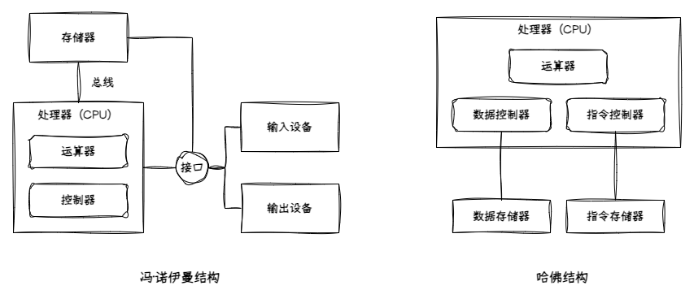
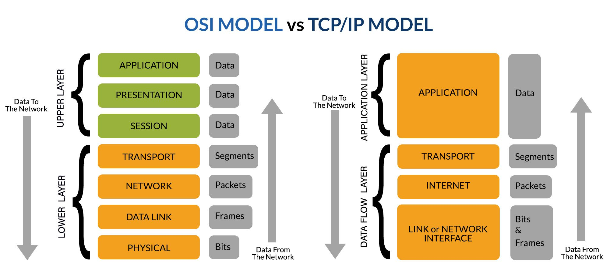
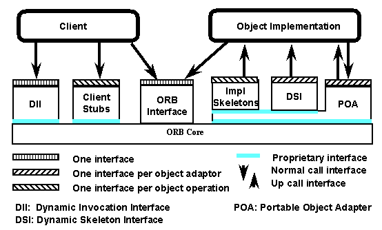
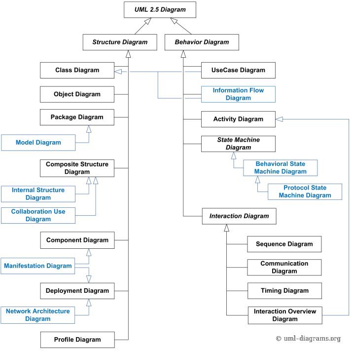
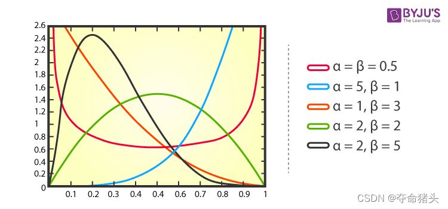

本文梳理了架构考试中的弱点概念，涵盖计算机体系结构、芯片发展、网络协议、物联网与移动通信、CORBA 与 TCSEC 标准、软件质量属性、UML、TOGAF、关系代数、操作系统内核、MDA 与 ABSD 等核心知识点，便于系统复习与查阅。

<!-- more -->

---

## 冯·诺伊曼结构与哈佛结构

- 冯·诺伊曼经典计算机结构主要分为**运算器**、**控制器**、**存储器**、**输入设备**和**输出设备**，通过**总线**连接
- 冯·诺伊曼结构的核心思想是“存储程序”和“程序控制”，也就是说，计算机将程序和数据都存储在存储器中，控制器按照存储器中的指令顺序执行程序
- 现代计算机遵循冯·诺伊曼结构，将云算器与控制器合并为**处理器**、输入设备和输出设备合并为**接口**、**总线**、**外设**的一体化系统
- 哈佛计算机架构上个世纪 50 年代因为冯·诺伊曼结构的兴起而淡出视野，在 80 年代由于**数字信号处理器（DSP）**的发展而再次流行

---

## 处理器芯片架构

[文献参考](https://jameltayeb.com/2020/08/15/p6-rocks/)

### Intel 芯片架构发展进程

| 年代 | 架构名称 | 代表产品 | 特点与意义 |
| --- | --- | --- | --- |
| 1978 | 8086 * | 8086 / 8088 | x86 架构诞生，奠定指令集基础 |
| 1982 | 80286 | Intel 286 | 实模式 + 保护模式 |
| 1985 | 80386 * | Intel 386 | 32位寄存器，全新内存分页机制 |
| 1989 | 80486 | Intel 486 | 集成FPU，支持流水线 |
| 1993 | P5 | Pentium | 超标量结构（双发射），分支预测 |
| 1995 | P6 * | Pentium Pro / II / III | 乱序执行、指令重命名、动态执行三件套 |
| 2000 | NetBurst | Pentium 4 | 超长流水线（20+），高频追求，失败案例 |
| 2006 | Core（Yonah → Conroe） * | Core 2 Duo | P6 改进 + 双核 + 更高能效比 |
| 2008 | Nehalem * | Core i7-920 | 引入 QPI、IMC、L3 缓存、SMT 超线程 |
| 2010 | Westmere | i7-980X | 六核处理器，AES-NI 指令集 |
| 2011 | Sandy Bridge * | i7-2600K | CPU+GPU 融合封装，AVX 指令 |
| 2012 | Ivy Bridge | i7-3770K | 三栅极（3D Tri-Gate）晶体管首次引入 |
| 2013 | Haswell | i7-4770K | FIVR 供电、AVX2、TSX 支持 |
| 2014 | Broadwell | i7-5775C | 14nm 首发，缓存更大 |
| 2015 | Skylake | i7-6700K | DDR4 支持，微指令缓存 |
| 2016 | Kaby Lake | i7-7700K | 优化版 Skylake，无架构大变 |
| 2017 | Coffee Lake | i7-8700K | 六核主流化 |
| 2018 | Whiskey Lake / Amber Lake | i5-8265U 等 | 移动平台优化 |
| 2019 | Comet Lake / Ice Lake | i7-10710U / i7-1065G7 | Ice 为首个 10nm CPU，集成 Iris Plus GPU |
| 2020 | Tiger Lake * | i7-1165G7 | 全新 Willow Cove 架构 + Xe GPU |
| 2021 | Alder Lake * | i9-12900K | 大小核混合（P核 + E核），Intel Thread Director |
| 2022 | Raptor Lake | i9-13900K | 增强混合架构，性能核+能效核更多 |
| 2023 | Meteor Lake * | Core Ultra 7 | 首次采用 Chiplet 架构，AI NPU |

### Nvidia GPU 芯片架构发展进程

| 年代 | 架构名称 | 代表产品 | 特点与意义 |
| --- | --- | --- | --- |
| 2004 | Curie | GeForce 6/7 系列 | 首次支持 Shader Model 3.0，引入 PureVideo 技术 |
| 2006 | Tesla | GeForce 8/9 系列 | 引入统一着色器架构，支持 CUDA，开启 GPGPU 计算 |
| 2010 | Fermi | GeForce 400/500 系列 | 引入 L1/L2 缓存，支持 ECC，提升计算性能 |
| 2012 | Kepler | GeForce 600/700 系列 | 提升能效比，支持动态并行和 Hyper-Q 技术 |
| 2014 | Maxwell | GeForce 900 系列 | 优化 SM 设计，提升性能和能效，支持 DirectX 12 |
| 2016 | Pascal | GeForce 10 系列 | 引入 NVLink，支持 HBM2，提升深度学习性能 |
| 2017 | Volta | Tesla V100 | 首次引入 Tensor Core，专为 AI 和 HPC 设计 |
| 2018 | Turing | GeForce RTX 20 系列 | 引入 RT Core，支持实时光线追踪和 AI 加速 |
| 2020 | Ampere | GeForce RTX 30 系列 | 提升 Tensor 和 RT Core 性能，支持 PCIe 4.0 |
| 2022 | Hopper | H100 | 引入 Transformer Engine，优化 AI 训练和推理 |
| 2024 | Blackwell | B100/B200 | 提升 AI 性能，支持 FP8 精度，优化能效比 |

---

## OSI 模型和 TCP/IP 协议集

- 网络五层模型是野路子，OSI 七层模型是官方标准 [ISO/IEC 7498-1](https://www.iso.org/obp/ui/#iso:std:iso-iec:7498:-1:ed-1:v2:en)
- OSI 协议集是 ISO 国际标准组织为实现 OSI 七层理论而制定的一整套实际网络协议，但历史上败给了 TCP/IP 协议集合
- OSI 协议集中有部分协议得到了保留并传播，比如 LLC、MAC

### 协议数据单元（PDU）

协议数据单元（Protocol Data Unit, PDU）是指在网络通信中，各层协议在数据传输时所使用的数据格式或信息单位。每一层在发送数据时会在上一层的数据基础上添加自己的头部（有时还有尾部），形成该层的 PDU 。对于 OSI 模型：

| 层级 | PDU | 说明 |
| --- | --- | --- |
| 应用层 表示层 会话层 | Message（消息） | 应用数据（如HTTP请求、FTP命令等） |
| 传输层 | Segment（TCP段） / Datagram（UDP数据报） | 端到端传输单元 |
| 网络层 | Packet（分组/数据包） | 网络中路由转发单元 |
| 链路层 | Frame（帧） | 局域网内传输单元 |
| 物理层 | Bits（比特流） | 在物理媒介上传输的电信号/光信号 |

PDU 的概念有助于理解数据在不同协议层之间的封装和解封装过程。

### OSI 协议集

| 层级 | 协议 | 说明 |
| --- | --- | --- |
| 应用层 | FTAM, X.400, X.500 | 文件传输、邮件、目录服务 |
| 表示层 | ASN.1（Abstract Syntax Notation One） | 数据表示和编码规则 |
| 会话层 | X.225 (Session Protocol) | 建立/管理/断开会话连接 |
| 传输层 | TP0-TP4（Transport Protocols） | 类似 TCP、UDP 的传输协议 |
| 网络层 | CLNP（Connectionless Network Protocol） | 类似 IP 的无连接网络协议 |
| 数据链路层 | LLC（Logical Link Control）、MAC | 逻辑链路控制和媒体接入控制 |
| 物理层 | X.21、RS-232、ISO 2110 | 各种物理信号标准 |

### TCP/IP 协议集

#### 应用层列表

| 简写 | 全称 | 用途 | 上下层关系 | 常用端口 |
| --- | --- | --- | --- | --- |
| HTTP HTTPS | HyperText Transfer Protocol HyperText Transfer Protocol Secure | 网页浏览与安全访问 | TCP | 80  443 |
| FTP | File Transfer Protocol | 文件传输 | TCP | 21（控制） 20（数据） |
| SMTP POP3 IMAP4 | Simple Mail Transfer Protocol Post Office Protocol 3 Internet Message Access Protocol 4 | 电子邮件收发 | TCP | 25 110 143 |
| DNS | Domain Name System | 域名解析 | TCP / UDP | 53 |
| DHCP | Dynamic Host Configuration Protocol | 动态 IP 地址分配 | UDP | 67（服务器） 68（客户端） |
| TELNET SSH | TELetype NETwork Secure Shell | 远程终端访问 | TCP | 23 22 |
| NTP | Network Time Protocol | 时间同步 | UDP | 123 |
| SNMP | Simple Network Management Protocol | 网络管理监控 | UDP | 161（查询） 162（Trap 告警） |
| TFTP | Trivial File Transfer Protocol | 简单文件传输 | UDP | 69 |
| LDAP | Lightweight Directory Access Protocol | 目录服务 | TCP / UDP | 389 |
| SIP RTSP | Session Initiation Protocol Real Time Streaming Protocol | 实时通信、流媒体控制 | TCP / UDP | 5060 554 |

#### 传输层列表

| 简写 | 全称 | 用途 | PDU |
| --- | --- | --- | --- |
| TCP | Transmission Control Protocol | 面向连接，可靠传输 | Segment |
| UDP | User Datagram Protocol | 无连接，快速传输 | Datagram |
| SCTP | Stream Control Transmission Protocol | 多流传输，信令传输 | Chunk |

#### 网络层列表

| 简写 | 全称 | 用途 | PDU |
| --- | --- | --- | --- |
| IPv4 IPv6 | Internet Protocol version 4 Internet Protocol version 6 | 数据报寻址与路由 | Packet |
| ICMP | Internet Control Message Protocol | 差错处理与控制（如Ping） | Message |
| ARP | Address Resolution Protocol | IP地址到MAC地址解析 | Frame |
| RARP | Reverse Address Resolution Protocol | MAC地址到IP地址反查（已淘汰） | Frame |
| IGMP | Internet Group Management Protocol | IPv4多播组管理 | Message |
| MLD | Multicast Listener Discovery | IPv6多播组管理 | Message |
| IPSec | IP Security | IP层安全加密与认证 | Packet |

#### 链路层列表

| 简写 | 全称 | 用途 | PDU |
| --- | --- | --- | --- |
| Ethernet | 以太网（Ethernet） | 有线局域网传输 | Frame |
| Wi-Fi | Wireless Fidelity（IEEE 802.11，无线保真） | 无线局域网传输 | Frame |
| PPP | Point-to-Point Protocol（点对点协议） | 点对点连接（拨号/广域网） | Frame |
| HDLC | High-Level Data Link Control（高级数据链路控制） | 点到点高效传输 | Frame |
| VLAN | Virtual Local Area Network（802.1Q，虚拟局域网） | 虚拟局域网分隔 | Frame |
| MPLS | Multi-Protocol Label Switching（多协议标签交换） | 高效路由转发（标签交换） | Frame / Label |
| Frame Relay ATM | Frame Relay（帧中继） Asynchronous Transfer Mode（异步传输模式） | 早期广域网技术 | Frame / Cell |

---

## 物联网与移动网络协议

- 物联网（IoT）是应用视角的技术概念，是应用需求的集合，而移动网络特指基于移动通信协议（2G/3G/4G/5G 等）发展起来的技术体系，两者具备很大程度的重叠
- 物联网（IoT）按照经典分层模型来讲分为感知层（Perception）、网络层（Network）、应用层（Application），在实际工程应用中，还可以增加平台层（Platform）和服务层（Service）
- 网络协议按照其特性，可以分为局域网（LAN）、广域网（WAN）、无线网、移动网

### 无线网络协议

| 协议 | 主要用途 | 频段 | 特点 |
| --- | --- | --- | --- |
| Wi-Fi（IEEE 802.11） | 无线局域网通信 | 2.4GHz/5GHz/6GHz | 高速、广泛应用于家庭/企业 |
| Bluetooth（IEEE 802.15.1） | 近距离设备通信 | 2.4GHz | 低功耗、短距离、点对点/组网 |
| ZigBee（IEEE 802.15.4） | 低速率无线个人局域网 | 2.4GHz/868MHz/915MHz | 低功耗、组网灵活、适合物联网 |
| Z-Wave | 智能家居自动化 | 868MHz/915MHz | 低速率、低功耗、专有协议 |
| LoRaWAN | 远距离低功耗广域网 | 433/470/868/915MHz | 超远距离、低速率、物联网应用 |
| NB-IoT | 蜂窝窄带物联网 | 700/800/900MHz等 | 运营商网络、广覆盖、低功耗 |
| Sigfox | 超窄带物联网 | 868/915MHz | 超低速率、超远距离、专有网络 |
| LTE-M（Cat-M1） | 蜂窝物联网 | 700/800/900MHz等 | 低功耗、移动性好、运营商支持 |
| WirelessHART | 工业无线传感器网络 | 2.4GHz | 工业自动化、可靠性高 |
| Thread | 智能家居物联网 | 2.4GHz | 基于IPv6、低功耗自组网 |

### 移动网络协议

| 协议 | 主要用途 | 代际 | 特点 |
| --- | --- | --- | --- |
| GSM（Global System for Mobile Communications） | 2G 移动语音与短信 | 2G | 数字蜂窝，支持语音、SMS |
| GPRS（General Packet Radio Service） | 2.5G 数据服务 | 2G/2.5G | 分组交换，支持互联网接入 |
| EDGE（Enhanced Data rates for GSM Evolution） | 2.75G 数据加速 | 2G/2.75G | 更高数据速率，兼容GSM |
| CDMA2000 | 2G/3G 移动通信 | 2G/3G | 基于CDMA，支持语音与数据 |
| WCDMA（Wideband CDMA） | 3G 移动通信 | 3G | UMTS主流，支持高速数据 |
| HSPA/HSPA+（High Speed Packet Access） | 3.5G/3.75G 数据加速 | 3G | 下行/上行速率提升 |
| LTE（Long Term Evolution） | 4G 移动宽带 | 4G | 全IP，低延迟，高速率 |
| LTE-Advanced | 4G+ 增强型 | 4G | 载波聚合，更高带宽 |
| 5G NR（New Radio） | 5G 移动通信 | 5G | 超高速、低延迟、海量连接 |
| NB-IoT（Narrowband IoT） | 物联网窄带通信 | 4G/5G | 低功耗、广覆盖、海量设备 |
| eMTC（LTE-M, Enhanced Machine Type Communication） | 物联网蜂窝通信 | 4G/5G | 低功耗、支持移动性、语音 |

### 5G 通信协议专题

5G（第五代移动通信技术）是新一代的移动通信技术，具有高速率、低延迟和大规模连接的特点。5G 通信网的关键技术包括：

| 技术 | 描述 | 优点 |
| --- | --- | --- |
| 大规模 MIMO (Massive Multiple-Input Multiple-Output) | 使用大量的天线进行数据传输，提高频谱效率和信道容量。 | 提高频谱效率，增加信道容量。 |
| 毫米波 (Millimeter Wave) | 使用高频段的无线电波进行数据传输，提供更大的带宽。 | 提供更大的带宽，实现高速数据传输。 |
| 网络切片 (Network Slicing) | 将物理网络划分为多个虚拟网络，每个虚拟网络满足不同的应用需求。 | 灵活的网络配置，满足不同的应用需求。 |
| 边缘计算 (Edge Computing) | 将计算和存储资源部署在网络的边缘，减少数据传输延迟。 | 降低延迟，提高应用响应速度。 |
| 波束成形 (Beamforming) | 将无线信号集中到一个特定的方向，提高信号的传输距离和抗干扰能力。 | 提高信号传输距离，降低干扰。 |
| 全双工 (Full Duplex) | 允许设备同时进行发送和接收数据，提高频谱利用率。 | 提高频谱利用率，增加信道容量。 |

在 5G 中，正交频分复用 (OFDM) 是一种关键的无线传输技术，它具有以下特点：

| 特点 | 描述 |
| --- | --- |
| 高频谱效率 | OFDM 将信道带宽划分为多个正交的子载波，每个子载波上进行数据传输，可以充分利用频谱资源。 |
| 抗多径衰落 | OFDM 将宽带信号分解为多个窄带信号，每个子载波上的信号带宽较窄，可以有效对抗多径衰落。 |
| 灵活的资源分配 | OFDM 可以根据用户的需求，灵活地分配子载波资源，提高资源利用率。 |
| 易于实现 MIMO | OFDM 易于与多输入多输出 (MIMO) 技术结合使用，进一步提高频谱效率和信道容量。 |
| 降低峰均功率比 (PAPR) | 通过特定的技术，可以降低 OFDM 信号的峰均功率比，减少功率放大器的负担。 |

LTE（Long Term Evolution，长期演进）是一种 4G 移动通信技术，提供更高的数据传输速率和更低的延迟。LTE 的特点包括：

| 特点 | 描述 |
| --- | --- |
| 高速数据传输 | LTE 提供下行链路高达 100 Mbps，上行链路高达 50 Mbps 的数据传输速率。 |
| 低延迟 | LTE 的延迟较低，可以提供更好的用户体验。 |
| 频谱效率 | LTE 采用 OFDM 和 MIMO 等技术，提高频谱效率。 |
| 灵活性 | LTE 支持多种频段和带宽，具有良好的灵活性。 |
| 全 IP 网络 | LTE 采用全 IP 网络架构，简化了网络结构。 |

MIMO（Multiple-Input Multiple-Output，多输入多输出）是一种无线通信技术，它使用多个发射天线和多个接收天线来提高无线通信系统的性能。MIMO 技术可以提高信道容量、频谱效率和可靠性，是 4G 和 5G 移动通信的关键技术之一。

MIMO 的基本原理是利用空间资源进行复用，通过在发射端和接收端使用多个天线，可以在同一频率上同时传输多个数据流，从而提高信道容量。MIMO 技术还可以利用多径效应，通过在接收端合并多个信号副本，提高信号的可靠性。

MIMO 技术可以分为以下几种类型：

| 类型 | 描述 | 优点 |
| --- | --- | --- |
| 空间复用 (Spatial Multiplexing) | 在发射端将数据流分成多个子流，每个子流通过不同的天线发送，在接收端通过信号处理技术将这些子流分离出来。 | 提高信道容量和频谱效率。 |
| 空间分集 (Spatial Diversity) | 在发射端将同一份数据通过不同的天线发送，在接收端将这些信号副本合并起来，提高信号的可靠性。 | 提高信号的可靠性和抗衰落能力。 |
| 波束成形 (Beamforming) | 在发射端调整天线的相位和幅度，将无线信号集中到一个特定的方向，提高信号的传输距离和抗干扰能力。 | 提高信号传输距离，降低干扰。 |

MIMO 技术在无线通信系统中得到了广泛应用，如 Wi-Fi、4G、5G 等。在 5G 中，大规模 MIMO (Massive MIMO) 是一种关键技术，它使用大量的天线进行数据传输，进一步提高频谱效率和信道容量。

在 5G 中，信道编码技术是确保数据可靠传输的关键。LDPC（低密度奇偶校验码）和 Polar 码是两种常用的信道编码技术。

| 特性 | LDPC (Low-Density Parity-Check Code) | Polar 码 |
| --- | --- | --- |
| 编码原理 | 基于稀疏矩阵的线性分组码，通过迭代译码逼近香农极限。 | 基于信道极化的理论，通过信道合并和分裂，将信道极化为可靠的子信道和不可靠的子信道。 |
| 编码复杂度 | 编码复杂度较高，需要进行矩阵运算。 | 编码复杂度较低，可以使用递归算法实现。 |
| 译码复杂度 | 译码复杂度较高，需要进行迭代译码。 | 译码复杂度较低，可以使用连续消除译码或置信传播译码。 |
| 性能 | 在长码长下，性能接近香农极限。 | 在中短码长下，性能优于 LDPC 码。 |
| 应用 | 4G、Wi-Fi、卫星通信等。 | 5G 控制信道。 |
| 优点 | 性能优异，灵活性高，支持多种码率。 | 编码和译码复杂度低，理论性能好。 |
| 缺点 | 编码和译码复杂度高，对硬件资源要求高。 | 对码长敏感，短码长下性能较差。 |

LDPC 码和 Polar 码都是现代通信系统中重要的信道编码技术，它们在不同的应用场景下发挥着重要作用。

NR（New Radio，新空口）是 5G 移动通信技术中的无线接入技术标准。它是 5G 的核心组成部分，定义了 5G 无线网络的空中接口，包括物理层、MAC 层、无线资源管理等。NR 旨在提供更高的数据传输速率、更低的延迟和更大的网络容量，以满足各种 5G 应用的需求。

> 总结一下 5G 技术层面的改进，信道编码的改进，毫米波和频谱扩展，MIMO 扩展，5G NR 资源管理优化，OFDM 优化。

> 教材的傻逼总结：
> - 基于 OFDM 优化的波形和多址接入 (人话：网络切片，物理网络虚拟化)
> - 实现可扩展的 OFDM 间隔参数配置（人话：多频谱共享、毫米波资源管理，5G NR 频域关键点）
> - OFDM 加窗提高多虑传输效率 (人话：物联网多路支持)
> - 灵活框架设计 （人话：5G NR 时域关键点，STTI时间间隔可扩展，自包含集成子帧，低延迟）
> - 大规模 MIMO 2-2 -> 4-4（人话：多天线）
> - 信道编码设计改进：（人话：LDPC 低密度奇偶效验和 Polar）

自包含集成子帧（Self-Contained Integrated Subframe）是一种在 5G NR（New Radio）中使用的帧结构设计，旨在提高无线通信系统的灵活性和效率。它具有以下特点：

| 特点 | 描述 |
| --- | --- |
| 自包含性 | 子帧包含完整的上行链路（UL）和下行链路（DL）资源，允许设备在同一子帧内完成数据的发送和接收。 |
| 灵活性 | 子帧的长度和结构可以根据实际需求进行调整，以适应不同的业务场景和信道条件。 |
| 低延迟 | 由于设备可以在同一子帧内完成数据的发送和接收，因此可以降低数据传输的延迟。 |
| 高效率 | 自包含集成子帧可以更好地利用频谱资源，提高系统的吞吐量。 |

自包含集成子帧的设计使得 5G NR 系统能够更灵活地支持各种不同的业务需求，如增强型移动宽带（eMBB）、超可靠低延迟通信（URLLC）和大规模机器类型通信（mMTC）。

> 人话，传统 TDD 上下行链路分离，ACK和NACK在不同子帧执行，自包含集成子帧将 ACK/NACK 等指令集成在一个子帧中完成低延迟，说白了，指令集成。

---

## CORBA 中间件标准

[参考引用](https://www.corba.org/orb_basics.htm#h:WhatsaServant)

| 核心概念 | 说明 |
| :--- | :--- |
| 对象（Object） | CORBA 中的基本单元，拥有唯一标识，提供一组服务接口。 |
| 接口（Interface） | 规定对象可以对外提供的服务（方法集合），通过IDL定义。 |
| IDL（Interface Definition Language） | 用来描述对象接口的语言，与具体编程语言无关。 |
| ORB（Object Request Broker） | 核心通信中介，负责在客户端和服务器端对象之间转发请求与响应。 |
| POA（Portable Object Adapter） | 服务器端管理对象实例的组件，处理对象生命周期和请求分发。 |
| IOR（Interoperable Object Reference） | 可互操作对象引用，表示对象的地址和访问信息。 |
| GIOP/IIOP | 规定不同ORB之间如何进行底层通信（GIOP是通用协议，IIOP是基于TCP/IP的实现）。 |

---

## TCSEC 安全等级标准

TCSEC（Trusted Computer System Evaluation Criteria），即著名的“橙皮书（Orange Book）”，是美国国防部在 1983 年制定的一套计算机安全评估标准，用于对操作系统与计算环境的安全等级进行分级。

| 等级 | 名称 | 简要说明 |
| --- | --- | --- |
| D | 最低保护级 Minimal Protection | 不满足 C1 以上的最低安全需求 未通过认证系统的默认等级 |
| C1 | 自主安全保护 Discretionary Security Protection | 实现基本的用户身份认证与访问控制 用户可定义访问权限 |
| C2 | 受控访问保护 Controlled Access Protection | 提供更细粒度的访问控制、审计日志、会话隔离 系统可对每个对象实现独立访问权限控制 |
| B1 | 标记安全保护 Labeled Security Protection | 增加强制访问控制（MAC） 对象被赋予安全标签（如机密级、秘密级） |
| B2 | 结构化保护 Structured Protection | 安全策略和机制更结构化，功能更分明，引入可信计算基（TCB）分层 加强标记传递控制和系统设计审查 |
| B3 | 安全域保护 Security Domains | 系统高度抵抗入侵，具备明显的可信计算边界 支持完全的审计和访问验证 |
| A1 | 形式化验证设计保护 Verified Design | 在 B3 基础上进行形式化的安全模型验证和实现验证 确保所有安全机制符合设计规范，是最高级别的保障体系 |

这里重点澄清《计算机信息系统安全保护等级划分准则》（GB/T 17859-1999）与 TCSEC 安全等级标准的对应关系

| 等级 | 名称 | 说明 |
| --- | --- | --- |
| 第一级（C1） | 自主保护级 | 防止无意的非法用户访问，保障系统基本可用性 实施最基本的安全措施，如用户认证和简单访问控制 |
| 第二级（C2） | 系统审计级 | 除一级目标外，要求可追踪操作行为 增加审计日志、安全标识、事件追踪 |
| 第三级（B1） | 安全标记级 | 加强对数据资源的访问控制，防止主动攻击 引入强制访问控制、访问标记、安全标签等机制 |
| 第四级（B2） | 结构保护级 | 防范有组织攻击，具备较高可信保障能力 明确划分系统安全边界，具备完整的安全策略实施机制 |
| 第五级（B3） | 访问验证级 | 防范国家级攻击者，支持系统整体可信验证 系统整体安全架构具备形式化安全验证机制，可抵御高强度攻击 |

---

## 软件质量属性

参考 ISO 25010:2023 标准：

| 主要特性 (Main Characteristic) | 子特性 (Sub-characteristic) |
| --- | --- |
| 功能适用性 (Functional suitability) | 功能完备性 (Functional completeness) |
|  | 功能正确性 (Functional correctness) |
|  | 功能适当性 (Functional appropriateness) |
| 性能效率 (Performance efficiency) | 时间行为 (Time behaviour) |
|  | 资源利用率 (Resource utilisation) |
|  | 容量 (Capacity) |
| 可靠性 (Reliability) | 成熟性 (Maturity) |
|  | 容错性 (Fault tolerance) |
|  | 可恢复性 (Recoverability) |
|  | 无故障性 (Faultlessness) |
|  | 可用性 (Availability) |
| 兼容性 (Compatibility) | 共存性 (Co-existence) |
|  | 互操作性 (Interoperability) |
| 交互能力 (Interaction capability) (原可用性 Usability) | 适当性识别性 (Appropriateness recognisability) |
|  | 可学习性 (Learnability) |
|  | 可操作性 (Operability) |
|  | 用户界面美观性 (User interface aesthetics) |
|  | 可访问性 (Accessibility) |
|  | 用户错误防护 (User error protection) |
|  | 用户参与 (User engagement) |
|  | 包容性 (Inclusivity) |
|  | 用户帮助 (User assistance) |
|  | 自描述性 (Self descriptiveness) |
| 可维护性 (Maintainability) | 模块化 (Modularity) |
|  | 可重用性 (Reusability) |
|  | 可分析性 (Analysability) |
|  | 可修改性 (Modifiability) |
|  | 可测试性 (Testability) |
| 灵活性 (Flexibility) (原可移植性 Portability) | 适应性 (Adaptability) |
|  | 可伸缩性 (Scalability) |
|  | 可安装性 (Installability) |
|  | 可替换性 (Replaceability) |
| 信息安全性 (Security) | 保密性 (Confidentiality) |
|  | 完整性 (Integrity) |
|  | 不可否认性 (Non-repudiation) |
|  | 责任性 (Accountability) |
|  | 真实性 (Authenticity) |
|  | 抵抗性 (Resistance) |
| 功能安全性 (Safety) | 运行约束 (Operational constraint) |
|  | 风险识别 (Risk identification) |
|  | 故障安全 (Fail safe) |
|  | 危险警告 (Hazard warning) |
|  | 安全集成 (Safe integration) |

---

## UML 设计标准

- 以 UML 2.5 为例，官方将图形工具分类为结构图（Structure Diagram）和行为图（Behavior Diagram）

### OMT 设计方法

对象建模技术 (Object Modeling Technique, OMT) 是由 James Rumbaugh 和他的同事在通用电气公司开发的一种早期的面向对象分析和设计方法。它在 1991 年出版的《面向对象建模与设计》（Object-Oriented Modeling and Design）一书中被广泛介绍，并在 1990 年代非常流行，是 UML 出现之前最具影响力的面向对象方法之一。

---

## TOGAF 信息系统架构

TOGAF（The Open Group Architecture Framework）是目前国际上应用最广泛的企业架构（Enterprise Architecture, EA）框架之一，由开放组织（The Open Group）制定和维护。它为企业架构的开发、实施、治理提供了一个系统化、结构化的方法论和工具集，广泛应用于政府、大型企业、信息系统集成项目中。

[参考连接](https://www.visual-paradigm.com/guide/togaf/togaf-91-framework/)

TOGAF 组成：

| 序号 | 组成 | 目的 |
| --- | --- | --- |
| 1 | 架构开发方法 (ADM) | 如何管理企业架构？ |
| 2 | ADM 指南和技巧 | 我们如何应用 ADM？ |
| 3 | 架构内容框架：可交付成果、工件、构建块 | 我们如何映射所有必要的信息？ |
| 4 | 企业连续统一体：架构知识库 | 我们如何最大化现有架构的重用？ |
| 5 | TOGAF 参考模型 | 我们如何基于行业实践模型构建？ |
| 6 | 架构能力框架：建立 EA 能力 | 我们如何设计我们的企业架构？ |

---

## 宏内核与微内核

宏内核是一种操作系统内核架构，其特点是将操作系统的所有核心服务（如进程管理、内存管理、文件系统、设备驱动、网络协议栈等）全部集成在单一的内核空间中运行。宏内核直接与硬件交互，所有服务都以内核态运行，彼此之间通过过程调用进行通信。

**主要特点**

- 高性能：由于所有服务都在内核空间，系统调用和服务间通信开销较小，性能较高。
- 复杂性高：内核体积庞大，代码复杂，维护和扩展难度较大。
- 稳定性风险：内核中任一模块出错都可能导致整个系统崩溃。
- 常见代表：Linux、Windows NT、UNIX（如 BSD、System V）等操作系统均采用宏内核架构。

**特性对比**

| 特性 | 宏内核 | 微内核 |
| ----- | ----- | ----- |
| 服务集成 | 所有核心服务集成在内核 | 仅保留最基本服务，其他服务在用户空间 |
| 性能 | 较高 | 通信开销大，性能略低 |
| 扩展性 | 较差 | 较好，易于模块化 |
| 稳定性 | 内核崩溃风险高 | 单一服务崩溃影响小 |

宏内核适合对性能要求较高、对硬件支持广泛的通用操作系统场景。

鸿蒙OS的内核架构是一个复杂且演进的过程。目前来看，鸿蒙OS并非纯粹的微内核或宏内核，而是一种混合内核的设计，并且正在朝着完全的微内核架构演进。

以下是一些关键点：

- 初期和部分设备： 在鸿蒙 OS 的早期版本以及一些资源受限的设备上，它采用了 Linux 宏内核或 LiteOS 等不同的内核。这意味着在这些情况下，鸿蒙 OS 在一定程度上是基于宏内核或轻量级内核的。
- 微内核的引入和发展： 华为从一开始就宣传鸿蒙 OS 是基于微内核的。鸿蒙 OS 的微内核主要应用于对安全性要求较高的场景，例如支付、人脸识别和指纹识别等。这个微内核具有代码量小、安全性高等特点，并且通过了形式化方法的认证。
- 多内核设计和内核抽象层 (KAL)： 鸿蒙 OS 采用了多内核设计，这意味着它可以根据不同设备的资源限制和需求选择合适的内核。为了屏蔽底层不同内核的差异，鸿蒙 OS 引入了内核抽象层 (KAL)，向上层提供统一的内核能力，包括进程/线程管理、内存管理、文件系统、网络管理和外设管理等。
- 未来趋势： 华为的长期目标是将鸿蒙 OS 发展成为一个完全基于自研微内核的操作系统。最新的鸿蒙星河版（HarmonyOS NEXT）已经去掉了 Linux 内核和安卓 AOSP 代码，仅支持鸿蒙内核和鸿蒙系统的应用，这标志着向纯微内核架构迈出了重要一步。

**信息总结**

当前的鸿蒙 OS 是一个混合内核系统，它在不同的设备和场景下可能使用不同的内核（包括 Linux 宏内核、 LiteOS 等），并且已经拥有并使用自研的微内核，尤其是在安全相关的领域。未来的发展方向是全面转向自研的微内核架构。

---

## MDA 模型驱动架构

在系统架构师考试中，**MDA（Model-Driven Architecture，模型驱动架构）**是面向模型的软件开发方法的重要考点。MDA 由 OMG（Object Management Group）提出，其核心思想是：通过模型转换来指导系统的开发和实现，从而提高系统的可移植性、可复用性与可维护性。

| 模型类型 | 全称 | 作用 |
| --- | --- | --- |
| CIM | Computation Independent Model（计算无关模型） | 关注业务需求和流程，与计算和实现无关，又称业务模型 |
| PIM | Platform Independent Model（平台无关模型） | 描述系统功能，但不涉及任何平台相关内容 |
| PSM | Platform Specific Model（平台相关模型） | 将PIM映射到具体技术平台，如Java、.NET、WebService |

---

## ABSD 基于架构的软件开发

ABSD（Architecture-Based Software Development，基于架构的软件开发）是系统架构师考试中的一个高频考点，体现了“以架构为中心”的现代软件开发方法，与 MDA 等模型驱动开发思想相辅相成。

**ABSD 的核心内容**

| 维度 | 说明 |
| --- | --- |
| 架构设计优先 | 开发从架构出发，而不是从需求直接写代码 |
| 组件化构建 | 系统被分解为一组可重用、可部署的组件（Component） |
| 连接器建模 | 构建组件之间通信机制（Connector），如调用、事件、消息、数据流等 |
| 架构文档驱动开发 | 明确架构文档在开发全生命周期中的主导地位 |
| 架构评估与重构 | 支持对架构的评估、优化、演进 |

**ABSD 的开发流程**

1. 架构分析（Architecture Analysis）
2. 架构设计（Architecture Design）
3. 架构实现（Architecture Implementation）
4. 架构验证与评估（Architecture Evaluation）
5. 架构维护与演进（Architecture Maintenance & Evolution）

---

## Beta 概率分布与 PERT 期望

理解 Beta 分布的关键在于认识到它可以被视为“**概率的概率分布**”。这意味着它不是直接描述一个事件发生的次数，而是描述一个概率值本身**的可能性分布。

Beta 分布的概率密度函数（PDF）为：

$$
f(x; \alpha, \beta) = \frac{\Gamma(\alpha+\beta)}{\Gamma(\alpha)\Gamma(\beta)} x^{\alpha-1} (1-x)^{\beta-1}, \quad 0 < x < 1,\ \alpha, \beta > 0
$$

其中 $\Gamma(\cdot)$ 为伽马函数，$\alpha$ 和 $\beta$ 是形状参数。

### PERT 期望计算

PERT 法使用 Beta 分布的思想（但通常不直接使用 Beta 分布的完整数学公式进行计算）来给出一个更合理的期望持续时间估算。它假设任务的实际持续时间分布类似于一个 Beta 分布的形状，其中最可能估算周围的概率密度较高。

PERT 期望（加权平均）计算公式：$ E = \frac{O + 4M + P}{6} $

其中：

- $E$ 为期望工期（Expected duration）
- $O$ 为最乐观时间（Optimistic time）
- $M$ 为最可能时间（Most likely time）
- $P$ 为最悲观时间（Pessimistic time）

该公式体现了对最可能时间的加权，反映了实际项目管理中对中间估算的重视。
