本文系统梳理了系统架构师考试中软件工程相关的核心知识，包括基础概念、认知哲学、生命周期模型、架构设计方法与理念、质量属性分析、系统测试与可靠性建模，以及系统演化策略。内容涵盖理论基础、主流模型、实际案例和标准方法，帮助读者全面理解软件工程的体系化方法与实践要点。

<!-- more -->

## 1.基础概念

### 1.1.概念定义

软件危机的概念，1968、1969 年北大西洋公约组织 NATO 连续召开两次会议，定义问题和痛点：
- 进度难以预测
- 成本难以控制
- 期望难以满足
- 质量无法保证
- 软件难以维护
- 文档资料缺失

软件工程是研究和应用工程化方法来指导软件开发、运行和维护的学科，旨在以系统化、规范化和可量化的方式生产高质量的软件产品。其核心内容包括需求分析、设计、编码、测试、维护等阶段，通过合理的管理和技术手段提高软件的可靠性、可维护性和开发效率。

### 1.2.认知哲学

> 我的目标是通过对软件工程的系统化学习，整合工程化方法和认知哲学，总结出自己的一套从理论出发的认知路径。

#### 1.2.1.认知理论

AI 为我总结了西方哲学历史上出现的认识论流派与观点：

| 认识论流派 | 历史时间 | 主要代表 | 精炼核心观点 |
|-|-|-|-|
| **唯心认识论** | 古希腊 | 柏拉图、黑格尔、笛卡尔 | 意识或理念决定现实。 |
| **经验认识论** | 17世纪 | 洛克、休谟、培根 | 知识源于感官经验。 |
| **理性认识论** | 17世纪 | 笛卡尔、莱布尼茨、斯宾诺莎 | 理性推理是知识基础。 |
| **批判认识论** | 18世纪 | 康德、波普尔 | 经验与理性结合，知识可证伪。 |
| **唯物认识论** | 19世纪 | 马克思、恩格斯、列宁 | 认识源于实践，实践检验真理。 |
| **实用认识论** | 19世纪 | 杜威、詹姆斯、皮尔士 | 真理以实际有用为标准。 |
| **现象认识论** | 20世纪 | 胡塞尔、海德格尔 | 关注主观体验与意识。 |
| **建构认识论** | 20世纪 | 维果茨基、皮亚杰、坎普 | 知识在互动中主动建构。 |

##### 马克思主义辩证法

根据对各种认识论的初步调研，在系统工程中较为合适的思维哲学是马克思辩证唯物认识论。

辩证法强调事物普遍联系和永恒发展。其核心概念包括：

- **对立统一规律**：事物内部存在矛盾，矛盾双方既对立又统一，推动事物发展。
- **质量互变规律**：量的积累引发质的飞跃，事物发展是渐进与突变的统一。
- **否定迭代规律**：事物发展呈螺旋式上升，每一次否定都是对旧事物的超越和保留。

#### 1.2.2.认知思维

我自己总结了边界、目标、结构、行为、模型、演化、治理、价值八大视角，并且汇总了面向系统工程的问题框架。

| 视角 | 认知目标 | 示例问题 |
|-|-|-|
| **边界（Boundary）** | 明确系统的空间、逻辑、组织边界及其开放性 | - 系统的边界在哪里？ - 系统与外部的交互路径是什么？ - 有哪些外部依赖或约束？ - 哪些子系统是“外部的”，但被认为“部分可控”？ |
| **目标（Objective）** | 理解系统存在的动因、主要目标与多目标权衡 | - 系统要解决的根本问题是什么？ - 有哪些显性/隐性目标？ - 目标是否动态变化？ - 如何在效率、安全、可扩展性等目标间做权衡？ |
| **结构（Structure）** | 把握系统构件、层级、连接关系与耦合形式 | - 系统由哪些核心构件组成？ - 各部分是如何协同工作的？ - 存在哪些耦合点与关键通路？ - 是否存在中心化或分布式结构？ |
| **行为（Behavior）** | 理解系统的动态运行逻辑与状态迁移特征 | - 系统在典型使用场景下会产生哪些行为？ - 哪些变量控制了系统输出？ - 是否存在关键路径、死循环或延迟链？ - 如何识别系统的稳定性与鲁棒性？ |
| **模型（Model）** | 描述系统的抽象认知方式及建模方法 | - 系统采用了哪些形式化/经验建模方式？ - 哪些模型是基于数据，哪些是基于规则？ - 模型的可信度、可验证性和可复用性如何？ - 模型之间是否存在冲突或断裂？ |
| **演化（Evolution）** | 认识系统随时间演变的路径与约束 | - 系统是如何从历史状态演变而来的？ - 有哪些“不可逆”的设计决策？ - 如何支持系统的弹性与进化能力？ - 是否存在外部变化无法适应的风险点？ |
| **治理（Governance）** | 掌握系统的控制机制、决策权结构与运维体系 | - 谁负责系统运行与变化？ - 系统的管理机制是集中式还是协同式？ - 是否存在冲突处理机制？ - 监控与审计机制如何运行？ |
| **价值（Value）** | 评估系统的目标达成度、代价与社会影响 | - 系统对各方带来了什么价值？ - 有哪些不可量化但重要的价值（如信任、公平）？ - 如何评估系统成功？是否有统一的标准？ - 是否存在负外部性或价值错配？ |

#### 1.2.3.认知路径

依据辩证唯物主义认识论，系统工程的认识过程可划分为**感性认知**、**理性分析**、**系统设计**、**实践验证**及**反馈演进**五个阶段，体现了“实践—认识—再实践—再认识”的螺旋式上升规律。

1. **感性认知阶段**：认识的起点
    - 通过观察、调研、数据采集等手段，获取系统运行的直观信息
    - 强调现象感知与经验积累，为后续分析奠定基础
    - 关键词：表象、经验、问题感知
2. **理性分析阶段**：认识的深化
    - 对感性信息进行抽象、归纳和逻辑推演
    - 明确系统目标、功能边界与构成要素
    - 构建系统模型，揭示运行机制与内在规律
    - 关键词：结构建模、本质分析、系统边界、逻辑演绎
3. **系统设计阶段**：认识的应用
    - 运用系统思维对复杂系统进行分解与集成
    - 制定可行方案，开展多方案比较与优选
    - 为实践提供理论支撑与技术路径
    - 关键词：架构设计、模块划分、集成方案、技术路线
4. **实践验证阶段**：认识的检验
    - 将设计方案付诸实施，验证系统运行效果
    - 监测运行状态，评估目标达成度与性能指标
    - 识别偏差，反馈问题，形成再认识基础
    - 关键词：方案实施、实地验证、运行监控、效果评估
5. **反馈演进阶段**：认识的升华
    - 基于实践反馈，修正模型与假设
    - 推动系统优化与演进，进入新一轮认知循环
    - 实现认识的深化与理论的创新
    - 关键词：认知修正、持续优化、系统演进、螺旋上升

### 1.3.数学视角

问题空间（Problem Space）和求解空间（Solution Space）是系统建模、人工智能、运筹优化等领域中非常重要的两个数学概念，尤其在问题求解、搜索算法、系统优化、建模抽象中被广泛使用。

> - 软件工程的数学本质，可以理解为从问题空间到求解空间的建模
> - 现实生活中，我们通过软件工程来解决业务上遇到的复杂问题，在不同的场景下得到不同的求解策略，并实施行动

#### 1.3.1.问题空间 (Problem Space)

定义：问题空间是指从初始状态（起点）到目标状态（终点）所涉及的所有可能状态及其状态转移规则构成的集合。

特征：
- 所有合法的中间状态集合（不是所有状态都能到达目标）
- 表达了问题结构本身
- 在人工智能中，常用图（Graph）或树（Tree）来描述问题空间

公式：

如果状态空间为 $State$，动作集合为 $Action$，则问题空间为：

$$ \text{Problem Space} = \{ State,Action \} $$

#### 1.3.2.求解空间 (Solution Space)

定义：求解空间是指满足问题约束的所有可能解的集合，通常是从问题空间中筛选出符合目标条件的部分。

特征：
- 求解空间是问题空间的有效子集
- 包含了所有可接受、合法、最优或次优的解决方案
- 常用于约束满足问题、组合优化、机器学习等领域

公式：

如果问题空间为 $PS$，目标函数为 $f(x)$，约束为 $C$，则解空间为：

$$ \text{Solution Space} = \{ x \in PS \mid C(x) \text{ is true} \} $$

---

## 2.生命周期

> 当我们分析一个生命周期时，需要从时间角度去分析不同的阶段，同时归纳结构化特点，针对各个环节进行方法论探讨。

下图为软件工程的生命周期模板评估：

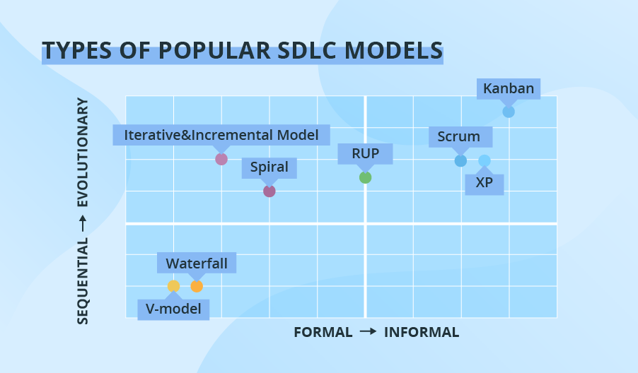

- X 轴代表用户参与度越来越高
- Y 轴代表流程灵活性越来越高

研究数据评估，场景假设 1000 个函数的软件开发，对比成本、质量（缺陷统计）、时间（TCO，单位时间成本）：

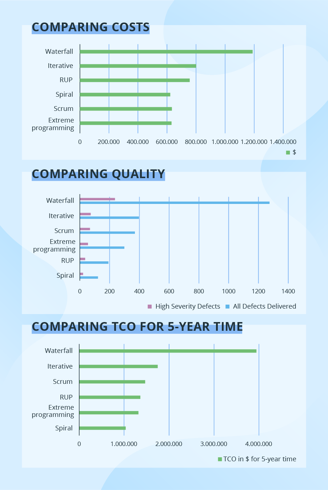

配套的看板工具示意图：

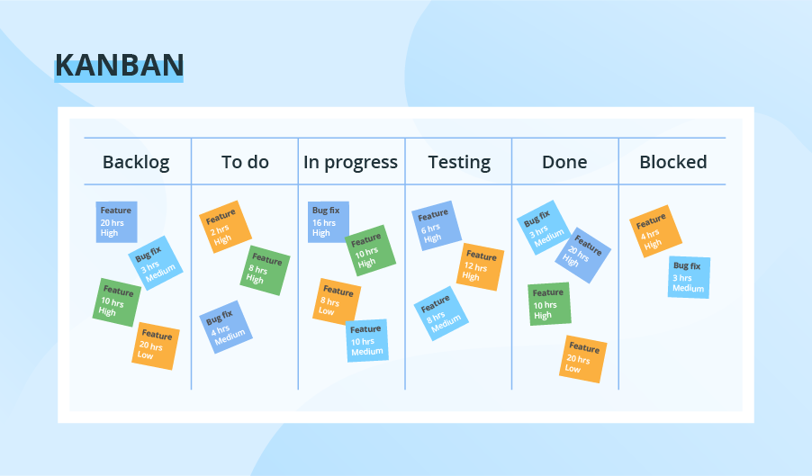

### 2.1.生命周期建模

#### 2.1.1.瀑布模型 (Waterfall)

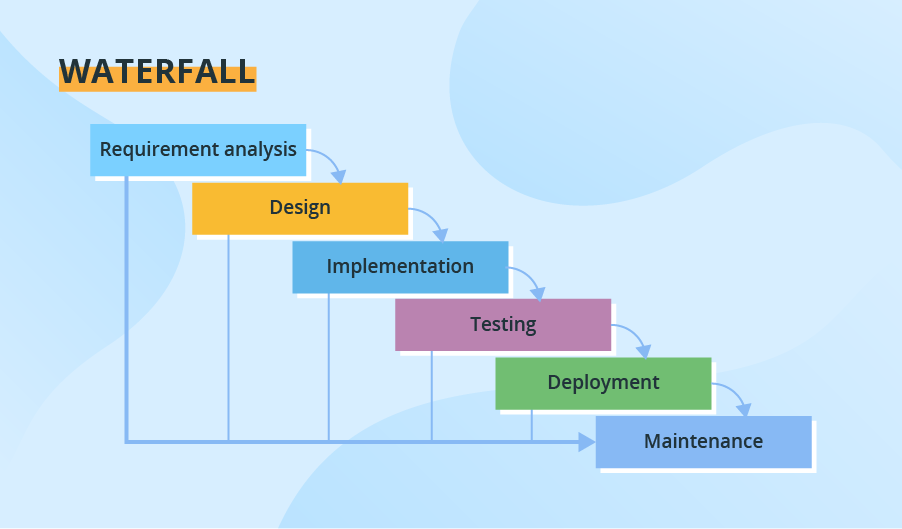

**特点**：
- 基线软件过程模型
- 串行链路结构

**案例**：
- 具有明确定义和不变要求的简单、中小型项目（小公司网站开发）。
- 需要更严格控制、可预测预算和时间表的项目（例如，政府项目）。
- 必须遵守多项规则和法规的项目（医疗保健项目）。
- 使用知名技术堆栈和工具的项目。

#### 2.1.2.验证模型 (V-Model)

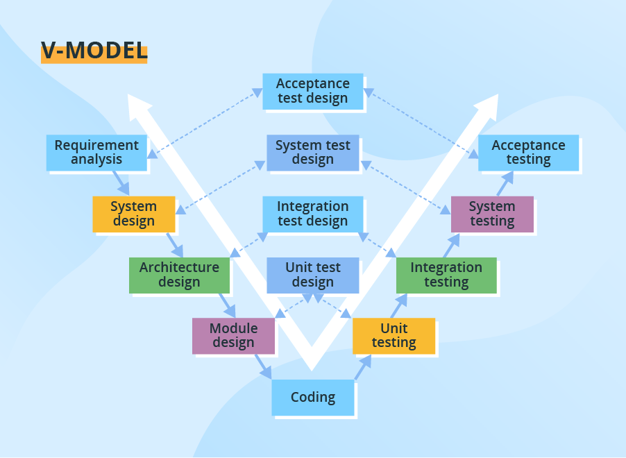

**特点**：
- 划分为设计阶段与验证阶段
- 每个阶段都有测试环节

**案例**：
- 不可接受的故障和停机时间的项目（例如，医疗软件、航空机队管理软件）。

#### 2.1.3.增量模型 (Incremental)

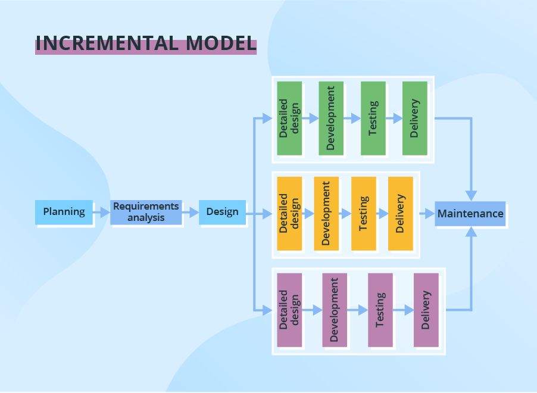

特点总结
- 实现环节模块化实现
- 软件过程并行推进

##### 净室软件工程 (Cleanroom Software Engineering)

Cleanroom Software Engineering（净室软件工程）采用的是一种特殊形式的增量式开发模型，它融合了形式化方法、统计质量控制和逐步增强（Incremental Refinement）三者的特点，形成了其独有的开发过程。

**定义**：净室软件工程是一种以高可靠性和高质量为目标的软件开发方法。它通过严格的数学方法和统计质量控制技术，减少软件中的缺陷，避免传统的“测试-修复”开发模式。

**特点**：
1. 形式化规范：
    - 使用数学方法描述软件的功能和行为。
    - 确保需求和设计的精确性，避免歧义。
2. 增量开发：
    - 将系统分解为多个增量，每个增量独立开发、验证和集成。
    - 每个增量都经过严格的质量控制。
3. 无缺陷开发：
    - 开发过程中不依赖传统的动态测试，而是通过形式化验证和代码审查确保无缺陷。
4. 统计质量控制：
    - 使用统计抽样和可靠性模型预测软件的质量和可靠性。
    - 确保软件达到预期的可靠性目标。

**案例**：NASA 航天器控制软件开发

NASA 的航天器控制软件需要极高的可靠性，因为任何软件缺陷都可能导致任务失败，甚至危及航天器和宇航员的安全。传统的“测试-修复”开发模式无法满足这种高可靠性需求，因此 NASA 采用了净室软件工程方法来开发关键系统。

1. 需求分析：
    - 使用形式化方法（如 Z 语言）描述航天器控制系统的需求。
    - 确保需求的完整性和一致性，避免歧义。
2. 设计阶段：
    - 采用模块化设计，将系统分解为多个独立的功能模块（如导航、通信、姿态控制等）。
    - 使用数学模型验证模块之间的接口和交互。
3. 实现阶段：
    - 编码严格遵循设计规范。
    - 开发过程中不进行动态测试，而是通过代码审查和形式化验证确保代码的正确性。
4. 验证阶段：
    - 使用统计质量控制方法对软件进行可靠性评估。
    - 通过模拟航天器的运行环境，验证软件的行为是否符合规范。

软件在首次运行时即达到高可靠性，未发现关键缺陷，减少了传统测试和修复的时间成本，提高了软件的可预测性和稳定性。

#### 2.1.4.迭代模型 (Interative)

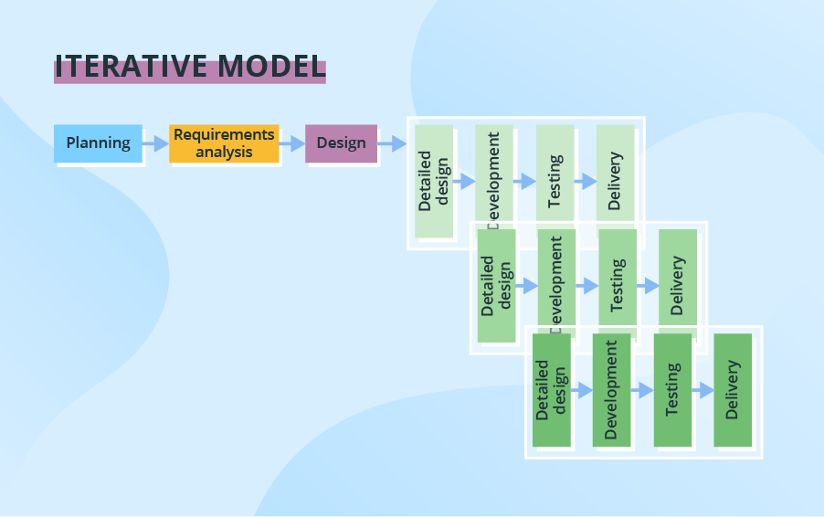

**特点**：
- 引入迭代开发环节
- 局部回路迭代

**案例**：
- 大型任务关键型企业应用程序，最好由松散耦合的部分组成，例如微服务或 Web 服务。

#### 2.1.5.螺旋模型 (Spiral)

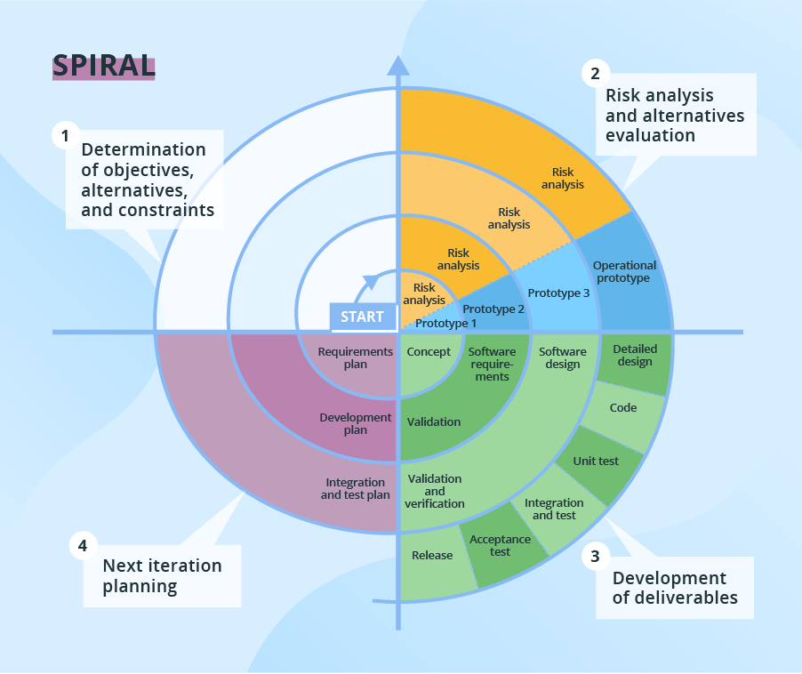

**特点**：
- 引入风险评估流程，关注质量管理
- 原型阶段性迭代
- 每个阶段细分为目标设定、风险分析、开发验证、结果评审

**案例**：
- 业务需求不明确或要求过于创新性的项目。
- 大型复杂项目。
- 研究和开发（R&D）一体化或创新产品。

#### 2.1.6.冲刺模型 (Scrum)

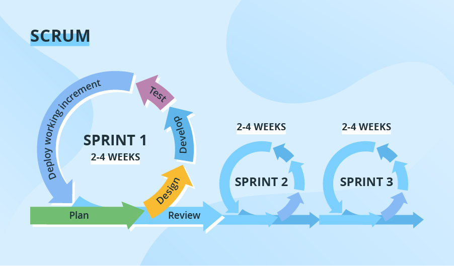

**特点**：
- 单次迭代持续 2-4 周
- 每日变更迭代

**案例**：
- 几乎任何需要最终用户早期反馈的创业计划。
- 自定义软件开发中的大多数中型项目，其中的业务需求无法自信地转化为详细的软件需求。
- 大型项目易于划分为小的功能部分，并且可以在每次迭代中逐步开发。

#### 2.1.7.极限编程 (XP)

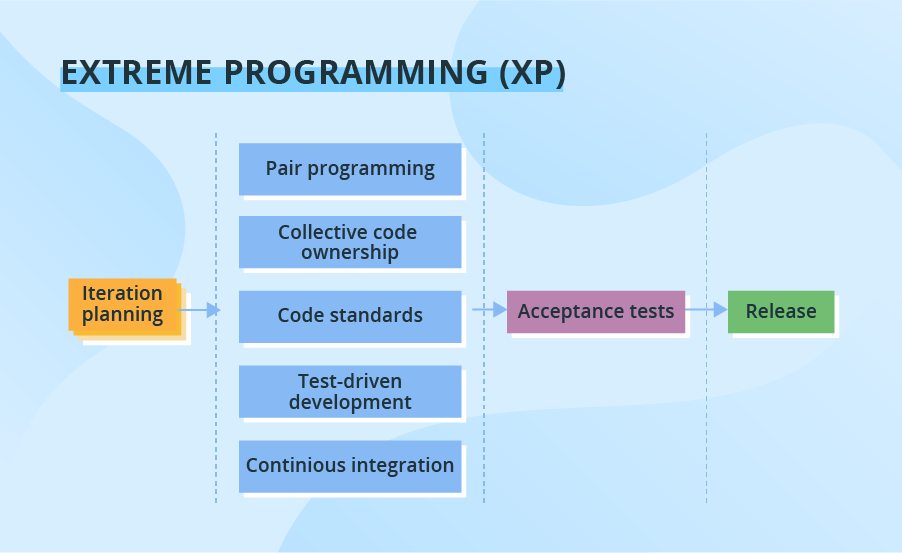

**特点**：
- 单次迭代持续 1-2 周
- 简单设计、结对编程、测试驱动、持续集成

#### 2.1.8.统一过程 (RUP)

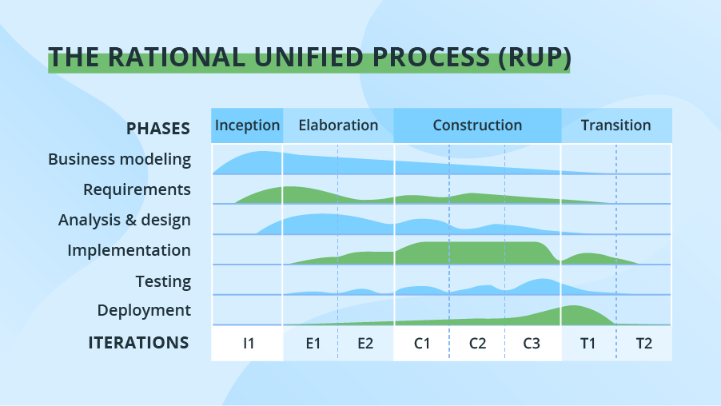

**特点**：
- 引入里程碑概念
- 用例驱动
- 过程分片
- 分片局部迭代

**案例**：
- 大型和高风险项目，尤其是基于用例的开发和高质量软件的快速开发。

### 2.2.生命周期分析

#### 2.2.1.能力成熟度标准（CMMI）

CMMI（Capability Maturity Model Integration，能力成熟度模型集成）是一套用于改进组织软件开发过程能力的国际标准框架。
CMMI 通过定义一系列过程领域和成熟度等级，帮助组织系统性地提升过程管理水平、产品质量和项目交付能力。

**核心内容**：

- **过程改进框架**：CMMI 提供了从初始级到优化级的五个成熟度等级，每一级都有明确的过程目标和实践要求。
- **过程领域（Process Areas）**：涵盖项目管理、工程、支持和过程管理等多个方面，如需求管理、项目计划、质量保证、配置管理等。
- **持续改进**：强调通过度量、分析和反馈机制，持续优化组织的软件开发流程。

**应用价值**：

- 提高项目可控性和可预测性
- 降低开发风险和缺陷率
- 增强客户信任和市场竞争力
- 支持组织持续成长和能力提升

CMMI 广泛应用于软件开发、系统集成、服务管理等领域，是衡量组织过程能力和成熟度的重要标准。

| 级别 | 名称 | 关键特征 |
| - | - | - |
| 1 | 初始级 | * 过程不可预测，混乱。   * 依赖于个人努力。   * 项目成功取决于个体能力。 |
| 2 | 管理级 | * 项目过程受到管理。   * 按照计划执行、监测和控制。   * 建立基本的项目管理过程，如需求管理、项目计划、项目监控等。   * 该阶段表明企业能够去按计划与流程做事情。 |
| 3 | 定义级 | * 组织过程被标准化并文档化。   * 拥有标准化的项目过程，可根据特定项目进行定制。   * 注重流程的标准化和统一化。   * 该阶段表明企业不但在同类的项目上能成功，在不同类项目上也能成功。 |
| 4 | 量化级 | * 过程被量化管理。   * 使用统计和其他量化技术来控制过程性能。   * 注重数据的收集和分析，以改进流程。   * 该阶段表明，管理流程要被量化和数字化。 |
| 5 | 优化级 | * 过程持续改进。   * 不断寻求改进过程的方法，以提高效率和效果。   * 注重流程的创新和优化。   * 表明公司具备持续发展，适应，并且成长的能力。 |

#### 2.2.2.质量管理标准（ISO 9001）

ISO 9001 是国际标准化组织（ISO）制定的质量管理体系（QMS）标准，适用于各类组织，包括软件开发企业。其核心目标是通过建立系统化的管理流程，持续提升产品和服务质量，满足客户和法规要求。

**主要内容：**
- 以“以客户为中心”为原则，强调满足客户需求和提升客户满意度
- 强调过程方法和基于风险的思维，要求组织识别、管理和持续改进关键过程
- 包括文件化管理、资源管理、产品实现、测量分析与改进等环节
- 要求组织建立质量方针、目标和管理评审机制，推动持续改进

**在软件工程中的应用：**
- 规范软件开发流程，提升过程可控性和产品一致性
- 强化文档管理、变更控制和质量保证
- 支持通过第三方认证，增强市场竞争力和客户信任

ISO 9001 关注的是组织整体的质量管理体系，而不是具体的软件开发技术。通过实施 ISO 9001，软件企业能够系统性地提升管理水平和产品质量，降低风险，满足客户和市场的高标准要求。

#### 2.2.3.风险管理标准

Boehm、Charette 和 CMU-SEI 风险管理体系各有侧重，适用场景和方法论存在明显差异：

| 体系 | 主要场景 | 管理流程 | 关注重点 |
|-|-|-|-|
| **Boehm** | 需求不明确、技术复杂、创新性强的项目 | 识别 → 分析 → 排序 → 缓解 → 跟踪 → 沟通 | 风险优先级、动态缓解、开发过程集成 |
| **Charette** | 大型、复杂、跨学科高风险系统工程 | 识别 → 分类建模 → 分析评估 → 优先级 → 策略制定 → 动态监控 | 风险全景、动态调整、团队沟通 |
| **CMU-SEI** | 追求过程成熟度、规范化管理的企业和政府项目 | 准备 → 识别 → 分析 → 规划 → 跟踪 → 控制 → 沟通 | 过程规范、持续改进、组织级能力 |

- **Boehm** 强调风险与开发活动的紧密结合，适合以风险为驱动的敏捷或螺旋开发流程。
- **Charette** 注重风险的多维度和动态变化，适合复杂系统和跨领域项目，强调知识共享和动态管理。
- **CMU-SEI** 提供标准化、系统化的风险管理流程，适合需要过程成熟度和持续改进的组织。

---

## 3.需求分析

> - 引用马克思主义辩证法的观点：**矛盾是事物发展的根本动力**
> - 针对软件工程而言，**用户的需求和痛点就是矛盾在软件工程中的对应概念**
> - 在一个相对周期内，**如果系统内各个环节均达成了共识，也就不会有问题**

需求工程通俗的来说，就是需求文档的制定与过程控制。

对于小型或独立团队来说，具备较高行业经验的个人，本身具备足够丰富的产品化经验，可以对某些环节进行裁剪。

对于大型软件工程来说，需求由于其复杂性和不稳定性，有时需要专门的团队来进行系统性管理与支持。

- **需求获取 (Elicitation)**：关注点在于需求的获取策略
- **需求分析 (Analysis)**：价值点、可行性、成本分析
- **需求定义 (Specification)**：标准化文档编制
- **需求验证 (Validation)**：用户一致性确认，各环节达成共识
- **需求管理 (Management)**：变更控制与版本控制，进度把控，需求与设计的正反向跟踪

---

## 4.架构设计

软件架构是软件系统的高层次抽象，它定义了系统的组成单元、这些单元之间的连接方式及其交互机制，并通过架构原则和设计规范指导系统的开发、演化和部署过程。软件架构既关注功能结构，又强调对性能、可靠性、可维护性、安全性等质量属性的支持。

架构驱动的软件开发（Architecture-Based Software Development，ABSD）是一种以软件架构为核心的开发方法，它强调在软件开发的早期阶段定义清晰的架构，并以此指导后续的开发活动。ABSD 方法通过架构设计来满足系统的质量属性需求，降低开发风险，提高开发效率。

**ABSD 的核心思想**：

- 架构优先：在需求分析之后，首先进行架构设计，确保架构能够满足关键的质量属性需求。
- 迭代开发：ABSD 通常采用迭代的开发方式，每个迭代都关注架构的演化和完善。
- 涉众参与：架构设计需要与所有涉众（包括客户、开发人员、测试人员等）进行充分的沟通和协商，确保架构能够满足各方的需求。

**ABSD 的典型步骤**：

- 需求获取：收集和分析系统的功能需求和质量属性需求。
- 架构设计：基于需求设计系统的架构，包括选择合适的架构风格、定义组件和接口、确定组件之间的交互方式等。
- 架构评估：对架构进行评估，检查其是否能够满足质量属性需求，并识别潜在的风险。
- 架构实现：根据架构设计，逐步实现系统的各个组件。
- 架构演化：在开发过程中，根据反馈和变化的需求，对架构进行演化和调整。

**ABSD 的优点**：

- 提高软件质量：通过架构设计来满足质量属性需求，提高软件的可靠性、性能、可维护性等。
- 降低开发风险：在早期阶段识别和解决潜在的架构问题，降低开发风险。
- 提高开发效率：通过清晰的架构指导开发活动，减少开发过程中的不确定性，提高开发效率。
- 促进团队协作：架构作为团队共同的蓝图，促进团队成员之间的沟通和协作。

**ABSD 的挑战**：

- 需要经验丰富的架构师：架构设计需要具备丰富的经验和深厚的知识，才能做出合理的决策。
- 需要充分的涉众参与：架构设计需要与所有涉众进行充分的沟通和协商，才能确保架构能够满足各方的需求。
- 需要持续的架构演化：在开发过程中，需要根据反馈和变化的需求，对架构进行演化和调整，这需要一定的灵活性和适应性。

### 4.1.架构设计工具

#### 4.1.1.架构描述语言 (Architecture Description Language，ADL)

#### 4.1.2.统一建模语言 (Unified Modeling Language, UML)

#### 4.1.3.问题描述图表 (Problem Analysis Diagram/Nassi–Shneiderman, PAD/NS)

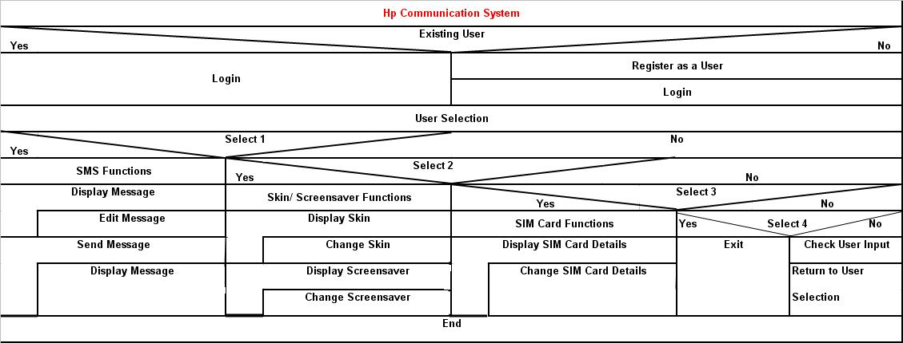

#### 4.1.4.程序描述语言 (Program Design Language, PDL)

### 4.2.架构设计方法

#### 4.2.1.结构分析与结构设计 (Structured Analysis and Structured Design, SASD)

**定义**：SASD 是由 Tom DeMarco、Edward Yourdon 等人提出的一种系统化开发方法，强调自顶向下、逐层分解的方式来分析与设计信息系统。
- Structured Analysis（SA）结构化分析：用于分析系统的需求，建立逻辑模型
- Structured Design（SD）结构化设计：基于分析结果进行模块化设计，确保结构清晰、耦合低、内聚高

SASD 引入以下工具：

| 工具 | 说明 |
|-|-|
| DFD（Data Flow Diagram） | 数据流图，描述系统中数据的流动 |
| Data Dictionary（数据字典） | 描述DFD中每个数据元素、数据存储的定义 |
| Mini-spec（小规格说明） | 对每个处理步骤进行精化说明 |
| 结构图（Structure Chart） | 显示模块间调用关系，用于详细设计阶段 |

**案例**：

DFD：数据流 (Data Flow)、处理 (Process)、数据存储、外部项

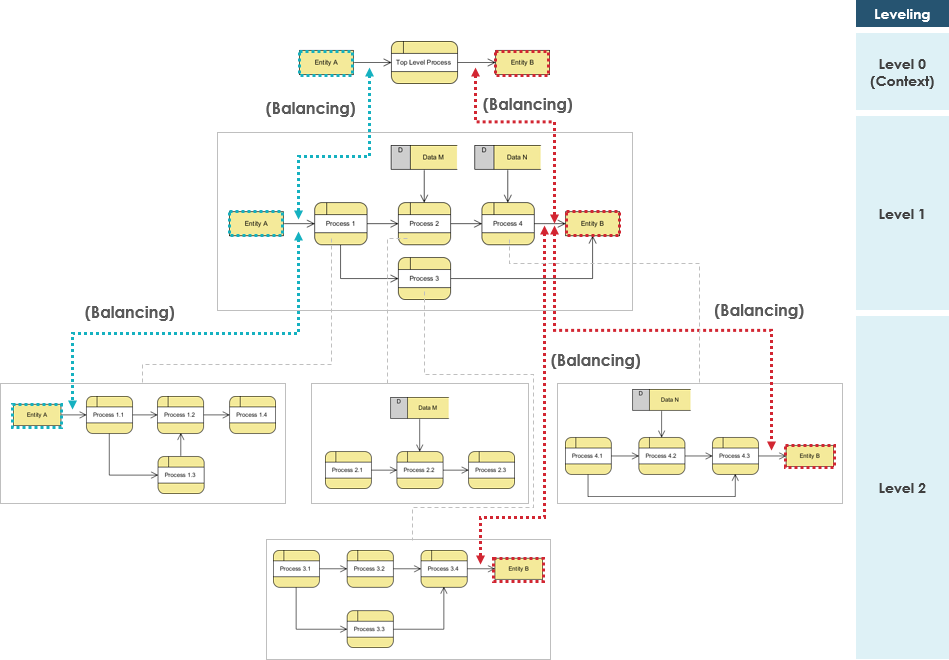

- 信息隐藏与抽象
- 模块化
- 耦合：非直接耦合、数据耦合、标记耦合、控制耦合、通信耦合、公共耦合、内容耦合
- 内聚：功能内聚、顺序内聚、通信内聚、过程内聚、时间内聚、逻辑内聚、偶然内聚

#### 4.2.2.结构分析与设计技术 (Structured Analysis and Design Technique, SADT)

**定义**：SADT 由 Douglas T. Ross 提出，是一种用于系统功能建模和过程建模的方法，特别强调系统的功能分解和控制流组织。

SADT 引入以下工具：

- IDEF0（Integration Definition for Function Modeling）：系统分析建模语言，美国空军标准。

#### 4.2.3.面向对象设计方法 (Object-Oriented Design, OOD)

#### 4.2.4.领域驱动设计方法 (Domain-Driven Design, DDD)

#### 4.2.5.响应驱动设计方法 (Reactive-Driven Design, RDD)*

#### 4.2.6.构件模型设计方法 (Component-Based Design, CBD)*

### 4.3.架构设计理念

#### 4.3.1.正交化设计

正交软件架构指的是系统中各个组件或模块之间的功能尽可能独立，互不影响。这样设计可以减少模块之间的耦合，提高系统的可维护性和可扩展性。当一个模块发生变化时，对其他模块的影响最小，有助于系统的演化和后期维护。正交性还可以提升系统的可测试性和复用性，是优秀软件架构的重要特征之一。

#### 4.3.2.动态化设计

动态软件架构（Dynamic Software Architecture, DSA）是指系统的结构能够在运行时根据环境变化、需求调整或资源状况进行动态调整和重组。与静态架构不同，DSA强调系统组件的创建、销毁、替换和重配置可以在系统运行过程中发生。动态软件架构通常用于需要高可用性、可扩展性和自适应能力的系统，如分布式系统、云计算平台和自适应中间件等。实现DSA常用的方法包括服务注册与发现、动态加载模块、事件驱动机制等。动态软件架构能够提升系统的灵活性和适应性，但也带来了更高的设计和实现复杂度。

**实现方式**：

- **服务注册与发现**：通过服务注册中心（如 Consul、Eureka 等）实现服务的动态注册和查找，支持服务的动态扩展和替换。
- **动态模块加载**：利用插件机制或模块热插拔技术（如 OSGi、Java SPI），在运行时加载、卸载或替换系统组件。
- **事件驱动机制**：采用事件总线或消息队列（如 Kafka、RabbitMQ），实现组件间的松耦合通信和动态响应。
- **配置中心与远程配置**：通过集中式配置管理（如 Spring Cloud Config、Apollo），支持运行时动态调整系统参数和行为。
- **容器化与编排**：利用容器技术（如 Docker）和编排平台（如 Kubernetes），实现服务的弹性伸缩、自动部署和动态重调度。
- **自适应中间件**：中间件根据系统负载、资源状况等自动调整自身行为，实现动态扩展和容错。

**实现案例**：

PKUAS（Peking University Application Server）是北京大学自主研发的应用服务器平台。该系统主要用于支撑大规模分布式应用的开发与部署，具备高可用性、可扩展性和良好的性能。PKUAS 支持多种主流编程语言和中间件技术，能够实现服务的动态注册、负载均衡、故障转移等功能，适用于高校、科研机构及企业的信息化建设需求。其架构设计强调模块化和正交性，便于系统的演化和维护。

#### 4.3.3.领域化设计

领域特定软件架构（Domain-Specific Software Architecture，DSSA）是一种针对特定应用领域的软件架构。DSSA 的目标是为特定领域提供一个通用的、可复用的架构，从而降低开发成本、提高软件质量和缩短开发周期。

**核心思想**：

- 领域分析：对特定领域进行深入分析，识别领域内的通用需求、约束和模式。
- 架构设计：基于领域分析的结果，设计一个通用的、可复用的架构，包括选择合适的架构风格、定义组件和接口、确定组件之间的交互方式等。
- 架构实现：实现架构中的通用组件和接口，并提供相应的开发工具和文档。
- 应用构建：基于 DSSA 构建具体的应用系统，通过定制和扩展架构中的组件来满足特定的需求。

**设计优势**：

- 提高软件质量：通过领域分析和架构设计，可以更好地满足领域内的通用需求，提高软件的可靠性、性能、可维护性等。
- 降低开发成本：通过复用架构中的通用组件和接口，可以减少开发工作量，降低开发成本。
- 缩短开发周期：通过使用 DSSA 提供的开发工具和文档，可以加快开发速度，缩短开发周期。
- 提高软件的可维护性：通过采用统一的架构风格和组件接口，可以提高软件的可维护性。

**设计劣势**：

- 需要深入的领域知识：DSSA 的设计需要对特定领域有深入的了解，才能识别领域内的通用需求和模式。
- 需要持续的维护和演化：随着领域的发展和变化，DSSA 需要不断地进行维护和演化，以适应新的需求和技术。
- 需要有效的推广和应用：DSSA 的价值只有在被广泛应用的情况下才能体现出来，因此需要进行有效的推广和应用。

### 4.4.架构设计模型

> 架构设计模型多种多样，我通过概念密集度这一指标，将整个架构设计风格进行了粗略的划分。

#### 4.4.1.数据密集型架构

**关注核心**：数据的采集、存储、加工与管理，可引入数据生命周期模型

**场景案例**：大数据工程、数据分析工程、搜索引擎

**关键思路**：数据仓库、数据流、非结构化数据库、特征工程、分布式存储、联机分析处理（OLAP）

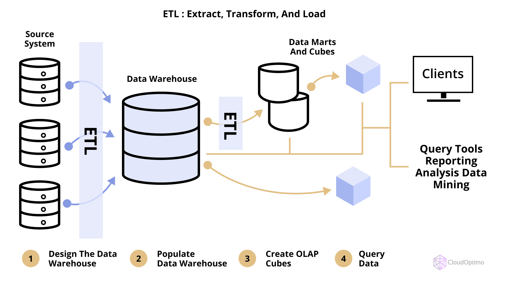

#### 4.4.2.通信密集型架构

**关注核心**：应对高频通信与消息传递

**场景案例**：消息中心、物联网、消息队列、网关、服务总线

**关键思路**：响应式编程、订阅/发布模式、负载均衡（ESB）

#### 4.4.3.控制密集型架构

**关注核心**：系统中存在复杂的路径管理、调度控制

**场景案例**：工作流引擎、嵌入式状态机

**关键思路**：流程路径管理、状态机系统

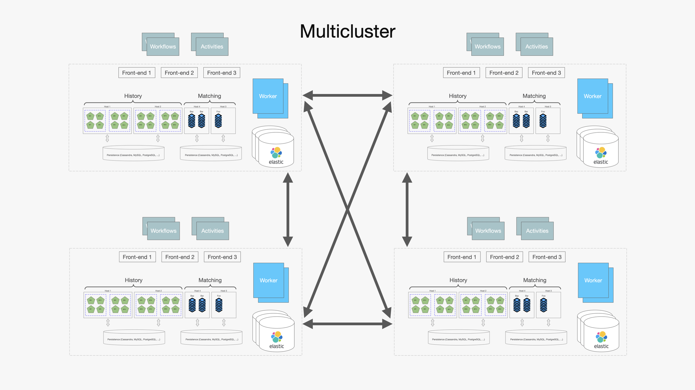

#### 4.4.4.计算密集型架构

**关注核心**：高频计算资源的占用

**场景案例**：有限元仿真、深度学习、机器视觉

**关键思路**：算子优化、解释器、分布式计算、边缘计算

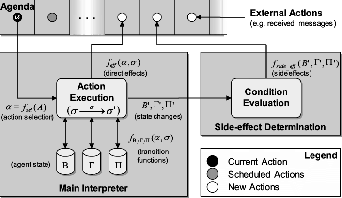

#### 4.4.5.事务密集型架构

**关注核心**：事务一致性、并发控制、事务隔离、持久化保障

**场景案例**：票务、支付系统

**关键思路**：二次提交机制、回滚机制、联机事务处理（OLTP）

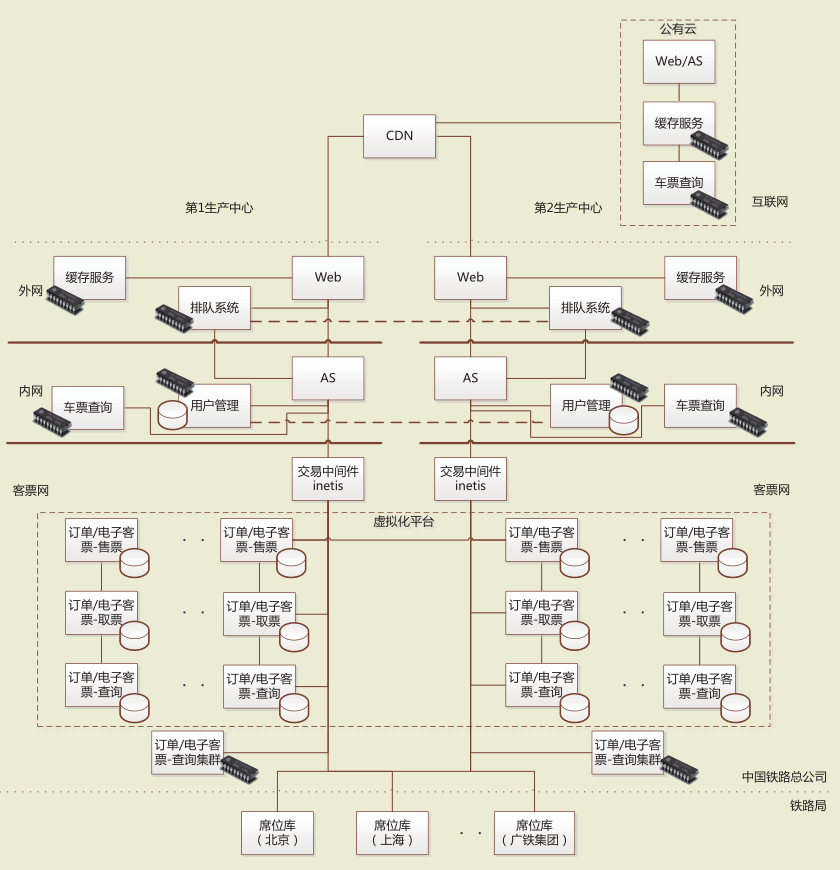

#### 4.4.6.扩展密集型架构

**关注核心**：应对频繁多样的功能扩展或定制化场景

**场景案例**：Docker Stack、Taizu Kubenates、Google App Store、JVM

**关键思路**：核心抽象化、实现插件化

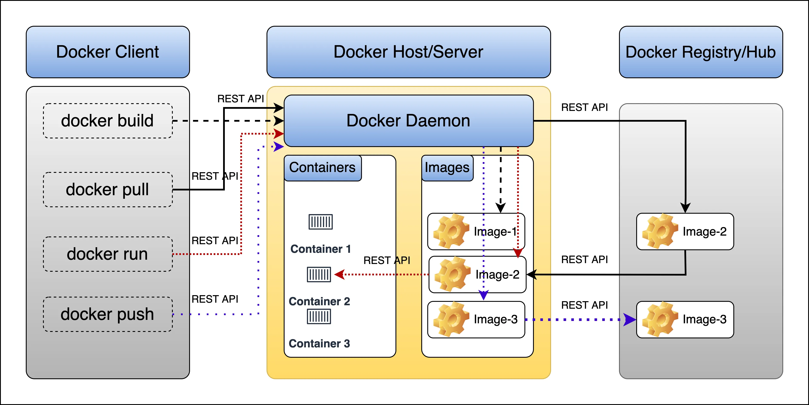

#### 4.4.7.安全密集型架构

**关注核心**：高安全保障需求，关注数据隐私、访问控制、零信任、抗攻击能力

**场景案例**：政务云、金融核心、医疗平台、区块链

**关键思路**：安全边界隔离、加密与脱敏、身份认证、密钥托管、审计追踪

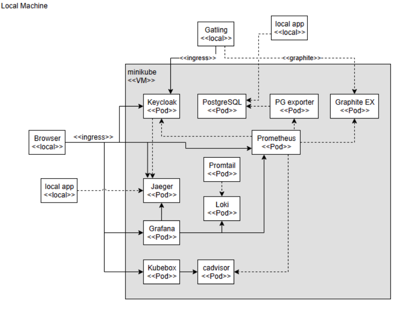

### 4.5.架构分析策略

教材引入**软件系统属性**的概念：
- 软件系统属性包括功能属性和质量属性，软件架构主要关注质量属性
- 架构设计的本质是在满足功能属性的前提下，关注软件系统质量属性

#### 4.5.1.功能属性

TODO

#### 4.5.2.质量属性（Quality Attributes, QA）

软件系统的质量属性是指软件系统在满足功能需求之外，其在运行过程中表现出的各种非功能特性。这些属性通常直接决定了系统的性能、可维护性、可扩展性、安全性等方面的表现，是架构设计中需要重点考虑的核心因素。

| 类别 | 说明 |
|-|-|
| 业务质量属性 | 与业务价值相关，如成本、时间、合规性、市场适应性等。 |
| 运行时质量属性 | 在系统运行时直接体现出来的属性，如性能、可用性、安全性、可靠性等。 |
| 设计时质量属性 | 与系统设计、开发和维护有关的属性，如可维护性、可扩展性、可测试性等。 |

在软件系统质量体系中，最为权威的是 ISO/IEC 25000-25099 的 SQuaRE 标准族系：

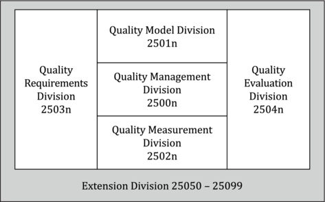

根据 [ISO/IEC 25010:2023](https://www.iso.org/obp/ui#iso:std:iso-iec:25010:ed-2:v1:en) 标准，将软件系统质量属性体系划分为下图质量属性架构，该模型是当前国际上评估软件产品质量最权威的标准之一，广泛应用于系统架构评估、质量保证、软件选型、采购验收等领域：

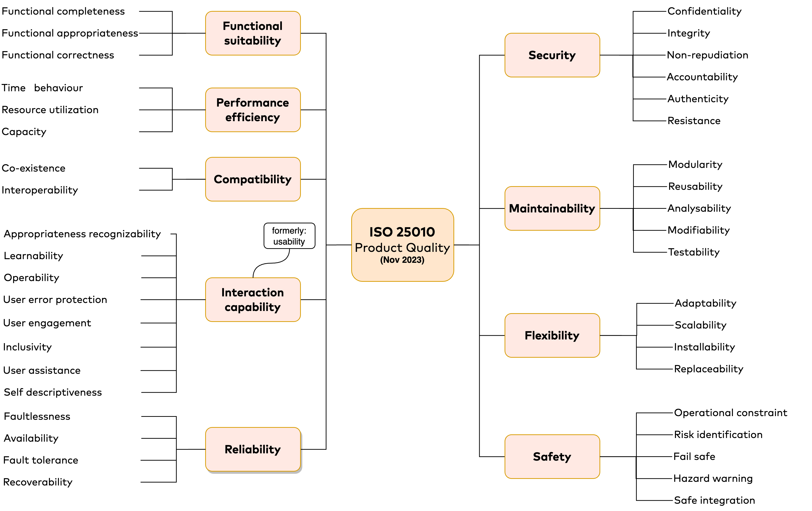

不同的特性遵循不同的测量路径，同时对应不同的关键指标，形成系统性的软件工程质量评估体系。

为了精确描述软件系统的质量属性，通常采用质量属性场景作为描述质量属性的手段。

| 类别 | 描述 |
| - | - |
| 刺激源 (Source) | 这是某个生成该刺激的实体（人、计算机系统或者任何其他刺激器） |
| 刺激 (Stimulus) | 该刺激是当刺激到达时需要考虑的条件 |
| 环境 (Environment) | 该刺激在某些条件下发生。当刺激触发时，系统可能处于过载、运行或者其他情况 |
| 制品 (Artifact) | 某个制品被激励。这可能是整个系统，也可能是系统的一部分 |
| 响应 (Response) | 该响应是在刺激到达后所采取的行动 |
| 响应度量 (Measurement) | 当响应发生时，应当能够以某种方式对其进行度量，以对需求进行测试 |

#### 4.5.3.建模分析

系统架构评估是架构设计过程中的关键步骤，用于系统性分析架构是否满足关键质量属性。

三种主流的评估方法：SAAM（Software Architecture Analysis Method）、ATAM（Architecture Tradeoff Analysis Method）、CBAM（Cost Benefit Analysis Method）是当前系统架构评估的核心方法，分别适用于不同的评估需求和成熟度阶段。

##### SAAM（Software Architecture Analysis Method）

SAAM 是最早的一种架构分析方法，主要用于评估单一质量属性（如可维护性、可扩展性），通过使用场景驱动的方式，对系统进行结构分析和演化评估。

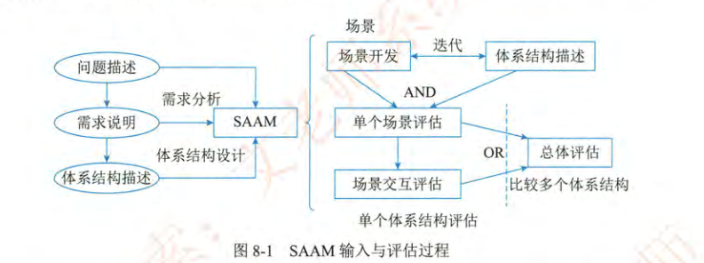

**主要步骤**：

- 描述架构：以组件-连接器模型展示架构。
- 制定使用场景（Scenarios）：包括正常使用场景和变化（演化）场景。
- 评估场景对架构的影响：判断各场景对系统架构模块的影响范围。
- 识别架构的潜在弱点。
- 对架构方案进行比较分析（可选，多方案时使用）。

**特点和适用性**：
| 项目 | 内容 |
| - | - |
| 目标 | 评估架构对未来变化的支持能力 |
| 特点 | 结构简单，适用于初期系统或单一质量属性分析 |
| 适用场景 | 小型系统、需求不复杂时的初步评估 |
| 局限性 | 无法支持多属性权衡分析，缺乏度量与经济性视角 |

##### ATAM（Architecture Tradeoff Analysis Method）

ATAM 是 SEI 提出的标准评估方法，在 SAAM 的基础上增加了多质量属性的权衡分析能力，广泛用于实际项目中进行架构设计评审。

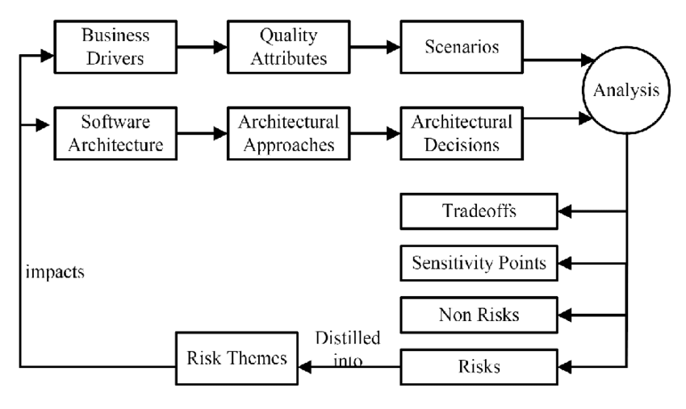

**主要目标**：
评估系统架构在多个质量属性（如性能、安全、可扩展性等）上的表现，并识别属性之间的冲突与权衡点。

**核心步骤**：
- 介绍评估目标与方法
- 陈述业务驱动因素（如业务目标、关键场景）
- 描述架构（以视图/组件模型呈现）
- 识别关键质量属性场景
- 分析架构的潜在问题和敏感点
- 构建效用树（Utility Tree）
- 分析架构应对场景的能力
- 进行权衡分析（Tradeoff Points）
- 总结结果和建议改进

**特点和适用性**：
| 项目 | 内容 |
| - | - |
| 目标 | 多属性评估，识别权衡点 |
| 特点 | 场景驱动 + 效用树分析，能发现潜在架构风险与改进建议 |
| 适用场景 | 中大型系统、正式评审会议、涉及多个质量属性时 |
| 局限性 | 过程较为复杂，成本较高，需要多方协作参与 |

**效用树**：

效用树是一棵结构化的质量属性目标树，用于捕捉系统在不同质量属性上的关注点、场景和优先级。

效用树的结构一般分为三层：
- 根节点：效用（Utility）
    - 表示系统整体对“效用”（或称系统整体质量）的追求，是最上层的质量目标。
- 中间节点：质量属性（Quality Attributes）
    - 如性能（Performance）、可用性（Availability）、安全性（Security）、可维护性（Maintainability）等。
- 叶节点：质量属性场景（Quality Attribute Scenarios）
    - 描述在具体上下文中，系统应如何应对某种质量属性相关的挑战（如：“系统高峰期每秒响应不超过1秒”）。

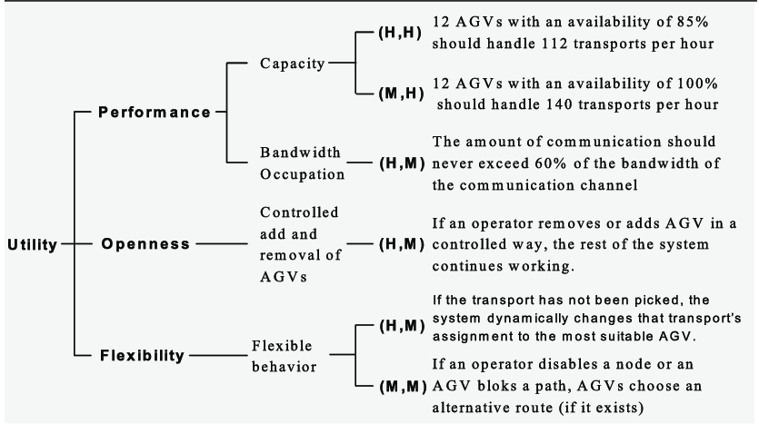

优先级评估：(H, H)、(M, H) 代表 (业务驱动重要性，架构实现风险)

##### CBAM（Cost Benefit Analysis Method）

CBAM 是对 ATAM 的经济性增强版，引入经济决策模型，用于分析不同架构方案或演进路径在成本、风险和收益之间的权衡。

**主要目标**：
帮助组织通过量化分析，在多个架构选择中做出经济最优决策。

**核心流程**：
- 基于 ATAM 输出建立基础
- 识别架构策略选项（如增加缓存、使用微服务、引入负载均衡等）
- 评估每个策略对质量属性的影响
- 估算每个策略的实施成本与风险
- 进行价值评分（使用效用函数 U(s) 表示收益）
- 计算每个策略的 ROI（投资回报率）
- 排序与筛选，制定演化路径

**特点与适用性**：
| 项目 | 内容 |
| - | - |
| 目标 | 基于质量属性影响分析进行投资回报优化 |
| 特点 | 引入经济学视角，增强决策的量化支持 |
| 适用场景 | 企业级系统、产品架构投资评估、演化路线制定 |
| 局限性 | 对成本、效用量化有依赖，数据不充分时准确性受限 |

#### 4.5.4.拓扑分析

| 指标 | 含义 | 公式 |
|-|-|-|
| **CCN（圈复杂度）** | - 衡量程序的复杂度，表示程序中独立路径的数量 - CCN 值越高，代码越复杂，测试和维护难度越大 | CCN = E - N + 2P 其中 E 为边数，N 为节点数，P 为连通子图数 |
| **FFC（功能点复杂度）** | - 衡量模块的输入输出复杂度 - Fan-in 表示调用该模块的其他模块数量 - Fan-out 表示该模块调用的其他模块数量 | FFC = Fan-in + Fan-out |
| **CBO（类间耦合）** | - 表示一个类与其他类之间的直接耦合关系数量 - CBO 值越高，类之间的依赖越多 - 系统的可维护性和可复用性越差 | CBO = 与本类直接耦合的其他类的数量 |
| **RFC（响应集）** | - 表示一个类对外可能响应的方法总数 - 包括自身的方法和调用的其他类的方法 | RFC = 类中所有方法及其直接调用的方法集合 |
| **TCC（紧密内聚度）** | - 衡量类中方法之间通过共享属性的紧密程度 - TCC 值越高，说明类的内聚性越好，设计质量越高 | TCC = 实际直接相关方法对数 / 可能相关方法对总数 |
| **LCC（松散内聚度）** | - 衡量类中方法之间通过间接方式（如调用链）共享属性的程度 - LCC 反映了类的松散内聚性，值越高说明类的结构更松散。 | LCC = 实际间接相关方法对数 / 可能相关方法对总数 |

---

## 5.系统测试

### 5.1.测试类型

单元测试、集成测试、系统测试、性能测试、验收测试、其他测试（AB测试、WEB链接测试、表单测试）

### 5.2.测试方法

静态测试、动态测试、黑盒测试、白盒测试、灰盒测试、自动化测试

### 5.3.测试案例

#### 5.3.1.软件可靠性工程（Software Reliability Engineering, SRE）

**基本概念**：

- 广义可靠性测试是指在软件开发和维护的各个阶段，通过各种测试手段（如单元测试、集成测试、系统测试、验收测试等）发现和消除软件中的缺陷，提高软件的可靠性。它不仅包括专门的可靠性测试，还包括所有有助于提升软件质量和可靠性的测试活动
- 狭义可靠性测试专指在软件开发后期或维护阶段，针对软件的可靠性特性进行的专门测试。其目的是评估软件在特定环境和条件下的无故障运行能力，通常通过模拟实际运行环境、长时间运行、故障注入等方式，统计和分析软件的失效概率、故障间隔时间等可靠性指标

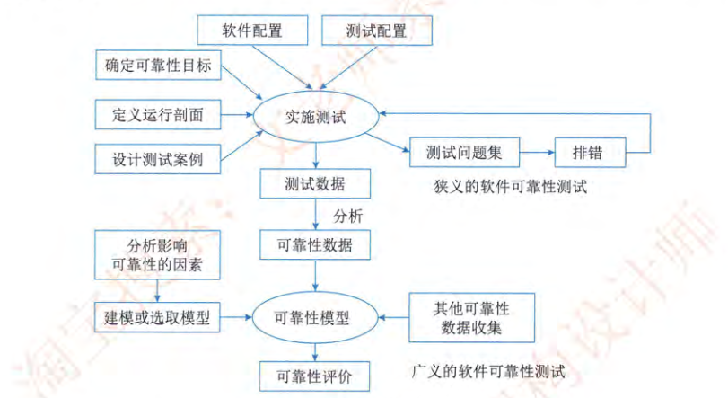

**软件可靠性**：

是指软件系统在规定条件下和规定时间内，无故障地完成其规定功能的能力。它反映了软件产品在实际运行过程中出现故障的概率，是衡量软件质量的重要指标之一。

- 软件失效导致灾难性风险
- 软件失效在整个计算机系统的占比很高
- 软件可靠性分析技术不成熟
- 软件可靠性问题的费用占比和增长率很高

影响软件可靠性的主要因素包括：

- **软件需求的完整性与正确性**：需求不明确或频繁变更容易引入缺陷。
- **设计质量**：架构设计不合理、模块划分不清晰会增加出错概率。
- **编码规范与实现质量**：不规范的编码、低质量实现容易导致隐藏缺陷。
- **测试充分性**：测试覆盖率不足、测试用例设计不合理会遗漏潜在问题。
- **开发人员的经验与技能**：团队经验不足、技能参差不齐会影响软件质量。
- **项目管理与开发过程控制**：缺乏有效的项目管理和过程控制会导致质量波动。
- **软件复杂度**：系统越复杂，出错的可能性越大，可靠性越难保证。
- **外部环境因素**：运行环境变化、硬件故障、第三方组件不稳定等也会影响软件可靠性。
- **维护与更新**：频繁修改、补丁管理不善可能引入新的缺陷。

软件可靠性评估通常包括以下几个主要步骤：

1. **确定评估目标与范围**  
    明确需要评估的软件系统、模块或功能，确定评估的具体目标和指标。
2. **选择评估方法**  
    根据项目特点选择合适的可靠性评估方法，如统计分析法、模型预测法、测试实验法等。
3. **收集数据**  
    通过测试、运行日志、历史缺陷记录等方式，收集与可靠性相关的数据（如故障次数、修复时间等）。
4. **建立可靠性模型**  
    根据收集到的数据，建立适用的可靠性数学模型（如指数分布模型、威布尔分布模型等）。
5. **计算与分析可靠性指标**  
    利用模型和数据，计算平均故障间隔时间（MTBF）、可靠度函数 $R(t)$、失效概率等指标，并进行分析。
6. **评估结果解释与改进建议**  
    对评估结果进行解释，识别系统中的薄弱环节，提出改进建议和措施。
7. **形成评估报告**  
    汇总评估过程、数据、分析结果和改进建议，形成正式的可靠性评估报告。

**关联指标**：

| 指标名称 | 含义 | 概率学公式 |
|-|-|-|
| 平均故障间隔时间（MTBF） | 两次故障之间的平均运行时间 | $\mathrm{MTBF} = \mathrm{MTTF} + \mathrm{MTTR}$ |
| 平均故障修复时间（MTTR） | 软件发生故障后，从发现到修复所需的平均时间 | $\mathrm{MTTR} = \frac{\text{总修复时间}}{\text{修复次数}}$ |
| 平均失效前时间（MTTF） | 从软件投入运行到首次发生故障的平均时间 | $\mathrm{MTTF} = \frac{\text{总运行时间}}{\text{失效次数}}$ |
| 失效概率 | 在给定时间内，软件发生至少一次故障的概率 | $P_f(t) = 1 - R(t)$ |
| 失效强度 | 单位时间内预期发生的失效次数 | $\lambda(t) = -\frac{dR(t)}{dt}$ |
| 故障率 | 单位时间内发生故障的次数 | $\lambda = \frac{1}{\mathrm{MTTF}}$ |
| 可靠度（Reliability） | 在给定时间内，软件无故障运行的概率，通常用 $R(t)$ 表示 | $R(t) = e^{-\lambda t}$ |
| 可用性（Availability）| 软件在任意时刻可用的概率，通常与 MTBF 和 MTTR 有关 | $A = \frac{\mathrm{MTBF}}{\mathrm{MTBF} + \mathrm{MTTR}}$ |

**硬件可靠性**：

> 1. **故障树分析（FTA, Fault Tree Analysis）**
> 故障树分析是一种自顶向下的系统可靠性分析方法，通过从系统顶层故障事件出发，逐层分解，分析导致该故障的各种原因及>其逻辑关系。FTA 通常用图形化的“故障树”表示，能够帮助识别系统中的薄弱环节，评估系统发生顶层故障的概率，并为改进>设计提供依据。
> 2. **失效模式与效应分析（FMEA, Failure Mode and Effects Analysis）**
> 失效模式与效应分析是一种自底向上的分析方法，通过识别系统、子系统或部件可能出现的各种失效模式，分析每种失效模式对系统的影响及其严重性、发生概率和可检测性。FMEA 有助于提前发现潜在风险，采取预防措施，提高系统的可靠性和安全性。

#### 5.3.2.软件可靠性建模

软件可靠性建模建模的目标：

- 定量度量软件的可靠性水平，如MTTF（平均无故障时间）、失效率（Failure Rate）等指标
- 预测失效概率与剩余缺陷，基于可靠性模型（如Jelinski-Moranda、Musa-Okumoto）
- 优化测试资源分配，精确识别高风险模块，进行重点测试
- 指导发布决策与维护计划，明确可靠性目标达成时间与条件

软件可靠性模型用于定量描述和预测软件在运行过程中的可靠性变化趋势。常见的软件可靠性模型主要包括以下几类：

##### 指数分布模型（Jelinski-Moranda，JM）

Jelinski-Moranda 模型（简称 JM模型）是软件可靠性工程中最早提出的失效数据驱动模型之一，由 Jelinski 和 Moranda 于1971年在美国贝尔实验室提出。它属于**指数分布类**模型，通过统计分析软件测试过程中的失效数据，估计剩余缺陷数量和软件可靠性水平，常用于软件测试阶段的可靠性预测与分析。

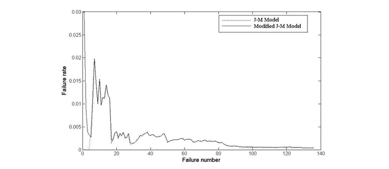

其中 Failure Number 为失效序号，代表第 $i$ 次失效修复。

**核心概念**：

- 初始时软件中含有固定数量的缺陷 $N$，这些缺陷在测试开始前是未知的
- 每次失效仅由一个缺陷引起，且该缺陷在失效后被完全修复，不引入新缺陷
- 每个剩余缺陷在单位时间内引发失效的概率相同且彼此独立
- 引入单位时间失效率（Failure Rate）常数 $\varphi$，代表单位时间内失效的预期次数
- 故障间隔时间服从指数分布

**数学计算**：

- 经过第 $i$ 次失效，当前的缺陷数为：$ N - i + 1 $
- 经过第 $i$ 次失效，当前的总失效率：$ \lambda_i = \varphi \cdot (N - i + 1) $
- 经过第 $i$ 次失效，设时间间隔为 $t_i$ ，则当前的失效概率密度服从指数概率分布：$ f_i(t_i) = \lambda_i e^{-\lambda_i t_i} $
- 引入统计学最大似然估计（MLE, Maximum Likelihood Estimation）概念
- 引入最大似然估计（MLE）公式：$ L(N, \varphi) = \prod_{i=1}^n f(t_i) $
- 代入 $ \lambda_i = \varphi \cdot (N - i + 1) $，我们得到：$ L(N, \varphi) = \varphi^n \cdot \prod_{i=1}^{n} (N - i + 1) \cdot \exp\left( -\varphi \sum_{i=1}^{n} (N - i + 1)t_i \right) $
- 为了便于求偏导数（最大值点），我们对上式取自然对数：$ \ln L(N, \varphi) = n \ln \varphi + \sum_{i=1}^{n} \ln (N - i + 1) - \varphi \sum_{i=1}^{n} (N - i + 1)t_i $
- 接下来求 $ \varphi $ 的偏导：$ \frac{\partial \ln L}{\partial \varphi} = \frac{n}{\varphi} - \sum_{i=1}^{n} (N - i + 1)t_i = 0 $
- 解得 $ \hat{\varphi} = \frac{n}{\sum_{i=1}^{n} (N - i + 1)t_i} $，这是 $ \varphi $ 的最大似然估计表达式
- 使用数值方法（牛顿-拉夫森法）求 $ N $ 的偏导：$ \sum_{i=1}^{n} \frac{1}{N - i + 1} = \hat{\varphi} \sum_{i=1}^{n} t_i $
- 通过最大似然估计得到参数 $\hat{N}$ 和 $\hat{\varphi}$ 后继续如下计算：
    - 预测下一个失效间隔时间的期望值（MTTF）
    - 估算可靠性（某时间段内不失效的概率）
    - 估算剩余缺陷数和未来整体失效率变化趋势
- 现在求 MTTF，已知前 $r$ 次失效后，还剩下 $\hat{N} - r$ 个缺陷，那么：
    - $ \lambda_{r+1} = \hat{\varphi} \cdot (\hat{N} - r) $
    - 下一次失效时间间隔服从指数分布：$ f_{r+1}(t) = \lambda_{r+1} e^{-\lambda_{r+1} t} $
    - 根据指数分布性质，其期望值就是失效间隔的预测值：$ \mathbb{E}[T_{r+1}] = \frac{1}{\lambda_{r+1}} = \frac{1}{\hat{\varphi} (\hat{N} - r)} $
- 预测下一段时间内无失效的概率（可靠性）：
    - $ R_{r+1}(t) = P(T_{r+1} > t) = e^{- \lambda_{r+1} t } = e^{ - \hat{\varphi} (\hat{N} - r) t } $
- 预测剩余缺陷数（未来整体缺陷估计）:
    - $ \text{Remaining Defects} = \hat{N} - r $
    - 软件释放判断：当 $ \hat{N} - r \approx 0 $ 时，说明软件趋于稳定；
- 可绘图的趋势分析（失效率曲线、期望失效间隔曲线、可靠性曲线）

**案例描述**：

NASA 在航天器控制软件的开发过程中，采用 Jelinski-Moranda 指数分布模型对软件可靠性进行预测。通过收集测试阶段的失效数据，估算剩余缺陷数和失效率，帮助项目团队判断是否达到发射标准。该模型的应用有效降低了在轨运行期间的软件故障率。

Jelinski-Moranda 模型适用于测试阶段缺陷修复彻底、失效率随缺陷减少而降低的场景。通过拟合实际失效数据，可以估算剩余缺陷数和整体可靠性，为软件发布和质量改进提供依据。

Jelinski-Moranda 模型是“用实际失效时间去反推系统里还有多少雷没踩”，从而辅助判断软件的可靠性。

##### 非齐次泊松过程（NHPP）模型（Goel-Okumoto, GO）

某大型电信交换系统在上线前，利用 Goel-Okumoto 非齐次泊松过程模型分析测试阶段的失效数据。通过拟合失效发生的时间分布，预测未来一段时间内的失效概率，为系统上线和后续维护提供决策依据。该方法提升了系统的可用性和用户满意度。

Goel-Okumoto NHPP（Non-Homogeneous Poisson Process，非齐次泊松过程）模型是一种常用的软件可靠性动态模型，适用于失效率随时间递减的软件系统。其核心思想是：随着缺陷的不断发现和修复，软件的失效率会逐步降低，失效事件的发生频率也随之减少。

主要特点和假设包括：

- 失效事件的发生服从非齐次泊松过程，失效率是时间的函数，通常随测试或运行时间递减；
- 每次失效修复后不会引入新缺陷，且修复是完全的；
- 适用于测试阶段或实际运行中，失效率随缺陷修复逐步降低的场景。

模型的主要公式为：

- 累计失效次数的期望值：$m(t) = a(1 - e^{-bt})$，其中 $a$ 表示最终可发现的总缺陷数，$b$ 为失效率递减系数，$t$ 为时间；
- 单位时间内的失效率：$\lambda(t) = a b e^{-bt}$。

通过拟合实际失效数据，可以估算 $a$ 和 $b$ 的值，从而预测未来一段时间内的失效概率、剩余缺陷数等指标，为软件上线和维护决策提供依据。Goel-Okumoto NHPP 模型广泛应用于大型软件系统的可靠性分析，尤其适合失效率随时间逐步降低的实际情况。

##### Weibull 分布模型

在医疗设备软件开发中，采用 Weibull 分布模型分析失效数据，发现初期失效率较高，经过多轮测试和修复后趋于稳定。通过模型参数调整，指导测试资源分配和发布时机选择，确保设备在实际使用中的高可靠性。

Weibull 分布模型是一种灵活的失效时间分布模型，广泛应用于可靠性工程领域。其概率密度函数为：

$$
f(t) = \frac{\beta}{\eta} \left(\frac{t}{\eta}\right)^{\beta-1} e^{-(t/\eta)^\beta}
$$

其中，$\beta$ 为形状参数，$\eta$ 为尺度参数。  
- 当 $\beta < 1$ 时，表示早期失效率较高，适用于“婴儿期失效”；
- 当 $\beta = 1$ 时，退化为指数分布，失效率恒定；
- 当 $\beta > 1$ 时，表示失效率随时间增加，适用于“老化失效”。

Weibull 模型能够描述不同阶段的失效特性，适合分析初期失效率高、经过修复后趋于稳定的软件系统。通过拟合实际失效数据，可以估算模型参数，指导测试资源分配和产品发布时机选择，提升软件可靠性。

##### 贝叶斯模型

某银行核心业务系统因历史数据有限，采用贝叶斯模型结合专家经验和有限测试数据进行可靠性预测。模型动态修正预测结果，帮助管理层评估上线风险，并制定相应的应急预案。

##### SRGM 增长模型

在操作系统内核开发过程中，利用软件可靠性增长模型（SRGM）跟踪缺陷修复进度和可靠性提升趋势。通过模型分析，团队能够量化测试成效，合理安排发布计划，降低了系统上线后的故障率。

##### 人工智能模型（LSTM，GNN，LLM）

Microsoft DeepDevInsight 是微软提出的一套基于深度学习和大模型的智能软件工程分析平台，能够自动化地对大型软件系统进行质量评估、缺陷预测和风险分析。其核心思想是利用代码、历史缺陷、开发过程等多源数据，通过人工智能模型实现系统性、动态化的质量评估。

基于人工智能模型的系统质量评估（如 Microsoft DeepDevInsight）已成为现代软件工程的重要趋势，能够为大型复杂系统提供高效、智能的质量保障手段，助力软件可靠性和演化能力的持续提升。

**主要特性**：
- **多模态数据融合**：集成源代码、提交历史、缺陷报告、测试用例、开发者行为等多维数据。
- **深度学习模型**：采用 LSTM、GNN、Transformer 等模型对代码结构、依赖关系和演化轨迹进行建模。
- **缺陷预测与定位**：自动识别高风险模块、潜在缺陷点，辅助测试资源分配和代码审查。
- **质量趋势分析**：动态追踪系统质量属性（如可维护性、复杂度、可靠性）的变化趋势，支持演化决策。
- **智能报告与可视化**：生成可解释的质量评估报告，支持决策者和开发团队理解系统风险。

**典型流程**：
- **数据采集**：自动抓取代码仓库、缺陷跟踪系统、CI/CD流水线等数据源。
- **特征工程**：提取代码复杂度、依赖关系、历史变更、开发者活跃度等特征。
- **模型训练与推理**：利用深度神经网络对缺陷分布、质量属性进行预测和分类。
- **结果解释与反馈**：通过可视化仪表盘展示高风险区域、质量趋势和改进建议。
- **持续演化**：模型根据新数据持续自我优化，适应系统和团队的变化。

**实际应用案例**：
- 微软在大规模云服务（如 Azure DevOps）中应用 DeepDevInsight，实现了对数百万行代码的自动化质量监控和缺陷预警，显著提升了系统的可靠性和维护效率。
- 通过模型预测结果，团队能够提前识别高风险模块，优化测试和代码审查资源分配，降低了生产环境故障率。

**优势与挑战**：
- 优势：自动化、可扩展、动态适应复杂系统，支持持续质量改进。
- 挑战：对高质量训练数据和模型解释性有较高要求，需结合领域知识进行结果校验。

---

## 6.演化迭代

将系统架构的演化路径归纳为业务增长型、功能扩展型、质量优化型三个维度，同时将演化方法分为构件升级和拓扑升级两个维度，确实能够形成一个清晰的演化矩阵：

| 维度 / 方式 | 构件演化 | 拓扑演化 |
|-|-|-|
| 业务增长型 | 增加模块或服务以提升性能和吞吐量 | 从单机架构到分布式架构或微服务架构 |
| 功能扩展型 | 添加新的功能模块，扩展现有服务 | 拓展为多模块系统，支持多方协作 |
| 质量优化型 | 优化现有组件的性能和稳定性 | 优化拓扑结构，增加冗余、容灾等 |

**拓扑升级策略**

- 分层化策略，管理优化
- 中心化策略，统一管理
- 联邦化策略，系统解耦
- 隔离化策略，安全控制
- 并行化策略，并行优化
- 平衡化策略，负载均衡
- 注册机策略，动态扩展
- 自适应策略，动态适应

### 6.1.业务增长型

#### 6.1.1.业务增长型构件演化案例

假设一家电子商务平台经历了用户量和订单量的大幅增长。在初期，平台可能使用单一的数据库来存储所有订单和用户数据。然而，随着业务的扩展，系统可能会面临性能瓶颈。因此，系统设计师选择通过**构件升级**来应对增长，具体做法是：

- 增加缓存层（例如Redis）来存储热门商品信息，减少数据库的访问频率
- 引入异步处理机制，例如消息队列来解耦订单处理流程，提升订单的处理能力
- 对现有数据库进行分表分库操作，以便处理更大的数据量

#### 6.1.2.业务增长型拓扑演化案例

在业务量持续增长的情况下，单机架构已经无法支持更高的访问量和更复杂的业务流程。于是，平台决定进行**拓扑升级**：

- 从单机架构迁移到**分布式架构**，将不同的服务（例如用户管理、订单管理、支付等）部署在多个独立的节点上
- 最终，平台实现了**微服务架构**，将每个核心业务功能（如订单服务、库存服务、支付服务）拆分为独立的微服务，通过API网关进行管理，提升了系统的可扩展性和容错能力

### 6.2.功能扩展型

#### 6.2.1.功能扩展型构件演化案例

某视频流媒体平台在原有的视频播放和搜索功能基础上，新增了社交互动功能，包括评论、点赞和分享。为了支持这些新功能，平台进行了**构件升级**：

- 添加了新的**评论模块**和**点赞模块**，并对原有的视频信息模型进行了扩展，以支持评论和点赞的关联
- 为了更好地管理用户互动数据，平台还引入了基于**NoSQL数据库**（例如MongoDB）来存储评论和点赞数据

#### 6.2.2.功能扩展型拓扑演化案例

随着社交功能的扩展，平台的业务模型也变得更加复杂，原有的单一模块无法支持多方用户交互。于是，平台决定进行**拓扑升级**：

- 平台将原本的单一应用扩展为一个**多模块系统**，将用户、视频、评论、推荐等功能模块化，并确保它们能够在不同的服务之间无缝协作
- 采用**微服务架构**来实现各个功能模块的独立部署和扩展，从而提升了服务的协作效率和整体性能

### 6.3.质量优化型

#### 6.3.1.质量优化型构件演化案例

假设某金融机构的交易系统需要进行优化，以提升交易处理的速度和稳定性。在对系统进行性能监控后，发现系统中的数据库查询成为性能瓶颈。为了解决这个问题，系统工程师进行了**构件升级**：

- 优化了现有的数据库查询，采用了**索引优化**和**查询缓存**技术，减少了不必要的数据库访问。
- 对于高频繁访问的数据，使用了**分布式缓存**系统（如Redis）来加速查询过程。

#### 6.3.2.质量优化型拓扑演化案例

为了提升系统的可用性和容错能力，金融机构决定进行**拓扑升级**：

- 通过增加多个**数据库副本**并配置主从复制机制，实现了数据库的高可用性。
- 引入了**容灾架构**，确保在某个数据中心发生故障时，另一个数据中心能够接管系统运行。
- 系统架构升级为支持自动扩展和负载均衡的分布式架构，确保在高负载情况下，系统能够自动增加资源，以应对突发流量。