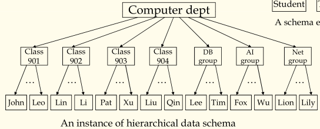
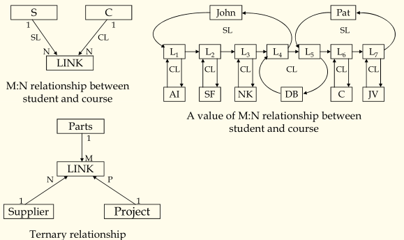
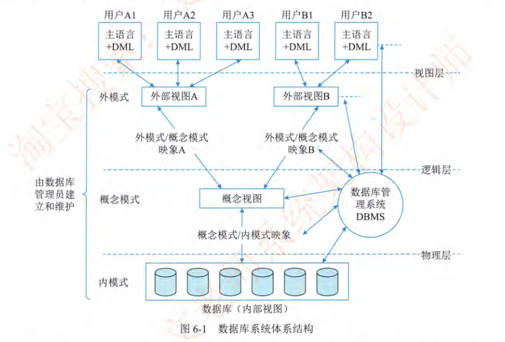
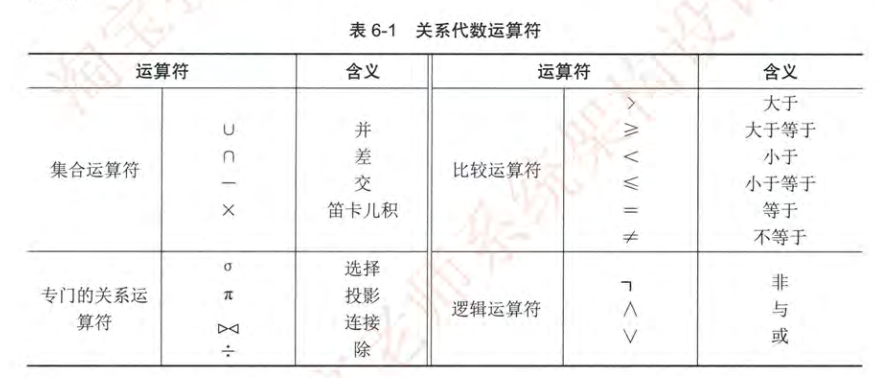

本文总结了系统架构师考试中数据工程部分的核心知识，包括数据库的基本概念、发展历程、数据模型（层次、网状、关系、非关系型）、数据库管理系统（DBMS）的主要功能及 SQL 命令分类，详细介绍了数据库三级模式、关系数据库的基本概念与设计理论（如函数依赖、多值依赖、规范化），并梳理了数据库设计的各个阶段及常见的用户访问接口。内容涵盖理论基础与实际应用，帮助考生系统掌握数据库相关知识。

<!-- more -->

## 数据库基本概念

### 数据库技术的发展及分类

DB, DBS, DBMS

人工管理阶段、文件系统阶段、数据库系统阶段

### 数据模型

数据结构、数据操作、数据的约束条件

1. 层次数据模式

虚拟记录：在现实世界中，很多时候并不只是存在一对多的关系，也就是可能存在多对多，多对一，三元关系等等，因此层次数据模型必须推广到模拟非层次的数据上才具有普遍意义。

为了避免冗余，虚拟记录的概念被引入进来用来解决提到的问题，所谓虚记录，其本质就是一个指针，也就是在本该存记录的地方用一个指针代替。

2. 网状数据模式

3. 关系数据模式

集合论与关系代数为基础，只有一种结构，表（集合）。

ACID: ACID 是数据库事务的四个关键特性，用于确保数据库操作的可靠性和一致性。
- 原子性 (Atomicity)
    - 定义：事务是一个不可分割的最小操作单元，要么全部执行成功，要么全部回滚失败。
    - 作用：确保事务中所有操作要么全部完成，要么不对数据库产生任何影响。
    - 示例：银行转账操作中，若从账户 A 扣款成功，但向账户 B 存款失败，则整个事务回滚，账户 A 的扣款也会被撤销。
- 一致性 (Consistency)
    - 定义：事务执行前后，数据库必须保持一致的状态，满足所有的约束条件。
    - 作用：确保数据的完整性和约束条件（如外键约束、唯一性约束）不被破坏。
    - 示例：在转账操作中，转账前后两个账户的总金额应保持不变。
- 隔离性 (Isolation)
    - 定义：多个事务并发执行时，一个事务的执行不应影响其他事务的执行。
    - 作用：防止事务之间的相互干扰，避免出现脏读、不可重复读、幻读等问题。
    - 示例：在一个事务完成之前，其他事务无法看到该事务未提交的中间状态。
- 持久性 (Durability)
    - 定义：事务一旦提交，其对数据库的修改将永久保存，即使系统发生故障也不会丢失。
    - 作用：确保提交的事务结果能够可靠地存储到数据库中。
    - 示例：在转账操作完成并提交后，即使系统崩溃，转账结果也会被保存。

4. 非关系型数据库

NoSQL = Not Only of SQL

### 数据库管理系统

数据库管理系统 (DBMS) 是用于管理数据库的软件系统，其主要功能包括以下几个方面：
1. 数据定义功能
    - 提供数据定义语言 (DDL)，用于定义数据库的结构和模式。
    - 定义表、视图、索引、约束等数据库对象。
    - 示例：创建表的 SQL 语句：
2. 数据操作功能
    - 提供数据操作语言 (DML)，用于对数据库中的数据进行增、删、改、查操作。
    - 支持事务操作，确保数据的一致性和完整性。
    - 示例：插入和查询数据的 SQL 语句：
3. 数据存储与管理功能
    - 负责数据的物理存储和组织，包括文件管理和索引管理。
    - 提供高效的数据存取机制，支持大规模数据的存储和检索。
4. 事务管理功能
    - 确保事务的 ACID 特性（原子性、一致性、隔离性、持久性）。
    - 管理并发事务，避免脏读、不可重复读和幻读等问题。
    - 示例：事务的 SQL 语句：
5. 数据安全性与权限管理
    - 提供用户认证和访问控制，确保数据的安全性。
    - 支持权限分配和管理，防止未经授权的访问。
    - 示例：授予权限的 SQL 语句：
6. 数据完整性管理
    - 确保数据的完整性，支持主键、外键、唯一性约束等。
    - 防止非法数据的插入或更新。
    - 示例：定义外键约束的 SQL 语句：
7. 数据备份与恢复功能
    - 提供数据备份和恢复机制，防止数据丢失。
    - 支持全量备份、增量备份和日志恢复。
8. 多用户并发控制
    - 管理多用户对数据库的并发访问，避免资源冲突。
    - 使用锁机制（如共享锁、排他锁）和隔离级别（如读未提交、读已提交）来控制并发。
9. 数据查询优化
    - 提供查询优化器，生成高效的查询执行计划，提高查询性能。
    - 自动选择最优的索引和访问路径。

总结：DBMS 的主要功能涵盖了数据定义、操作、存储、事务管理、安全性、完整性、备份恢复、并发控制和查询优化等方面。这些功能共同确保了数据库系统的高效性、可靠性和安全性。

SQL COMMANDS 分类：

| 类别 | 英文缩写 | 描述 | 常用命令 |
| :- | :- | :- | :- |
| 数据定义语言 | DDL | 定义和修改数据库的结构 | `CREATE`, `ALTER`, `DROP`, `TRUNCATE` |
| 数据操作语言 | DML | 操作数据库中存储的数据 | `SELECT`, `INSERT`, `UPDATE`, `DELETE` |
| 数据查询语言 | DQL | 主要用于数据的查询。 | `SELECT` |
| 数据控制语言 | DCL | 管理数据库的访问权限和安全性 | `GRANT`, `REVOKE` |
| 事务控制语言 | TCL | 管理数据库事务，确保数据的完整性和一致性。 | `COMMIT`, `ROLLBACK`, `SAVEPOINT` |

### 数据库三级模式

数据库的三级模式，是数据库系统为了提高数据独立性，将数据库管理系统（DBMS）中数据组织方式，从用户应用中剥离出来，按数据的抽象级别，对数据库分为了三个不同的抽象层次。这三个层次分别是：

- 外模式（External Schema）：
    - 也称为用户模式。
    - 这是用户看到的数据视图，它描述了数据库中某个或某些用户所需要的数据的逻辑结构。
    - 外模式是用户与数据库交互的接口，不同的用户可以有不同的外模式。
    - 简单的说就是用户可以看到的这部分数据。
- 概念模式（Conceptual Schema）：
    - 也称为逻辑模式。
    - 这是数据库中所有数据的整体逻辑结构，它描述了数据库中所有数据的逻辑组织和相互关系。
    - 概念模式是数据库设计的核心，它独立于物理存储细节和用户应用。
    - 简单的说就是数据库的整体逻辑结构。
- 内模式（Internal Schema）：
    - 也称为存储模式。
    - 这是数据库在物理存储介质上的实际存储结构，它描述了数据在计算机内部的存储方式和组织形式。
    - 内模式涉及到存储介质的类型、存储文件的组织、索引的建立等。
    - 简单的说就是数据在计算机里怎样存储。

这三个模式之间通过二级映射来实现数据的独立性：

- 外模式/概念模式映射（外模式-概念模式映射）：
    - 保证了数据的逻辑独立性，即当概念模式发生变化时，只要修改外模式/概念模式映射，就可以使外模式保持不变，从而使应用程序不受影响。
- 概念模式/内模式映射（概念模式-内模式映射）：
    - 保证了数据的物理独立性，即当内模式发生变化时，只要修改概念模式/内模式映射，就可以使概念模式保持不变，从而使应用程序不受影响。

## 关系数据库

### 公理系统与设计理论

**基本概念：**

| 术语 | 定义 | 示例 |
| :- | :- | :- |
| 属性 (Attribute) | 在现实世界中，用来描述一个事物的特征。 | 学生的学号、姓名、年龄等。 |
| 域 (Domain) | 每个属性的取值范围。在关系数据模型中，域的值必须是原子数据（不可再分的数据）。 | 年龄的域是所有可能的年龄数值；性别的域是{男, 女}。 |
| 目/度 (Degree) | 一个关系中属性的数量。也就是表中有多少列。 | 一个包含学号、姓名、年龄的表，其目/度为3。 |
| 元组 (Tuple) | 表中的一行数据，代表一个记录。 | 表中一行包含一个学生的学号、姓名和年龄的完整信息。 |

属性 = 列，域 = 数据类型，目/度 = 列数，元组 = 行

关系型数据库中的键：

| 术语 | 定义 | 说明 |
| :- | :- | :- |
| 候选码 (Candidate Key) | 能唯一标识一个元组的属性或属性组。 | 通过候选码，可以找到唯一的一行数据。一个关系（表）可以有多个候选码。 |
| 主码 (Primary Key) | 从候选码中选出的一个，用来唯一标识元组。 | 一个表只能有一个主码。主码不能为空。 |
| 主属性 (Prime Attribute) | 包含在任何候选码中的属性。 | 只要一个属性属于任何一个候选码，它就是主属性。 |
| 非主属性 (Non-Prime Attribute) | 不包含在任何候选码中的属性。 | 任何不属于任何候选码的属性都是非主属性。 |
| 外码 (Foreign Key) | 一个关系中的属性或属性组，它引用另一个关系的主码。 | 用来建立表与表之间的联系。外码可以为空，但是如果非空，则其值必须是另一个表的主码的值。 |
| 全码 (All-Key) | 关系模型的所有属性组是这个关系模型的候选码。 | 当关系的所有属性的组合才能唯一的标志一个元组的时候，就称这个组合为全码。一般来说，一个关系如果全部由外码构成，就非常容易出现全码。一般来说全码出现的频率非常低。 |

其他：

- 笛卡尔积 (Cartesian Product): 两个或多个集合的乘积。在数据库中，笛卡尔积会产生包含所有可能的行组合的新表。

Armstrong 公理（Armstrong's Axioms）是数据库范式理论与关系代数推理中的一个高频知识点，主要用于函数依赖的推理与闭包计算。

**Armstrong 三条基本公理**

| 公理名 | 形式 | 意义说明 |
| --- | --- | --- |
| 自反律（Reflexivity） | 若 Y ⊆ X，则 X → Y | 拥有一个属性集合，自然决定其子集 |
| 增广律（Augmentation） | 若 X → Y，则 XZ → YZ | 在依赖两边加上相同属性，依赖仍成立 |
| 传递律（Transitivity） | 若 X → Y 且 Y → Z，则 X → Z | 函数依赖可传递推导 |

**派生规则（可由三条基本公理推出）**

| 规则名 | 形式 | 考试备注 |
| --- | --- | --- |
| 并规则（Union） | 若 X→Y 且 X→Z，则 X→YZ | 常用于依赖合并 |
| 分规则（Decomposition） | 若 X→YZ，则 X→Y 且 X→Z | 常用于依赖分解 |
| 伪传递律（Pseudotransitivity） | 若 X→Y 且 WY→Z，则 WX→Z | 多表关联查询或候选码判断常见 |
| 属性闭包（X⁺） | 对给定属性集 X，求其所有可推导属性 | 候选码判断、范式归属、主属性判定的基础操作 |

**概念：函数依赖、多值依赖、规范化**

在数据库设计中，数据依赖是影响关系模式设计的重要因素。函数依赖（Functional Dependency）和多值依赖（Multivalued Dependency）是其中两种关键类型，它们对于理解和规范化数据库模式至关重要。

1. 函数依赖（Functional Dependency, FD）
- 定义：
    - 在关系模式 R(U) 中，U 是属性集，X 和 Y 是 U 的子集。如果对于 R 的任何有效实例，X 的每个值都唯一确定 Y 的值，则称 Y 函数依赖于 X，记作 X → Y。
    - 换句话说，如果两个元组在 X 属性上具有相同的值，那么它们在 Y 属性上也必须具有相同的值。
    
| 名称 | 定义 | 示例 |
| :- | :- | :- |
| 函数依赖（FD） | $X \rightarrow Y$ | 在学生信息表中，学号（学号）→ 姓名（姓名）。 |
| 平凡函数依赖 | $Y \subseteq X \land X \rightarrow Y$ | 在（学号，姓名）的属性集中，（学号，姓名）→ 学号。 |
| 非平凡函数依赖 |$Y \nsubseteq X \land X \rightarrow Y$ | 学号（学号）→ 姓名（姓名）。 |
| 完全函数依赖 | $X \rightarrow Y$ 且不存在 $X' \subset X$ 使得 $X' \rightarrow Y$ | 学生选课表中，（学号，课程号）→ 成绩。 |
| 部分函数依赖 | 存在 $X' \subset X$ 使得 $X' \rightarrow Y$ | 学生选课表中，（学号，课程号，姓名）→ 成绩。 |
| 传递函数依赖 | $X \rightarrow Y \land Y \rightarrow Z \land Y \nsubseteq X \land Z \nsubseteq Y \implies X \rightarrow Z$ | 学生信息表里：学号 → 宿舍号，宿舍号 → 宿舍管理员，学号 → 宿舍管理员 |

2. 多值依赖（Multivalued Dependency, MVD）
- 定义：
    - 在关系模式 R(U) 中，如果 X、Y 和 Z 是 U 的子集，并且当 X 的值确定时，Y 的值集独立于 Z 的值集，则称 Y 多值依赖于 X，记作 X ↠ Y。
    - 多值依赖出现在一个属性确定多个属性的场合，这些属性互相独立。
- 性质：
    - 平凡多值依赖： 如果 Y ⊆ X 或 X ∪ Y = U，则 X ↠ Y 始终成立。
    - 多值依赖比函数依赖更一般，如果 X → Y，那么 X ↠ Y 也成立，但是反过来不成立。
- Latex 公式表示：
    - 多值依赖：$X \twoheadrightarrow Y$
    - 平凡多值依赖：$Y \subseteq X \lor X \cup Y = U \implies X \twoheadrightarrow Y$

举例，某一个学生关系表里面，有学生学号，这个学生参加的课程，以及这个学生参与的社团活动，那么，学生的社团活动，与学生参加的课程，是互相独立的。也就是说，学生的社团活动，与该学生学习的什么课程无关，反之也是同样成立。但是这两项内容都依赖于学生学号的存在。这样的关系就为多值依赖。

总结：
- 函数依赖描述了一个属性集如何唯一确定另一个属性集。
- 多值依赖描述了一个属性集如何确定多个独立的属性集。
- 理解这些依赖关系对于设计规范化的数据库模式至关重要，这可以避免数据冗余和更新异常。

规范化：

| 范式 | 定义 | 关键特点 | 常见问题避免 |
| :- | :- | :- | :- |
| 第一范式 (1NF) | 关系中的所有属性都应该是原子性的，即不可再分。 | 每个属性只包含一个值。 | 避免属性中的重复组。 |
| 第二范式 (2NF) | 满足 1NF，并且所有非主属性都完全依赖于主键。 | 消除了部分依赖：所有非主属性都完全依赖于整个主键。 | 避免了数据冗余，修改异常，插入异常：因为如果一个表里面，某个属性，只依赖部分主键，那么这个属性就会在不同的数据行重复很多次，造成数据冗余，修改麻烦，插入数据的时候，如果没有另外的部分主键，那么该数据插入异常。 |
| 第三范式 (3NF) | 满足 2NF，并且所有非主属性都不能传递依赖于主键。 | 消除了传递依赖：所有非主属性都直接依赖于主键，而不是依赖于其他非主属性。 | 避免了数据冗余，修改异常，插入异常：因为如果存在传递依赖，会造成，数据冗余，并且修改传递属性的父属性，导致所有子属性都要连同修改，造成修改异常，同时如果插入传递属性的子属性，必须连同父属性一起插入，造成插入异常。 |
| 博伊斯-科德范式 (BCNF) | 对于关系中的每个决定因素（determinant），它必须是一个候选键。 | 是 3NF 的更严格形式，消除了任何属性对任何非候选键属性的函数依赖。 | 在满足3NF基础上，解决主属性对候选键的部分依赖与传递依赖。更进一步的消除，数据冗余，修改异常，删除异常。 |
| 第四范式 (4NF) | 满足 BCNF，并且关系中不包含多值依赖。 | 确保关系中不存在多值依赖，从而减少数据冗余。 | 避免了多值依赖带来的数据冗余。 |

关键点解析：

- 原子性：确保每个属性都是最小的、不可分割的数据单元。
- 完全依赖：非主属性必须依赖于整个主键，而不是部分主键。
- 传递依赖：非主属性不应依赖于其他非主属性，而是直接依赖于主键。
- 多值依赖：保证表里面的某个属性的值，确定另外一组独立属性值的情况下，这组独立属性值，不依赖于数据表内的任何其他属性。

> 总结：规范化的含义主要是判断什么时候利用主外键分表。

### 关系运算

笛卡尔关系代数表达式是关系数据库查询语言的基础概念之一。它涉及到使用一系列运算符来操作关系（表），以产生新的关系。笛卡尔关系代数是声明性的，意味着它描述了想要的结果，而不是如何计算结果。

以下是一些与笛卡尔关系代数表达式相关的关键概念和运算符：

**基本概念：**

- 关系 (Relation): 在关系数据库中，关系等同于表。它由一组唯一的元组（行）组成，每个元组包含若干属性（列）。
- 属性 (Attribute): 表中的列名，描述了元组的某个特征。
- 元组 (Tuple): 表中的一行数据，包含了每个属性的值。
- 域 (Domain): 每个属性允许取值的集合。

**基本关系代数运算符：**

1.  选择 (Selection, $\sigma$):
    - 作用于单个关系，根据给定的谓词（条件）选择满足条件的元组。
    - 表达式形式：$\sigma_{谓词}(关系)$
    - 示例：$\sigma_{年龄 > 25}(员工)$  (选择 `员工` 表中年龄大于 25 的所有元组)
2.  投影 (Projection, $\pi$):
    - 作用于单个关系，选择指定的属性列，并去除重复的元组（如果需要）。
    - 表达式形式：$\pi_{属性列表}(关系)$
    - 示例：$\pi_{姓名, 部门}(员工)$ (从 `员工` 表中选择 `姓名` 和 `部门` 这两列)
3.  并 (Union, $\cup$):
    - 作用于两个具有相同模式（相同的属性名和数据类型）的关系，产生一个包含两个关系中所有元组的新关系，并去除重复的元组。
    - 表达式形式：$关系1 \cup 关系2$
4.  交 (Intersection, $\cap$):
    - 作用于两个具有相同模式的关系，产生一个包含同时存在于两个关系中的所有元组的新关系。
    - 表达式形式：$关系1 \cap 关系2$
    - 注意：交运算可以通过差运算来实现：$R \cap S = R - (R - S)$ 或 $R \cap S = S - (S - R)$
5.  差 (Difference, $-$):
    - 作用于两个具有相同模式的关系，产生一个包含存在于第一个关系中但不存在于第二个关系中的所有元组的新关系。
    - 表达式形式：$关系1 - 关系2$
6.  笛卡尔积 (Cartesian Product, $\times$):
    - 作用于两个关系，将第一个关系的每个元组与第二个关系的每个元组进行连接，产生一个新的关系。新关系的属性是两个原始关系属性的并集。
    - 表达式形式：$关系1 \times 关系2$
    - 如果关系1有 $m$ 个元组和 $n$ 个属性，关系2有 $p$ 个元组和 $q$ 个属性，则笛卡尔积的结果将有 $m \times p$ 个元组和 $n + q$ 个属性。
    - 笛卡尔积本身通常不是一个最终的有意义的结果，但它是其他更复杂操作（如连接）的基础。

**派生关系代数运算符（可以通过基本运算符组合实现）：**

1.  连接 (Join, $\bowtie$):
    - 基于两个关系中相关属性之间的条件，将它们的元组合并成新的元组。有多种类型的连接：
        - 条件连接 (Theta Join, $\bowtie_{\theta}$): 基于任意条件 $\theta$ 连接元组。
            - 表达式形式：$关系1 \bowtie_{\theta} 关系2 = \sigma_{\theta}(关系1 \times 关系2)$
        - 等值连接 (Equijoin, $\bowtie_{属性1=属性2}$): 一种特殊的条件连接，条件是两个关系中某些属性的值相等。
            - 表达式形式：$关系1 \bowtie_{属性1=属性2} 关系2$
        - 自然连接 (Natural Join, $\bowtie$): 一种特殊的等值连接，它在两个关系中名称相同的属性上进行连接，并且结果中只保留一个同名属性列。
            - 表达式形式：$关系1 \bowtie 关系2$
        - 外连接 (Outer Join): 在连接的基础上，保留一些不匹配的元组，并在结果中用空值 (NULL) 填充缺失的属性。包括左外连接 ($\ltimes$), 右外连接 ($\rtimes$), 和全外连接 ($\Join$).
2.  除 (Division, $\div$):
    - 当需要找到与另一个关系的所有元组都相关的第一个关系的元组时使用。
    - 表达式形式：$关系1 \div 关系2$
    - 如果关系1的属性包含关系2的所有属性，以及一些其他属性，则结果包含关系1中那些与关系2中所有元组组合后都存在的元组在剩余属性上的投影。

**笛卡尔关系代数表达式的构建：**

复杂的查询可以通过组合这些基本和派生运算符来构建关系代数表达式。例如，要找到所有在 "IT" 部门工作的员工的姓名，可以使用以下表达式：

$\pi_{姓名}(\sigma_{部门 = 'IT'}(员工))$

这个表达式首先使用选择运算符 ($\sigma$) 从 `员工` 表中选择所有 `部门` 等于 'IT' 的元组，然后使用投影运算符 ($\pi$) 从结果中提取 `姓名` 属性。

## 数据库设计

1. 需求分析
    - 任务：综合各个用户的应用需求，对现实世界要处理的对象进行详细调查，在了解现行系统的概况，确定新系统功能的过程中，收集支持系统目标的基础数据及处理方法。（观察、识别、筛选）
    - 人员：分析人员和用户
    - 方法：自顶向下、自底向上（信息要求、处理要求、系统要求）
2. 概念设计
    - 认识的三种方法：分类、聚合、概括
    - E-R 模型
3. 逻辑设计
    - 从 E-R 模型到关系模式（关系数据库的数据依赖）
    - 规范化和反规范化
4. 物理设计
    - 数据分布、存储结构和访问方式
5. 实施设计
    - DDL/DCL: 数据库实施工具
    - 结构定义、加载流程、试运行和评价
6. 数据库运行和维护阶段
    - 性能监测、备份、故障处理、重组和重构

## 用户访问数据库的标准接口

专业术语：库函数级别访问接口 OCI，嵌入 SQL 访问接口 SQL86，ODBC